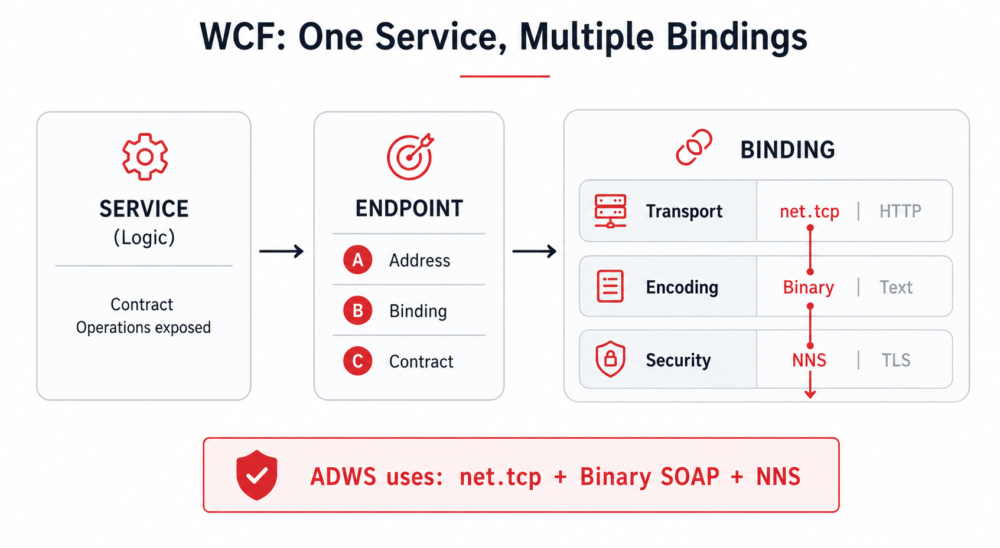
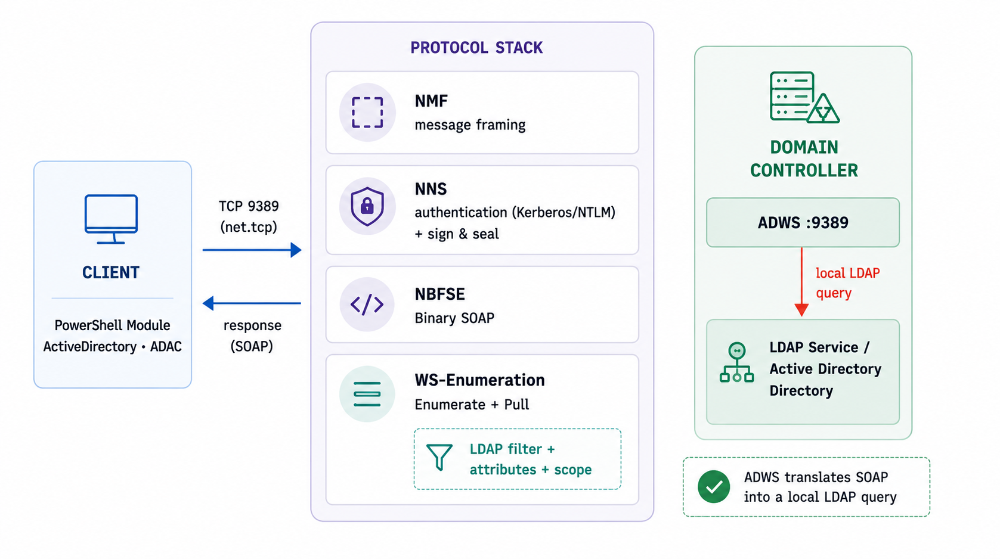
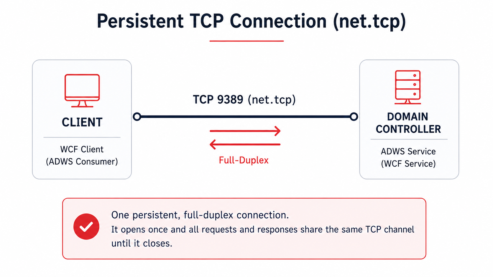
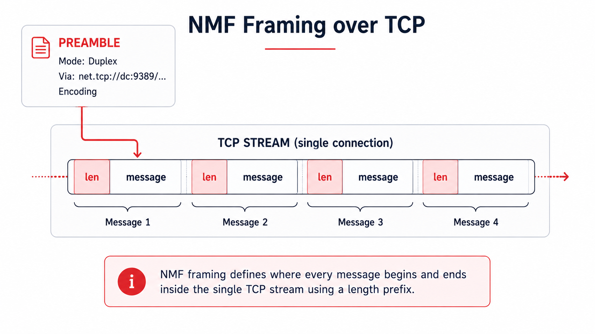
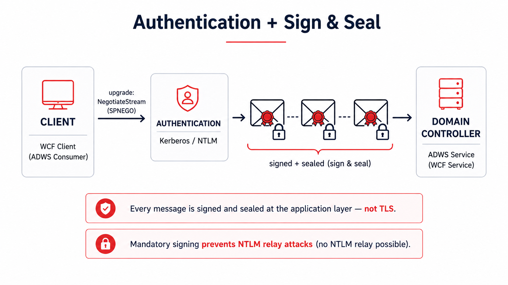
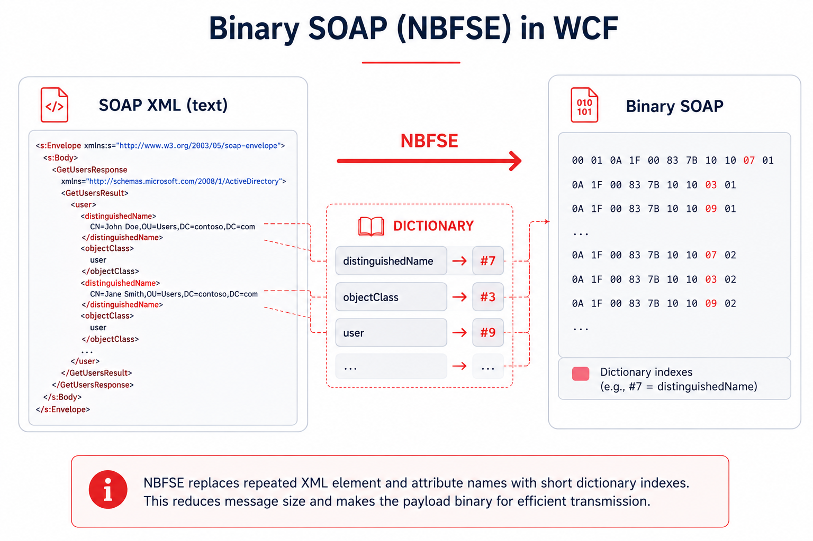
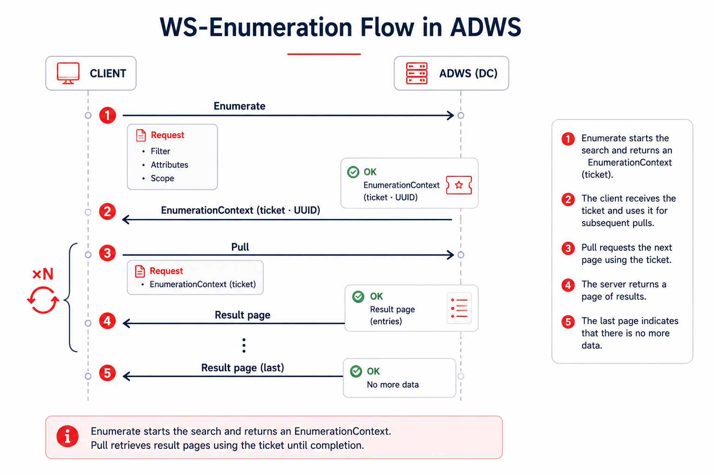

## Introduction

If you operate in Active Directory, the first move after landing in the domain is one you know by heart: recon. Users, groups, computers, trusts, ACLs... all of it has to be mapped before making a move. And the pattern is almost always the same: dump the directory and feed it into BloodHound to find the shortest path to compromising the domain. Underneath, though, all that reconnaissance boils down to a single thing: LDAP queries against the domain controller (DC) on ports 389 and 636.

The problem is that the Blue Team knows that script too. LDAP is today one of the most monitored things in the domain: there is query logging on the client and on the DC itself, and products like Microsoft Defender for Identity, or an EDR like CrowdStrike, watch recon patterns. On top of that telemetry, Sigma-style rules catch the usual suspects: the per-object noise, the wildcard filters that give away a mass sweep, a query that is too broad coming from a low-privilege account. Collecting over LDAP means playing on the field where the defender has spent years setting up cameras.

In this case, the operator does the logical thing when a channel is saturated with detection: look for an alternative. And there is one. It has been on every DC since 2008, it understands exactly the same LDAP filters, and it generally has almost no defensive coverage on it, to the point that only organizations with very high maturity manage to detect it. It is called Active Directory Web Services, ADWS, and it listens on port 9389.

This article is not about pressing a tool's button, it is about understanding what happens underneath. We are going to take ADWS apart layer by layer: how it communicates, why it understands LDAP queries if no LDAP travels over the wire, where its OPSEC comes from and, above all, where it breaks. Understanding the why is what lets you adapt the technique the day the defender starts watching 9389 too.

And to bring it down to earth, we will close with the practical part: ADWSHound, an ingestor for BloodHound CE written in Python that collects directory information by speaking ADWS directly, built with several OPSEC considerations in mind. The same view of the domain a classic collection would give you, but through the door almost nobody watches.

## What ADWS is

Active Directory Web Services (ADWS) is a WCF-based service that Microsoft introduced in Windows Server 2008 R2 and that is installed and enabled by default on every domain controller. It exposes a network interface to query and manage the directory, both AD DS and AD LDS instances, and listens on TCP port 9389. It is not an optional component nor one commonly disabled: it is part of the directory role and is present on any modern DC.

ADWS is the transport that modern administration tools use. The `ActiveDirectory` PowerShell module (`Get-ADUser`, `Get-ADComputer`, `Get-ADObject`, etc.) and the ADAC console (`dsac.exe`, Active Directory Administrative Center) do not emit LDAP over the network: they direct their queries to ADWS. When you run `Get-ADUser -Filter *`, the client opens a connection to the DC's 9389, not to 389. Disabling it would break these tools, which is why it is rarely turned off.

That said, the name is misleading: despite being called Web Services, HTTP is involved at no point. There are no REST requests nor GET verbs. Underneath, the communication rests on a stack of .NET protocols over `net.tcp`, and to understand that stack it helps to start with the framework it comes from.

That framework is WCF. Windows Communication Foundation is the .NET technology used to build network services, and its central idea is to separate the logic from the "how it communicates". A service exposes a contract (the operations it offers) through one or more *endpoints*, and each endpoint is defined by three pieces, the so-called ABC: *Address* (where it listens), *Binding* (how it is spoken) and *Contract* (what it offers). The key piece is the binding, because it bundles three decisions: the transport (for example `net.tcp` or HTTP), the encoding (binary or text) and the security (NNS or TLS). The same service can be exposed with different bindings without touching its logic.

ADWS is nothing more than a concrete combination of that binding: `net.tcp` as transport, binary SOAP as encoding and NNS as security. Those three choices are exactly what we will break down, layer by layer, in the next section.

## How the communication works

The previous section left the big picture: ADWS is a WCF binding combination, `net.tcp` plus binary SOAP plus NNS. Now it is time to open that combination and see, layer by layer, what happens from the moment the client opens the connection until the directory answers. It is not a single protocol, but several .NET pieces stacked one on top of another.

To avoid getting lost in acronyms, keep in mind the image of the reception desk of a huge archive building (the directory). You do not go in to rummage: you hand your request to the desk and a clerk goes, looks it up and brings you the result. Each layer is a step of that procedure. We go through them from the bottom up.

### Transport: TCP 9389 (net.tcp)

ADWS publishes its endpoints with WCF's `net.tcp` binding over TCP 9389. There is no HTTP nor transport TLS. The session is full-duplex and persistent: a single TCP connection carries the entire conversation, requests and responses, until it closes. The base endpoint has the form `net.tcp://dc:9389/ActiveDirectoryWebServices/...`.

Picture it: it is a direct phone line to the DC's desk. You do not hang up between one question and the next. You open the call once and everything goes through it, back and forth, until you are done and hang up.

### Framing: .NET Message Framing (MS-NMF)

NMF defines how messages are delimited within that TCP stream. The conversation starts with a *Preamble*: the mode (always Duplex in ADWS), a *Via* record with the endpoint URI and the encoding record. From there, each message carries its length up front so you know where it starts and where it ends.

Picture it: it is agreeing on the envelope format before writing to each other: the size, which window it goes to and in what language. Without that agreement, the other side would only see a stream of bytes without knowing where one letter ends and the next begins.

### Security: .NET NegotiateStream (MS-NNS)

On top of the framing, an *upgrade* to NegotiateStream takes place: an SPNEGO exchange that selects Kerberos (or NTLM) and authenticates the client. From that point, messages go signed and usually encrypted (sign and seal) at the application level. The server requires the signature, which neutralizes NTLM relay.

Picture it: you show your credential at reception and, from there, every letter goes registered and in a sealed envelope. Nobody along the way reads or changes it, and the seal proves you sent it. It is not the browser's padlock (TLS): here the envelope is armored, not the hallway.

### Encoding: NBFSE (binary SOAP)

The SOAP does not travel as text XML, but serialized with NBFSE, the binary variant of SOAP with an in-band dictionary that replaces repeated tags and names with short indices. The result is fewer bytes and a format that no longer parses like normal XML.

Picture it: it is the difference between writing "distinguishedName" out in full every time or using an agreed abbreviation like "#7". Compact for whoever has the dictionary, and gibberish for whoever intercepts the wire without it.

### Application: SOAP + WS-Enumeration

At the application layer, ADWS implements several WS-* standards: WS-Transfer (read or write a specific object), WS-MetadataExchange and, for mass searches, WS-Enumeration. The AD-specific schema and endpoints are defined by MS-ADDM. The LDAP filter, the attribute list and the scope travel in the body of the `Enumerate` message.

Two details of the behavior matter. The first: the size of each page is decided by the server, and the `EnumerationContext` expires after ~30 minutes, so a long collection forces you to paginate without pause or to slice the filter into short batches (for example, by CN prefix: `cn=a*`, `cn=b*`...) so as not to lose the context halfway. The second affects security descriptors: for ADWS to return the `nTSecurityDescriptor` attribute you have to ask for it with the `LDAP_SERVER_SD_FLAGS_OID` control indicating only Owner, Group and DACL (flags `0x7`). Reading the SACL requires privileges, and here ADWS does not behave like LDAP: if you do not bound it with that control, instead of trimming the SACL it drops the whole attribute from the response. Without that `0x7`, you are left without the ACLs BloodHound needs.

Picture it: it is the form you fill out at the desk. "I want the records that match this" (filter), "bring me only these boxes" (attributes) and "search on this floor" (scope). And since there can be thousands, they are not handed to you all at once: you ask (`Enumerate`), they give you a ticket number (`EnumerationContext`, a UUID) and you collect the result in batches (`Pull`) until you finish. That ticket expires after 30 minutes, a detail that shapes how the tools collect.

## Why it accepts LDAP-style queries

The key, and what makes it so convenient for an operator, lies in what ADWS does when it receives the `Enumerate` message: it does not interpret a proprietary API nor force you to learn a new language. Inside that message travel three things anyone who has touched LDAP recognizes instantly: a filter with the usual LDAP syntax (RFC 4515's, `(&(objectClass=user)(adminCount=1))` and company), the list of attributes you want back (the projection) and the search scope (Base, OneLevel or Subtree). ADWS pulls them out of the SOAP body and builds a plain, ordinary LDAP search with them.

And it is, literally, against the same directory. ADWS runs on the domain controller itself, next to the directory service that also serves 389/636; it does not talk to a replica nor to a separate database, it queries the same NTDS. That is why it respects the same matching rules, the same indices, the same size limits and the same LDAP controls (pagination, or the `SD_FLAGS` for security descriptors we will see below). There is no second query logic: ADWS is a protocol adapter that wraps and unwraps, but the search is resolved by the directory just as always. Your `(&(objectClass=user)(adminCount=1))` returns exactly the same set as over 389, because in the end it is the same engine resolving it.

For the operator, that means you throw away none of your repertoire. The same filters you would launch with PowerView, `ldapsearch` or a BloodHound collector work here word for word: accounts with `adminCount=1`, kerberoastable SPNs, delegations, trust relationships. The enumeration is identical (T1087 - Account Discovery, T1069 - Permission Groups Discovery, T1018 - Remote System Discovery, T1482 - Domain Trust Discovery); the only thing that changes is the wrapper and the door it comes in through. Same recon, same TTPs, different telemetry: you change channel, not trade.

## Why its OPSEC is so good

With the stack already taken apart, the advantages for an operator fall out on their own. Each layer we saw adds its grain:

- A different port. The traffic goes out over 9389, not over 389/636. Most network sensors and rules are tuned for classic LDAP, so they see nothing here.
- Binary and sealed. Between NMF framing, NBFSE binary encoding and NNS sealing, what crosses the wire is opaque: it is neither readable XML nor an easy pattern for an IDS to signature.
- The origin blurs. Since the LDAP search is run by ADWS itself locally, in the DC's Directory Service logs (Event 1644, if enabled) the query appears originated by the controller itself, by localhost (`[::1]`), not by your IP. Your machine vanishes from the query's trace.
- You blend in with the legitimate. The AD PowerShell module, `dsac.exe` and many monitoring agents speak ADWS constantly and normally. One more connection to 9389 does not stand out on its own.
- Little telemetry out of the box. ADWS's SOAP messages are not recorded in the Windows Event Logs by default: without added configuration, no trace of the query remains.
- It dodges the detections meant for LDAP. Client-side LDAP logging (with a query cap in some EDRs), the rules watching suspicious LDAP patterns and the per-object noise of collectors like SharpHound are all left looking at the wrong channel.

All together: same information, same query power, but over a barely watched channel and with your origin blurred. That is why the technique has gained so much traction. That said, "barely watched" is not the same as "invisible", and that is the other half of the story.

## PoC: enumeration over ADWS

So much for the theory. To put it into practice I wrote [ADWSHound](https://github.com/JosuPalacios99/ADWSHound), my own Python tool to enumerate Active Directory by speaking ADWS directly: authenticate against the domain controller's 9389, launch the queries wrapped in SOAP and collect the result to take it into BloodHound CE, without touching 389/636 at any point.

The tool is finished and available in the repository: [github.com/JosuPalacios99/ADWSHound](https://github.com/JosuPalacios99/ADWSHound). The code, usage and implementation details are all there.

## The honest nuance: why it isn't invisible

This is the other half of the story. ADWS has excellent OPSEC, but excellent is not a synonym for undetectable, and taking it for invisible is precisely what ends up burning operations. The underlying reason is the one we have already seen: however much the wrapper is SOAP over 9389, in the end the LDAP query really does run against the directory. And running leaves a trace:

- The LDAP filter, the attributes and the user do reach the directory. With Directory Service diagnostic logging enabled (the "Field Engineering" key), Event 1644 records the query: the filter, the attributes and the account that launched it. The only thing camouflaged is the origin, which appears as the DC itself.
- SACLs and canary objects still fire. If an object has access auditing configured (SACL), Event 4662 triggers all the same when you touch it over ADWS. Seeding decoy objects and auditing them is, in fact, the most reliable detection against this technique.
- Event correlation on the DC. Directory Service events can be chained by Operation ID to reconstruct the enumeration session: the connection (1138), the query (1644), the statistics and indices (1166/1167) and the authentication (1139/1140). There are very telling indicators, such as the `[all_with_list]` prefix left by PowerShell's `-Properties *`, or `SDflags:0x7` in the queries. This last one is especially valuable for the defender: since ADWS only returns the `nTSecurityDescriptor` if you ask for exactly Owner, Group and DACL (that `0x7`), its repeated appearance gives away, almost unambiguously, a BloodHound-style ACL collection over ADWS.
- Network detection at the endpoint. A process that should not be talking to 9389 connecting to the DC (captured by Sysmon EventID 3), or a connection to ADWS right after a process injection, are clear signals. There are public rules in Sigma, Elastic and Splunk for exactly this.

The big advantage the attacker keeps is not invisibility, it is attribution: since the query logs show the DC as origin, figuring out which machine on the network actually launched the enumeration is costly, and it forces the defender to correlate the enumerating account with the environment's active sessions.

## Conclusion

ADWS is an uncomfortable reminder of something that comes up a lot in Red Team: defending a protocol is not the same as defending a capability. You can have LDAP monitored down to the last filter and still leave the same information going out through a side door almost nobody watches.

For the attacker, ADWS is enumeration with excellent OPSEC: same query power, barely watched channel, blurred origin. For the defender, the message is clear: watching only 389/636 leaves a blind spot the size of a domain controller. Covering 9389, enabling Directory Service logging, seeding objects with SACLs and correlating events by Operation ID turns that blind spot into a trap.

As almost always, the technique is not magic: it is knowing where the other one is looking and coming in where they are not. ADWS is, today, that back door into the directory. And as soon as the defender learns to look there too, it stops being a shortcut and goes back to being just one more connection in the logs.

## References

1. FalconForce — _SOAPHound: tool to collect Active Directory data via ADWS_. [falconforce.nl](https://falconforce.nl/soaphound-tool-to-collect-active-directory-data-via-adws/)
2. Logan Goins — _Stealthy Enumeration of Active Directory Environments Through ADWS_ and the tool _SoaPy_. [logan-goins.com](http://logan-goins.com/2025-02-21-stealthy-enum-adws/)
3. IBM X-Force — _Stealthy enumeration of Active Directory environments through ADWS_. [ibm.com](https://www.ibm.com/think/x-force/stealthy-enumeration-of-active-directory-environments-through-adws)
4. ipurple.team — _Active Directory Enumeration – ADWS_. [ipurple.team](https://ipurple.team/2025/08/12/active-directory-enumeration-adws/)
5. Huntress — _The ADWS Architecture That Hides PowerShell AD Enumeration_. [huntress.com](https://www.huntress.com/blog/ldap-active-directory-detection-part-5a)
6. Microsoft Learn — _MS-ADDM_ (AD Web Services endpoints), _MS-NMF_ (.NET Message Framing) and _MS-NNS_ (.NET NegotiateStream).
7. wh0amitz — _SharpADWS_. [github.com/wh0amitz/SharpADWS](https://github.com/wh0amitz/SharpADWS)
8. Detection rules — Sigma (network connection to ADWS), Elastic (_discovery_active_directory_webservice_), Splunk Security Content and FalconForce _FalconFriday_.
9. j0su — _ADWSHound_ (BloodHound CE ingestor over ADWS). [github.com/JosuPalacios99/ADWSHound](https://github.com/JosuPalacios99/ADWSHound)
