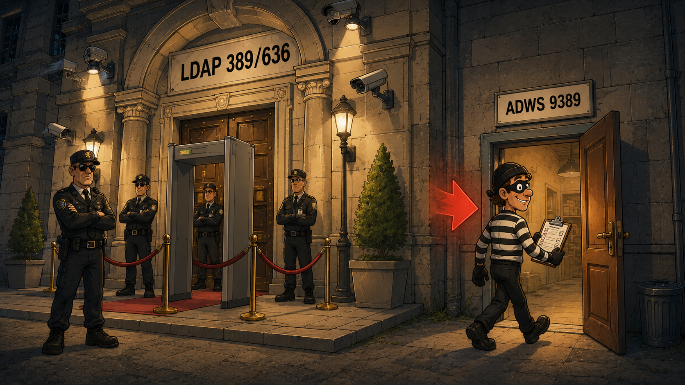
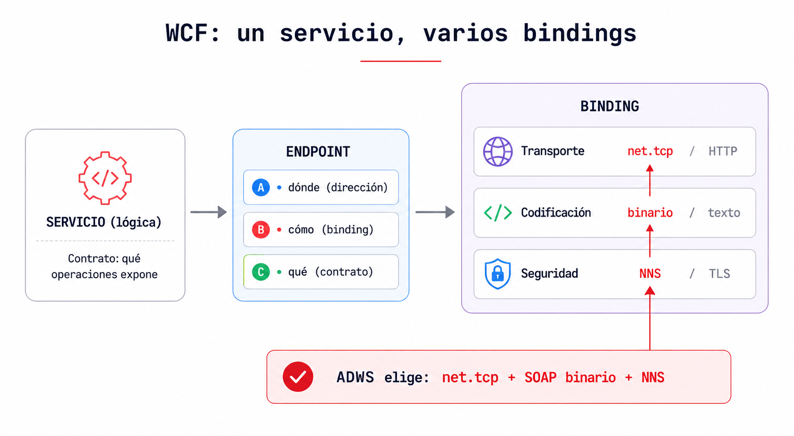
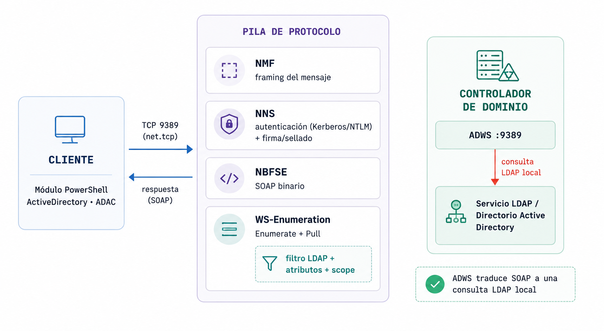
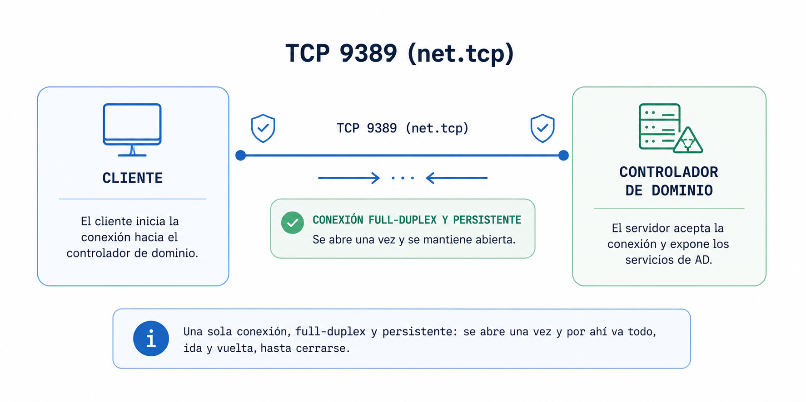
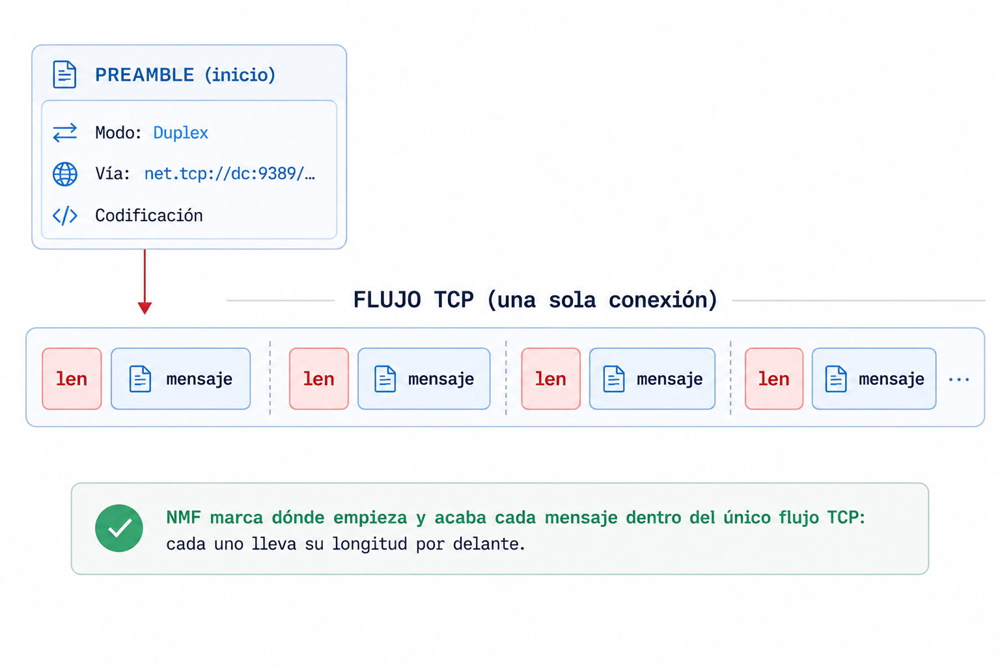
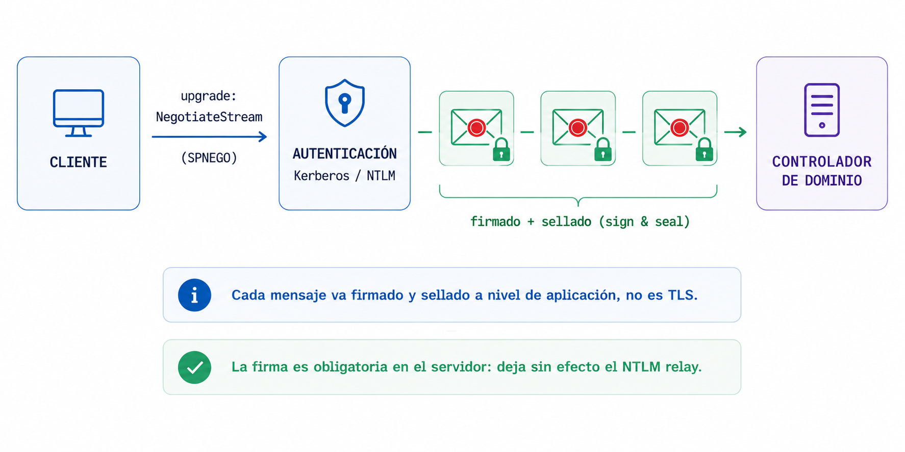
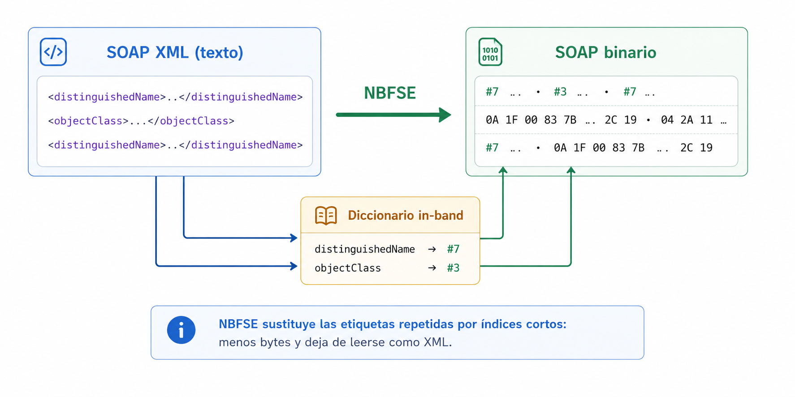
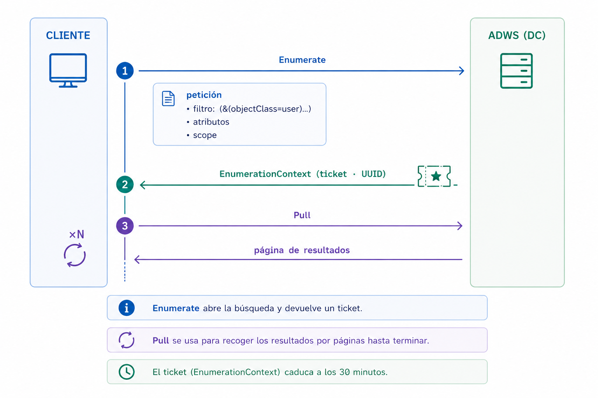

## Introducción

Si operas en Active Directory, el primer movimiento después de pisar el dominio te lo sabes de memoria: recon. Usuarios, grupos, equipos, confianzas, ACLs… todo eso hay que mapearlo antes de mover ficha. Y el patrón es casi siempre el mismo: volcar el directorio y meterlo en BloodHound para encontrar el camino más corto hasta comprometer el dominio. Por debajo, sin embargo, todo ese reconocimiento se reduce a una sola cosa: consultas LDAP contra el controlador de dominio (DC) por los puertos 389 y 636.

El problema es que el Blue Team también se sabe ese guion. LDAP es hoy de lo más monitorizado del dominio: hay logging de consultas en el cliente y en el propio DC, y productos como Microsoft Defender for Identity, o un EDR como CrowdStrike, vigilan los patrones de recon. Sobre esa telemetría, las reglas al estilo Sigma cazan lo de siempre: el ruido per-objeto, los filtros con wildcards que delatan un barrido masivo, una consulta demasiado amplia saliendo de una cuenta de bajo privilegio. Recolectar por LDAP es jugar en el campo donde el defensor lleva años montando cámaras.

En este caso, el operador hace lo lógico cuando un canal está saturado de detección: busca una alternativa. Y la hay. Lleva en todos los DC desde 2008, entiende exactamente los mismos filtros LDAP y, por lo general, apenas tiene cobertura defensiva encima, hasta el punto de que solo las organizaciones con una madurez muy alta llegan a detectarla. Se llama Active Directory Web Services, ADWS, y escucha en el puerto 9389.

Este artículo no va de apretar el botón de una herramienta, va de entender qué pasa por debajo. Vamos a desmontar ADWS capa a capa: cómo se comunica, por qué entiende consultas LDAP si por el cable no viaja LDAP, de dónde sale su OPSEC y, sobre todo, dónde se rompe. Entender el porqué es lo que te permite adaptar la técnica el día que el defensor empiece a mirar también el 9389.

Y para bajarlo a tierra, cerraremos con la parte práctica: ADWSHound, un ingestor para BloodHound CE escrito en Python que recoge la información del directorio hablando directamente ADWS y construido cuidando varias consideraciones de OPSEC. La misma visión del dominio que te daría una recolección clásica, pero por la puerta que casi nadie vigila.

## Qué es ADWS

Active Directory Web Services (ADWS) es un servicio basado en WCF que Microsoft introdujo en Windows Server 2008 R2 y que se instala y habilita de forma predeterminada en todo controlador de dominio. Expone una interfaz de red para consultar y administrar el directorio, tanto instancias de AD DS como de AD LDS, y escucha en el puerto TCP 9389. No es un componente opcional ni habitual de deshabilitar: forma parte del rol de directorio y está presente en cualquier DC actual.

ADWS es el transporte que emplean las herramientas de administración modernas. El módulo de PowerShell `ActiveDirectory` (`Get-ADUser`, `Get-ADComputer`, `Get-ADObject`, etc.) y la consola ADAC (`dsac.exe`, Active Directory Administrative Center) no emiten LDAP por la red: dirigen sus consultas a ADWS. Al ejecutar `Get-ADUser -Filter *`, el cliente abre una conexión al 9389 del DC, no al 389. Deshabilitarlo inutilizaría estas herramientas, motivo por el que rara vez se desactiva.

Ahora bien, el nombre induce a error: pese a llamarse Web Services, no interviene HTTP en ningún punto. No hay peticiones REST ni verbos GET. Por debajo, la comunicación se apoya en una pila de protocolos de .NET sobre `net.tcp`, y para entender esa pila conviene empezar por el framework del que sale.

Ese framework es WCF. Windows Communication Foundation es la tecnología de .NET con la que se construyen servicios de red, y su idea central es separar la lógica del "cómo se comunica". Un servicio expone un contrato (las operaciones que ofrece) a través de uno o varios *endpoints*, y cada endpoint se define con tres piezas, el llamado ABC: *Address* (dónde escucha), *Binding* (cómo se habla) y *Contract* (qué ofrece). La pieza clave es el binding, porque agrupa tres decisiones: el transporte (por ejemplo `net.tcp` o HTTP), la codificación (binaria o texto) y la seguridad (NNS o TLS). El mismo servicio puede exponerse con bindings distintos sin tocar su lógica.

ADWS no es más que una combinación concreta de ese binding: `net.tcp` como transporte, SOAP binario como codificación y NNS como seguridad. Esas tres elecciones son justo las que desglosaremos, capa a capa, en la siguiente sección.

## Cómo funciona la comunicación

En la sección anterior quedó la foto general: ADWS es una combinación de binding de WCF, `net.tcp` más SOAP binario más NNS. Toca abrir esa combinación y ver, capa a capa, qué ocurre desde que el cliente abre la conexión hasta que el directorio responde. No es un protocolo único, sino varias piezas de .NET apiladas una sobre otra.

Para no perderse entre siglas, mantén en la cabeza la imagen del mostrador de recepción de un edificio de archivos enorme (el directorio). Tú no entras a rebuscar: entregas tu petición en el mostrador y un empleado va, la busca y te trae el resultado. Cada capa es un paso de ese trámite. Las vemos de abajo a arriba.

### Transporte: TCP 9389 (net.tcp)

ADWS publica sus endpoints con el binding `net.tcp` de WCF sobre TCP 9389. No hay HTTP ni TLS de transporte. La sesión es full-duplex y persistente: una única conexión TCP transporta toda la conversación, peticiones y respuestas, hasta que se cierra. El endpoint base tiene la forma `net.tcp://dc:9389/ActiveDirectoryWebServices/...`.

Visualízalo: es una línea telefónica directa al mostrador del DC. No cuelgas entre pregunta y pregunta. Abres la llamada una vez y por ahí va todo, ida y vuelta, hasta que terminas y cuelgas.

### Framing: .NET Message Framing (MS-NMF)

NMF define cómo se delimitan los mensajes dentro de ese flujo TCP. La conversación arranca con un *Preamble*: el modo (siempre Duplex en ADWS), un record *Via* con la URI del endpoint y el record de codificación. A partir de ahí, cada mensaje lleva su longitud por delante para saber dónde empieza y dónde acaba.

Visualízalo: es ponerse de acuerdo en el formato de los sobres antes de escribirse: el tamaño, a qué ventanilla van y en qué idioma. Sin ese acuerdo, el otro lado solo vería un chorro de bytes sin saber dónde corta una carta y empieza la siguiente.

### Seguridad: .NET NegotiateStream (MS-NNS)

Sobre el framing se hace un *upgrade* a NegotiateStream: un intercambio SPNEGO que selecciona Kerberos (o NTLM) y autentica al cliente. Desde ese punto, los mensajes van firmados y normalmente cifrados (sign and seal) a nivel de aplicación. El servidor exige la firma, lo que deja sin efecto el NTLM relay.

Visualízalo: enseñas tu credencial en recepción y, a partir de ahí, cada carta va certificada y en un sobre lacrado. Nadie por el camino la lee ni la cambia, y el lacre prueba que la mandaste tú. No es el candado del navegador (TLS): aquí va blindado el sobre, no el pasillo.

### Codificación: NBFSE (SOAP binario)

El SOAP no viaja como XML de texto, sino serializado con NBFSE, la variante binaria de SOAP con un diccionario in-band que sustituye etiquetas y nombres repetidos por índices cortos. El resultado son menos bytes y un formato que ya no se parsea como XML normal.

Visualízalo: es la diferencia entre escribir "distinguishedName" entero cada vez o usar una abreviatura pactada como "#7". Compacto para quien tiene el diccionario, y un galimatías para quien intercepta el cable sin él.

### Aplicación: SOAP + WS-Enumeration

En la capa de aplicación, ADWS implementa varios estándares WS-*: WS-Transfer (leer o escribir un objeto concreto), WS-MetadataExchange y, para búsquedas masivas, WS-Enumeration. El esquema y los endpoints específicos de AD los define MS-ADDM. El filtro LDAP, la lista de atributos y el scope viajan en el cuerpo del mensaje `Enumerate`.

Dos matices del funcionamiento importan. El primero: el tamaño de cada página lo decide el servidor, y el `EnumerationContext` caduca a los ~30 minutos, así que una recolección larga obliga a paginar sin pausa o a trocear el filtro en lotes cortos (por ejemplo, por prefijo de CN: `cn=a*`, `cn=b*`…) para no perder el contexto a mitad. El segundo afecta a los descriptores de seguridad: para que ADWS devuelva el atributo `nTSecurityDescriptor` hay que pedirlo con el control `LDAP_SERVER_SD_FLAGS_OID` indicando solo Owner, Group y DACL (flags `0x7`). Leer la SACL exige privilegios, y aquí ADWS no se comporta como LDAP: si no acotas con ese control, en lugar de recortar la SACL descarta el atributo entero de la respuesta. Sin ese `0x7`, te quedas sin las ACLs que necesita BloodHound.

Visualízalo: es el formulario que rellenas en el mostrador. "Quiero las fichas que cumplan esto" (filtro), "tráeme solo estas casillas" (atributos) y "busca en esta planta" (scope). Y como pueden ser miles, no te las dan de golpe: pides (`Enumerate`), te dan un número de ticket (`EnumerationContext`, un UUID) y vas recogiendo el resultado por tandas (`Pull`) hasta acabar. Ese ticket caduca a los 30 minutos, un detalle que condiciona cómo recolectan las herramientas.

## Por qué acepta consultas tipo LDAP

La clave, y lo que lo hace tan cómodo para un operador, está en lo que ADWS hace al recibir el mensaje `Enumerate`: no interpreta una API propia ni te obliga a aprender un lenguaje nuevo. Dentro de ese mensaje viajan tres cosas que cualquiera que haya tocado LDAP reconoce al instante: un filtro con la sintaxis LDAP de siempre (la de RFC 4515, `(&(objectClass=user)(adminCount=1))` y compañía), la lista de atributos que quieres de vuelta (la proyección) y el scope de búsqueda (Base, OneLevel o Subtree). ADWS los saca del cuerpo SOAP y monta con ellos una búsqueda LDAP normal y corriente.

Y es, literalmente, contra el mismo directorio. ADWS se ejecuta en el propio controlador de dominio, al lado del servicio de directorio que también atiende el 389/636; no habla con una réplica ni con una base de datos aparte, consulta la misma NTDS. Por eso respeta las mismas reglas de coincidencia, los mismos índices, los mismos límites de tamaño y los mismos controles LDAP (la paginación, o el `SD_FLAGS` para descriptores de seguridad que veremos más abajo). No hay una segunda lógica de consulta: ADWS es un adaptador de protocolo que envuelve y desenvuelve, pero la búsqueda la resuelve el directorio igual que siempre. Tu `(&(objectClass=user)(adminCount=1))` devuelve exactamente el mismo conjunto que por el 389, porque al final lo resuelve el mismo motor.

Para el operador, eso significa que no tiras nada de tu repertorio. Los mismos filtros que lanzarías con PowerView, `ldapsearch` o un recolector de BloodHound valen aquí palabra por palabra: cuentas con `adminCount=1`, SPNs kerberoasteables, delegaciones, relaciones de confianza. La enumeración es idéntica (T1087 - Account Discovery, T1069 - Permission Groups Discovery, T1018 - Remote System Discovery, T1482 - Domain Trust Discovery); lo único que cambia es el envoltorio y la puerta por la que entra. Mismo recon, mismas TTPs, telemetría distinta: cambias de canal, no de oficio.

## Por qué su OPSEC es tan bueno

Con la pila ya desmontada, las ventajas para un operador caen por su propio peso. Cada capa que vimos aporta su grano:

- Otro puerto. El tráfico sale por el 9389, no por el 389/636. La mayoría de sensores y reglas de red están afinados para el LDAP clásico, así que por aquí no ven nada.
- Binario y sellado. Entre el framing de NMF, la codificación binaria de NBFSE y el sellado de NNS, lo que cruza el cable es opaco: ni es XML legible ni hay un patrón cómodo de firmar para un IDS.
- El origen se difumina. Como la búsqueda LDAP la ejecuta el propio ADWS en local, en los registros de Directory Service del DC (Event 1644, si está activo) la consulta figura originada por el propio controlador, por localhost (`[::1]`), no por tu IP. Tu equipo desaparece de la traza de la consulta.
- Te confundes con lo legítimo. El módulo de PowerShell AD, `dsac.exe` y muchos agentes de monitorización hablan ADWS de forma constante y normal. Una conexión más al 9389 no destaca por sí sola.
- Poca telemetría de serie. Los mensajes SOAP de ADWS no se registran en los Event Logs de Windows por defecto: sin configuración añadida, no queda rastro de la consulta.
- Esquiva las detecciones pensadas para LDAP. El logging de LDAP en el cliente (con tope de consultas en algunos EDR), las reglas que vigilan patrones LDAP sospechosos y el ruido per-objeto de recolectores como SharpHound se quedan mirando el canal equivocado.

En conjunto: misma información, misma potencia de consulta, pero por un canal poco vigilado y con tu origen difuminado. Por eso la técnica ha ganado tanta tracción. Ahora bien, "poco vigilado" no es lo mismo que "invisible", y esa es la otra mitad de la historia.

## PoC: enumeración por ADWS

Hasta aquí la teoría. Para llevarlo a la práctica he escrito [ADWSHound](https://github.com/JosuPalacios99/ADWSHound), una herramienta propia en Python para enumerar Active Directory hablando directamente ADWS: autenticarse contra el 9389 del controlador de dominio, lanzar las consultas envueltas en SOAP y recolectar el resultado para llevarlo a BloodHound CE, sin tocar el 389/636 en ningún momento.

La herramienta está terminada y disponible en el repositorio: [github.com/JosuPalacios99/ADWSHound](https://github.com/JosuPalacios99/ADWSHound). Ahí están el código, el uso y los detalles de la implementación.

## El matiz honesto: por qué no es invisible

Esta es la otra mitad de la historia. ADWS tiene un OPSEC excelente, pero excelente no es sinónimo de indetectable, y darlo por invisible es justo lo que acaba quemando operaciones. La razón de fondo es la que ya hemos visto: por mucho que el envoltorio sea SOAP por el 9389, al final la consulta LDAP se ejecuta de verdad contra el directorio. Y ejecutar deja rastro:

- El filtro LDAP, los atributos y el usuario sí llegan al directorio. Con el logging de diagnóstico de Directory Service activado (la clave "Field Engineering"), el Event 1644 registra la consulta: el filtro, los atributos y la cuenta que la lanzó. Lo único que se camufla es el origen, que aparece como el propio DC.
- Las SACL y los objetos canario siguen saltando. Si un objeto tiene auditoría de acceso configurada (SACL), el Event 4662 se dispara igual cuando lo tocas por ADWS. Sembrar objetos señuelo y auditarlos es, de hecho, la detección más fiable contra esta técnica.
- Correlación de eventos en el DC. Los eventos de Directory Service se pueden encadenar por Operation ID para reconstruir la sesión de enumeración: la conexión (1138), la consulta (1644), las estadísticas e índices (1166/1167) y la autenticación (1139/1140). Hay indicadores muy delatores, como el prefijo `[all_with_list]` que deja el `-Properties *` de PowerShell, o `SDflags:0x7` en las consultas. Este último es especialmente valioso para el defensor: como ADWS solo devuelve el `nTSecurityDescriptor` si pides justo Owner, Group y DACL (ese `0x7`), su aparición repetida delata casi sin ambigüedad una recolección de ACLs estilo BloodHound por ADWS.
- Detección de red en el endpoint. Un proceso que no debería hablar con el 9389 conectándose al DC (capturado por Sysmon EventID 3), o una conexión a ADWS justo después de una inyección de proceso, son señales claras. Existen reglas públicas en Sigma, Elastic y Splunk justo para esto.

La gran ventaja que le queda al atacante no es la invisibilidad, es la atribución: como los logs de la consulta muestran al DC como origen, averiguar qué máquina de la red lanzó realmente la enumeración cuesta, y obliga al defensor a correlacionar la cuenta que enumera con las sesiones activas del entorno.

## Conclusión

ADWS es un recordatorio incómodo de algo que se repite mucho en Red Team: defender un protocolo no es lo mismo que defender una capacidad. Puedes tener LDAP monitorizado hasta el último filtro y aun así dejar la misma información saliendo por una puerta de al lado que casi nadie mira.

Para el atacante, ADWS es enumeración con un OPSEC excelente: mismo poder de consulta, canal poco vigilado, origen difuminado. Para el defensor, el mensaje es claro: vigilar solo el 389/636 deja un punto ciego del tamaño de un controlador de dominio. Cubrir el 9389, activar el logging de Directory Service, sembrar objetos con SACL y correlacionar eventos por Operation ID convierte ese punto ciego en una trampa.

Como casi siempre, la técnica no es magia: es saber por dónde mira el otro y entrar por donde no mira. ADWS es, hoy, esa puerta de atrás del directorio. Y, en cuanto el defensor aprende a mirar también ahí, deja de ser un atajo y vuelve a ser solo otra conexión más en los logs.

## Referencias

1. FalconForce — _SOAPHound: tool to collect Active Directory data via ADWS_. [falconforce.nl](https://falconforce.nl/soaphound-tool-to-collect-active-directory-data-via-adws/)
2. Logan Goins — _Stealthy Enumeration of Active Directory Environments Through ADWS_ y la herramienta _SoaPy_. [logan-goins.com](http://logan-goins.com/2025-02-21-stealthy-enum-adws/)
3. IBM X-Force — _Stealthy enumeration of Active Directory environments through ADWS_. [ibm.com](https://www.ibm.com/think/x-force/stealthy-enumeration-of-active-directory-environments-through-adws)
4. ipurple.team — _Active Directory Enumeration – ADWS_. [ipurple.team](https://ipurple.team/2025/08/12/active-directory-enumeration-adws/)
5. Huntress — _The ADWS Architecture That Hides PowerShell AD Enumeration_. [huntress.com](https://www.huntress.com/blog/ldap-active-directory-detection-part-5a)
6. Microsoft Learn — _MS-ADDM_ (endpoints de AD Web Services), _MS-NMF_ (.NET Message Framing) y _MS-NNS_ (.NET NegotiateStream).
7. wh0amitz — _SharpADWS_. [github.com/wh0amitz/SharpADWS](https://github.com/wh0amitz/SharpADWS)
8. Reglas de detección — Sigma (conexión de red a ADWS), Elastic (_discovery_active_directory_webservice_), Splunk Security Content y FalconForce _FalconFriday_.
9. j0su — _ADWSHound_ (ingestor de BloodHound CE sobre ADWS). [github.com/JosuPalacios99/ADWSHound](https://github.com/JosuPalacios99/ADWSHound)
