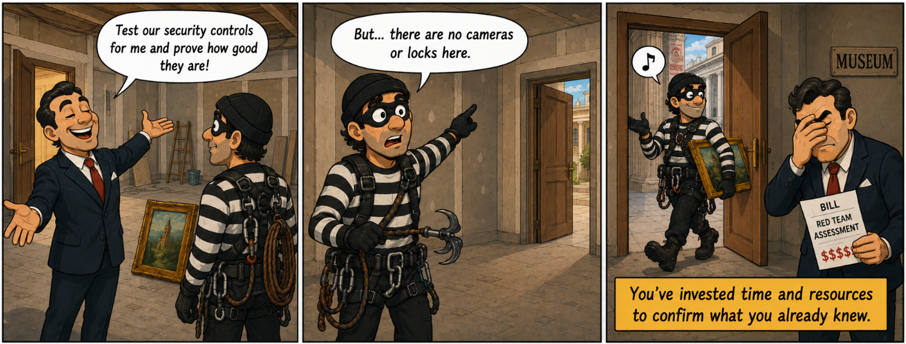
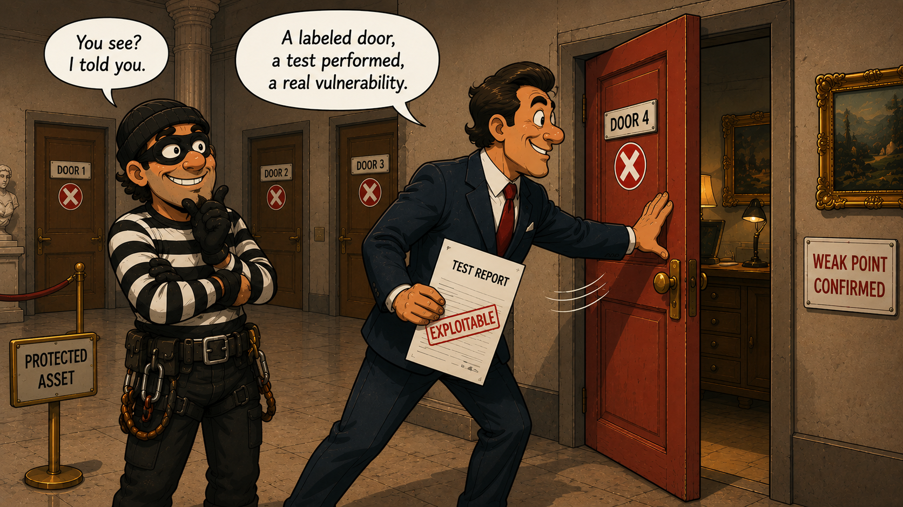
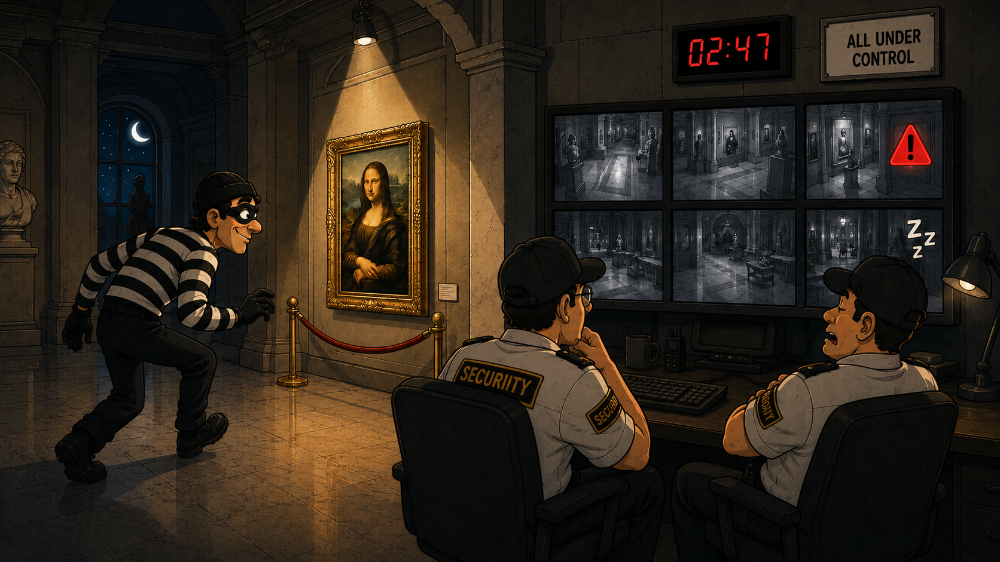
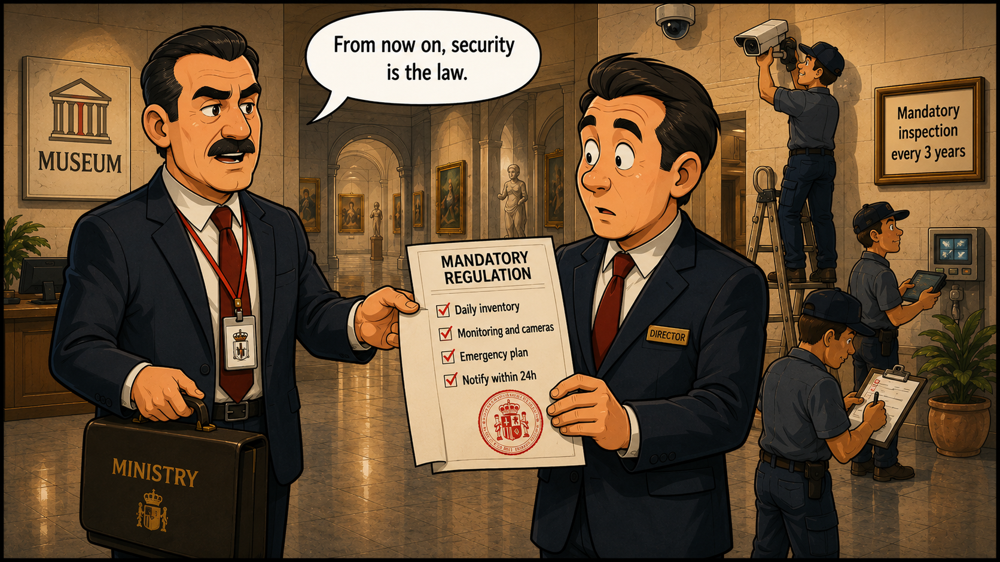
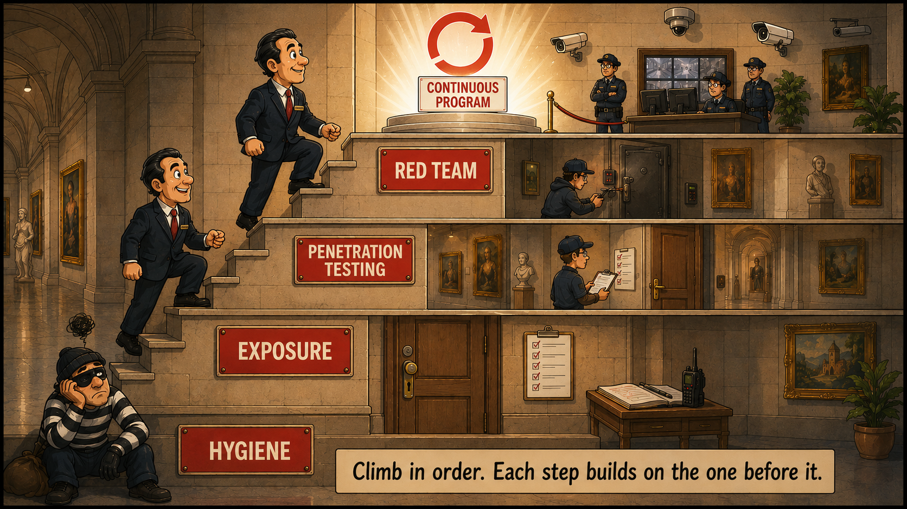

> I wrote this one back in the day, and it was originally published on [Security Art Work](https://www.securityartwork.es/2026/07/13/que-servicio-seguridad-ofensiva-necesitas/) (S2GRUPO) on July 13, 2026.

## Introduction

Go back for a moment to the museum from the [previous article](../red-teaming-pensar-como-el-adversario/). Only this time, picture something different: the director, before installing a single camera, before putting locks on the doors, before anything else… picks up the phone and hires the best thief in the world to try to steal the painting.

The result? The thief walks in through the door, which is open, grabs the painting and leaves. Ten minutes. But before that there were weeks of coordination, preparation and meetings, plus a hefty invoice, just to confirm something you already knew: that you have nothing.

It was a waste of resources to confirm the obvious. You learned nothing you didn't already know.

And here's the key: the mistake wasn't hiring the thief. It was the timing. That same thief, in a museum with cameras, guards and display cases, would have taught you a great deal. In an empty museum, all he does is confirm the obvious.

Exactly the same thing happens with offensive security services. You don't pick them at random. It's not about grabbing the simplest one to tick a box, nor the most ambitious one to show off. It's about choosing the one you need for the moment you're in.

Because these services aren't dishes on a menu: they're steps on a staircase. And climbing them in order is what separates making the most of your resources from wasting them.

## Maturity: it's not a menu, it's a staircase

"Maturity" in security isn't a marketing label: it's simply how much you've built and how much you've tested it. A mature organization isn't the one with the most tools, but the one that knows what it has, protects it, detects when something goes wrong, responds and recovers.

If you want something more formal, the *NIST Cybersecurity Framework* offers a good definition:

> Security maturity is the degree to which an organization's security capabilities are consistent, repeatable and improvable over time; that is, it measures how well you manage risk, not what tools you own.

That last part is the key. Maturity isn't having the most expensive EDR on the market: that makes you well-equipped, not mature. NIST itself sorts it into four levels: from the one that puts out fires with no process, through the one that already decides based on risk, to the one whose management is so well-oiled that it learns from every incident and adjusts on its own. And what those levels measure isn't how much you've spent on defense, but how integrated your way of managing risk is.

And there's an important detail: the highest level isn't the goal for everyone. Each organization should aim for the one that fits its business and the risk it's willing to accept. Wanting the top step just because is wasting resources… just like hiring a Red Team before you're ready for it.

One piece is still missing, and the *C2M2* from the U.S. Department of Energy provides it: its levels are cumulative. To reach one, you have to meet everything in the previous one. There are no shortcuts and you don't skip the foundations. There, in a single sentence, is why this is a staircase and not a menu. It also measures each area separately, so you can be solid at managing vulnerabilities and weak at responding to incidents.

And those five things we mentioned at the start (knowing what you have, protecting it, detecting, responding and recovering) are exactly the five functions of the NIST CSF: Identify → Protect → Detect → Respond → Recover. It's no accident they come in that order: you can't respond to something you don't detect, nor detect on systems you didn't even know you had.

Offensive security services follow the same path. Each one tests one more function, and each one assumes the previous ones are already covered. That's why they're a staircase: buying above your maturity is investing time and effort to confirm something you already know; staying below it is missing what's really broken.

So knowing which step you're on is the smartest decision you can make before committing a single resource.

## The services at a glance

Before getting into the detail, the full map. The idea is simple: there are three main services, which make up the bulk of the journey, and a set of specialized services that come into play once you have a foundation.

Each of the three main services looks at a different "surface" of the problem and answers a different question:

| Service | Surface it looks at | What it solves |
|---------|--------------------|----------------|
| Vulnerability Assessment | Exposure surface: everything I have exposed | what do I have and where am I exposed? |
| Penetration Testing | Attack surface: enumerates the real vectors and tests them all within scope | is it actually exploitable and what's the impact? |
| Red Teaming | Objective-driven attack surface: it picks the paths that lead to a goal, like an adversary | can I defend against an adversary who's after something? |

Notice that each step doesn't just add depth, it adds intent: it goes from "what's there" to "what's attackable" and, from there, to "what someone after a specific goal would do".

And around them, the specialized ones, which refine or extend the above:

| Service | What it solves |
|---------|----------------|
| Device audit | are my systems properly configured and hardened? |
| Breach & Attack Simulation (BAS) | do my controls fire when they should, continuously? |
| Physical intrusion | can I withstand someone coming through the door, not the network? |
| Ransomware simulation | can I survive an encryption event and get back to operating? |

So much for the map. Now let's go down into the detail of each step: when it's your turn, what it gives you and when it's still not the moment.

## The steps, in detail

For each level, the same: how to tell you're there, what fits, what you get and, just as important, what does NOT make sense yet.

### Level 0: Basic hygiene (offense still isn't the move)

Before paying anyone to attack you, comes the boring part: security hygiene. It's having locks on the doors, controlling who holds the keys and knowing what's inside the building. Without that, any offensive exercise will just tell you what you already suspect. And it's no small matter: year after year, breach reports (like the Verizon DBIR) keep showing that most incidents still come in through the usual suspects, a stolen or reused credential, an unpatched system or an exposed asset nobody was watching.

- Signs you're here: you don't have a reliable inventory of assets or software; patching is hit-or-miss, with no prioritization by criticality; there's no widespread MFA and passwords get reused; the network is flat, unsegmented; privileges are handed out "just in case"; and, if backups exist, restoring them has never been tested.
- What fits: the essentials first, what frameworks like the CIS Controls group into their first implementation group (IG1) under the name basic hygiene. Asset and software inventory, vulnerability and patch management, MFA, secure configuration and hardening, least privilege, network segmentation, event logging and backups that have genuinely been tested for restoration.
- What does NOT make sense yet: hiring a Red Team, or even a deep pentest. It's the thief in the museum with no cameras: he gets in for sure and you learn nothing you didn't know. Every resource you put into offense here is a resource you're not putting into closing the doors you already know are open.

### Level 1: Knowing what you have and where you're exposed

With hygiene under way, the next step is to get a clear picture of where they could get in. This is where the vulnerability assessment comes in: the discipline of broadly and systematically searching for the known flaws that surface in your systems. NIST defines it as the systematic examination of a system to identify security deficiencies (NIST SP 800-30). In practice, it's running your surface through a fine, automated comb to find out what's there and what it looks like.

- Signs: you already have the basics covered, but not a clear picture of your exposure. You know you have assets, though not quite which versions are running, what you expose to the internet, or which known vulnerabilities you're accumulating.
- What fits: a vulnerability assessment, ideally with authenticated scanning (using credentials) and not only from the outside, which sees far more than a blind one. It searches, identifies and catalogs known flaws broadly and recurrently. Breadth over depth: it's not about exploiting anything, but about building the inventory of cracks.
- What you get: a map of your exposure surface and a prioritized list of what to patch first, ideally crossing technical severity (CVSS) with business context and the real likelihood of exploitation (metrics like EPSS or the CISA KEV catalog of actively exploited vulnerabilities). It covers *Identify* and pushes *Protect*.
- What does NOT make sense yet: jumping to a pentest or a Red Team. If you're still piling up a list of unpatched known vulnerabilities, paying for someone to exploit them will only confirm what the scanner already told you, and a Red Team will walk in through the first of them without you learning anything new. First reduce that obvious exposure; once you no longer know which of the remaining flaws are actually exploitable, it'll be time to climb to the next step.

### Level 2: Checking what's actually exploitable

A list of vulnerabilities tells you where the cracks are; it doesn't tell you which ones give way when someone pushes. That leap, from the theoretical to the demonstrated, is the pentest. NIST describes it as a test in which evaluators attempt to evade or defeat a system's security measures (NIST SP 800-115). Here the flaw is no longer just catalogued: it's exploited, chained with others and measured to see how far it lets you go.

- Signs: you've done the vulnerability assessment and have a prioritized list, but you don't know the real impact those flaws would have when chained. You need to go from "this looks vulnerable" to "this compromises that system and this data".
- What fits: a pentest with a bounded scope (external or internal). The team takes the flaws, exploits them to prove they're real, combines them and pursues a technical objective. Depth over breadth. It's worth setting clear rules of engagement and, depending on the case, choosing how much information is handed over (from black box with no data to white box with access and documentation).
- What you get: confirmation of real risks with reproducible evidence, an exploitation chain that shows the business impact and prioritized remediation recommendations. It separates the noise (the flaw nobody can exploit) from what can genuinely hurt you: your real attack surface, the one that gives way when pushed. It adds *Detect* in an early form.
- What does NOT make sense yet: confusing it with a Red Team. A pentest is usually known to the defense, runs against a closed scope and seeks technical coverage; it doesn't measure whether your SOC detects and reacts to someone stealthy who takes their time. Coverage isn't the same as stealth, and a good pentest doesn't pretend to be invisible: its value is in finding and proving, not in hiding.

### Level 3: Withstanding a real adversary

The pentest tells you whether a door opens. The Red Team tells you whether anyone notices when it's crossed, when they move around inside and go for what matters. It's no longer a system being tested, but the whole organization: the technology, the processes and the people who defend it. That's why NIST describes it as an exercise that, reflecting real-world conditions, simulates an adversary's attempt to compromise an organization's missions or business processes (CNSSI 4009). The key difference isn't technical: it's that here the defense isn't warned, it doesn't know it's being tested.

- Signs: you already protect, detect and are starting to respond. You have a SOC, EDR, response processes and a team that knows what it's doing, but you've never measured them against someone who behaves like a real attacker, takes their time and doesn't want to be seen.
- What fits: a Red Team exercise guided by threat modeling. A plausible adversary for your organization is chosen (sector, geopolitics, exposure), their real TTPs are emulated (drawing on frameworks like MITRE ATT&CK) and a concrete business objective is pursued (reach this data, get to that system), stealthily and without the defense knowing. It doesn't measure the number of flaws, but the real detection and response capability: do they see it? in how long? do they react well?
- What you get: the real measure of your detection and response (*Respond* and *Recover*), a map of blind spots and, above all, a step-by-step account of the incident that shows where the chain broke. It doesn't cover the whole surface, but the path an adversary would take to reach its objective. It's the exercise that most closely resembles what would actually happen.
- What does NOT make sense: judging the exercise by "did they get in or not?". Given time and resources, they get in; we knew that before starting. The question that pays for the exercise is what happened next: how long it took to spot them, whether they were contained and what's learned for next time.

## What if you're regulated? DORA and TIBER-EU

So far we've talked about choosing based on your maturity, as if the decision were yours alone. But for part of the business fabric, especially the financial sector, some of these steps have stopped being an option and become a legal obligation.

Back to the museum. Imagine the director no longer decides how much security to put in place: the Ministry of Culture steps in and issues a regulation. Every museum holding works above a certain value is required to keep an up-to-date inventory, surveillance, cameras, a tested emergency plan, and to notify the authority within hours if a thief gets in. And the most important ones, on top of that, will have to pass a realistic, supervised theft test every so often. Security stops being a choice and gets a minimum floor set by law. That, transferred to the digital world and the financial sector, is DORA.

### What DORA is

DORA (*Digital Operational Resilience Act*, EU Regulation 2022/2554) is the European law that, since 17 January 2025, requires the financial sector to be able to withstand, respond to and recover from technological incidents. It's not a recommendation or a best-practices guide: it's a binding regulation.

It applies to a broad range of entities: banks, insurers, investment firms, payment institutions, fintechs, crypto-asset providers, fund managers… and also the critical ICT providers they depend on, such as the big cloud providers. It rests on several pillars: ICT risk management, incident reporting, third-party risk management, information sharing and, the one we care about here, resilience testing.

Within that testing, the entities that the authorities designate by their criticality are required to undergo a TLPT (*Threat-Led Penetration Testing*): an offensive exercise driven by threat intelligence, typically every three years. This is where the staircase in this article crosses paths squarely with the law.

### What TIBER-EU is

If DORA says "you have to run the test", TIBER-EU says "this is how you run it". It's the framework created by the European Central Bank in 2018 that standardizes how that TLPT is carried out: how the scope is defined, how threat intelligence is used to choose which adversary to emulate, how a Red Team is launched against the real production systems and how everything is supervised end to end so nothing actually breaks. Each country has its adaptation; in Spain it's TIBER-ES, coordinated by the Banco de España.

In the museum, TIBER-EU would be the official protocol for how that theft test is organized: who authorizes the thief, how a real thief's modus operandi is studied first so the test is credible, that it's done with the museum open to the public (in production) but with a small group of trusted insiders watching so nothing ends up broken, and with an inspector from the authority validating that it was done right. It's standardized so that one bank's test is comparable to another's.

In practice, a TLPT under TIBER-EU is a high-end Red Team: guided by real *threat intelligence*, run against production and with a formal end-to-end process.

### Are you subject to a framework like this? How to tell

The first question is simple: do you operate in the EU financial sector? If you're a bank, insurer, investment firm, payment or e-money institution, fund manager or crypto-asset provider, DORA almost certainly applies to you. And if you're an ICT provider those entities depend on, it may reach you too.

A different matter is being specifically required to do the TLPT: that doesn't apply to all of them, but to the entities that the competent authorities designate by their size and criticality. To clear up doubts, the short path is to ask your compliance or legal team and check with your supervisor (in Spain, depending on the sector, the Banco de España, the CNMV or the DGSFP).

And bear in mind that DORA isn't the only framework. Outside the financial world there are others that also impose security obligations, like NIS2 for essential sectors (energy, transport, healthcare, water…). If your activity is sensitive, it's worth checking before assuming the decision is yours alone.

The takeaway for the rest of the article: if you're regulated, the high steps of the staircase aren't an aspiration, they're an obligation. And like any obligation of this kind, it requires having climbed the lower ones first: you don't pass a TLPT successfully, nor learn from it, without the prior maturity to identify, protect and detect.

## Questions for a self-assessment

First, an honest warning: what follows is indicative. It helps you place yourself roughly, but it's not a definitive diagnosis nor a substitute for a study done by professionals on your specific case (your sector, your architecture, your risks and your obligations). Take it as a compass, not a GPS.

That said, answer honestly. Where your first "no" falls, that's your step:

1. Do you have a reliable inventory, up-to-date patching, widespread MFA and tested backups? → If not: Level 0, basic hygiene.
2. Do you know what you have exposed and with which known vulnerabilities? → If not: Level 1, vulnerability assessment.
3. Have you confirmed by exploiting which of those flaws are real and their impact? → If not: Level 2, pentest.
4. Do you have detection and response (SOC/EDR/IR) and have you tested them blind? → If not: Level 3, Red Team / Adversary Simulation.
5. Do you already have a mature Red Team and want to measure a specific scenario (physical intrusion, ransomware resilience, device audit)? → specialized services.
6. Do you operate in EU banking or finance, or in an essential sector? → check whether DORA or NIS2 oblige you (and, if so, to a TLPT).

> Rule of thumb: if a service is going to confirm something you already know, it's not your service yet. The good one is the one that reveals something you didn't know.

Want to go deeper? Here's a self-assessment in Excel with more than 30 questions across areas, which calculates your level and suggests which step to focus on:

[Download the self-assessment in Excel](autodiagnostico-madurez-en.xlsx)

For the record, once again: even that spreadsheet is indicative. To genuinely decide what to hire, the sensible move is a professional study of your specific situation.

## Common mistakes

Almost all the problems with offensive security don't come from the service itself, but from choosing it or using it badly. These are the most common stumbles, from most to least serious.

- Skipping steps. It's the most expensive mistake and the most frequent. Going for depth without having breadth covered: you hire a Red Team when you don't even know what you have exposed. You find one way in, but ten go unchecked, and you pay to confirm what you already suspected. The staircase exists for a reason: each step assumes the previous one.
- Treating it as a one-off. A standalone exercise is a still photo; security is a movie. The value is in the cycle: you test, you learn, you fix and you test again. Passing a Red Team once to tick the box doesn't build maturity, it just eases your conscience.
- Buying what's trendy. "I want a Red Team" because it sounds good in the meeting, when what you need is a pentest and to fix the basics. The name is impressive; the result doesn't add more if it arrives too soon.
- Not defining the objective of the exercise. Hiring "a pentest" or "a Red Team" without nailing down what question it should answer or what counts as success. With no clear objective, the provider improvises the scope and you get a report that doesn't match what actually worried you. Before signing, be clear on one thing: what do I want to know when this is over?
- Not being clear on the maturity goal. Chasing the highest step just because, without knowing what level you really need to reach. As NIST itself warns, the goal isn't the maximum for everyone, but the one that fits your business and your risk tolerance. Aiming higher than necessary is also wasting resources.
- Not knowing what each exercise is for. Each one measures something different, and applying the wrong yardstick leads to absurd conclusions. In a pentest, whether they detect you or not says nothing about its quality: the pentester isn't after stealth, they're after coverage and proving impact, and in fact being seen is the norm. Stealth and detection are exactly what a Red Team evaluates, not a pentest. Asking each service for what isn't its job only breeds frustration and misread reports.

## Conclusions

We've climbed the whole staircase: from the basic hygiene that holds everything up, through knowing your exposure and confirming what's actually exploitable, to putting yourself to the test against a real adversary. At its core it's a shift in intent: from knowing what you have, to what's attackable, to what someone after a specific goal would do. And around it, the specialized services and, if it applies to you, regulatory obligations like DORA.

The underlying idea is just one: well-chosen offensive security isn't the most ambitious nor the one that sounds best in a meeting, it's the one that fits your moment. Climb the steps in order and each one will reveal something you didn't know. Skip them and you'll end up like the museum at the start, investing time and resources for a thief to confirm you didn't even have cameras.

And the Red Team isn't the final goal either. Real maturity isn't passing one exercise, but turning all of this into a program that sustains itself and improves over time.

If after reading this you're not entirely clear on which step you're on, that's fine: realizing that is already the first step. Start with the [self-assessment](autodiagnostico-madurez-en.xlsx) and, from there, decide with judgment.

## References

1. NIST — *Cybersecurity Framework (CSF)*. *Implementation Tiers* (Partial, Risk Informed, Repeatable, Adaptive): they describe how mature and integrated risk management is, not the quality of the controls; the highest Tier isn't the universal goal, but the one that fits each organization's business and risk tolerance. Framework functions: Identify, Protect, Detect, Respond, Recover.
2. U.S. Department of Energy — *Cybersecurity Capability Maturity Model (C2M2)*. Cumulative maturity indicator levels (MIL0–MIL3): reaching a level requires meeting the practices of that level and all the previous ones. Maturity is assessed by domain independently.
3. Center for Internet Security — *CIS Critical Security Controls*. Implementation Group 1 (IG1) defines essential cyber hygiene: asset and software inventory, vulnerability management, MFA, secure configuration, access control and backups, among others.
4. Verizon — *Data Breach Investigations Report (DBIR)*. An annual report that, edition after edition, places compromised credentials, the exploitation of known vulnerabilities and misconfigurations among the main breach vectors.
5. NIST — definitions of vulnerability assessment (*SP 800-30*), penetration testing (*SP 800-115*) and Red Team exercise (*CNSSI 4009*). Prioritization models: *CVSS* (technical severity), *EPSS* (likelihood of exploitation) and *CISA KEV* (catalog of actively exploited vulnerabilities).
6. MITRE — *ATT&CK*. Knowledge base of real adversaries' tactics, techniques and procedures (TTPs), used to design and map the emulation in a Red Team exercise.
7. European Union — Regulation (EU) 2022/2554, *Digital Operational Resilience Act (DORA)*. Applicable since 17 January 2025; it governs the digital operational resilience of the financial sector and includes the TLPT obligation for entities designated by their criticality.
8. European Central Bank — *TIBER-EU* framework (*Threat Intelligence-Based Ethical Red Teaming*, 2018) and its national adaptation *TIBER-ES* (Banco de España): a standardized method to run a TLPT guided by threat intelligence against production systems.
9. European Union — Directive (EU) 2022/2555, *NIS2*. Cybersecurity obligations for essential and important entities outside the financial sector (energy, transport, healthcare, water, etc.).
