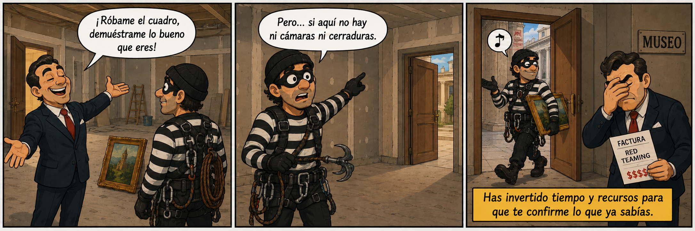
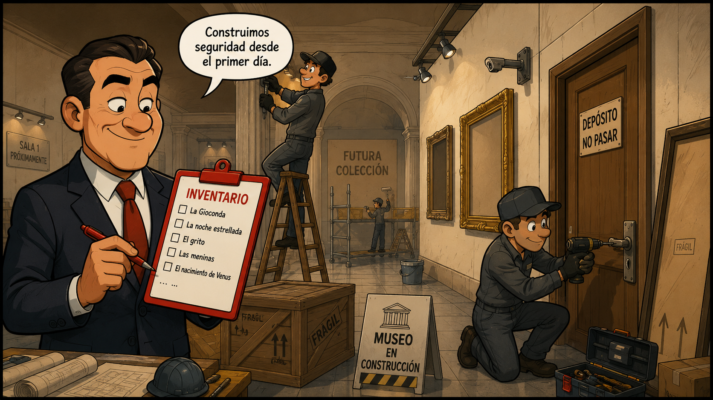
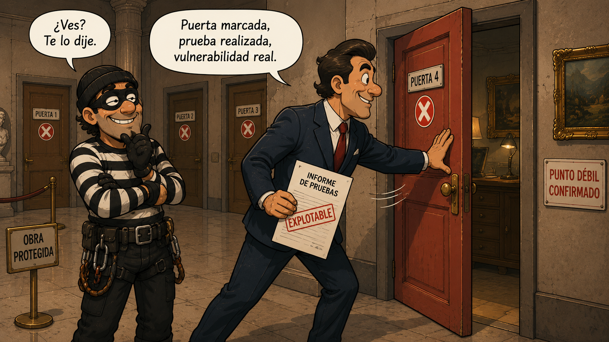
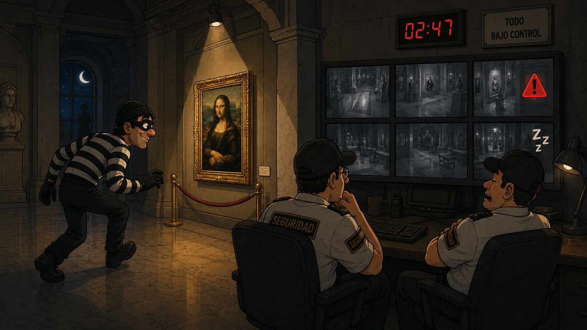
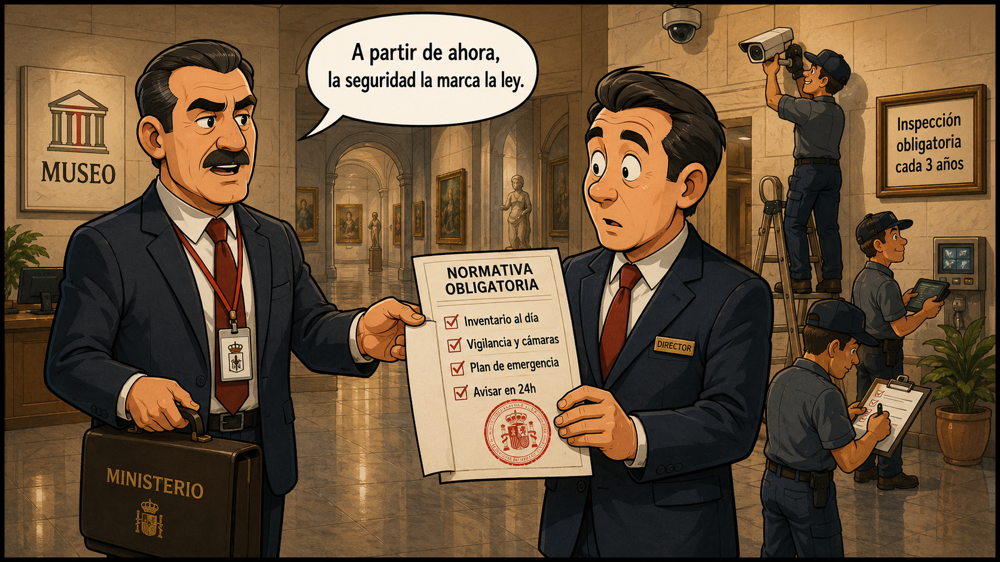
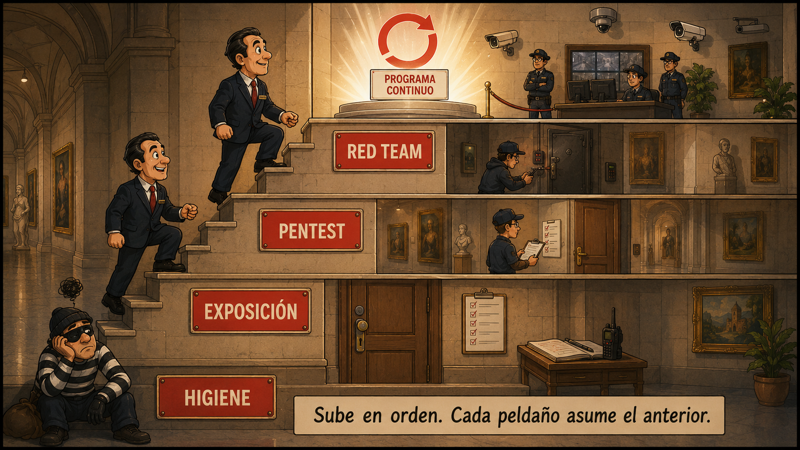

> Este post lo escribí en su día y se publicó originalmente en [Security Art Work](https://www.securityartwork.es/2026/07/13/que-servicio-seguridad-ofensiva-necesitas/) (S2GRUPO) el 13 de julio de 2026.

## Introducción

Vuelve por un momento al museo del [artículo anterior](../red-teaming-pensar-como-el-adversario/). Solo que esta vez imagínate algo distinto: el director, antes de instalar una sola cámara, antes de poner cerraduras en las puertas, antes de nada… coge el teléfono y contrata al mejor ladrón del mundo para que intente robar el cuadro.

¿El resultado? El ladrón entra por la puerta, que está abierta, coge el cuadro y se va. Diez minutos. Pero antes hubo semanas de coordinación, preparación y reuniones, y una factura considerable, para confirmarte algo que ya sabías: que no tienes nada.

Ha sido una pérdida de recursos para confirmar lo evidente. No has aprendido nada que no supieras.

Y aquí está la clave: el error no fue contratar al ladrón. Fue el momento en el que lo contrató. Ese mismo ladrón, en un museo con cámaras, guardias y vitrinas, te habría enseñado muchísimo. En un museo vacío, solo te confirma lo obvio.

Con los servicios de seguridad ofensiva pasa exactamente lo mismo. No se eligen al azar. No se trata de coger el más sencillo para cumplir, ni el más ambicioso para presumir. Se trata de elegir el que necesitas según el momento en el que estás.

Porque estos servicios no son platos de una carta: son peldaños de una escalera. Y subirlos en orden es lo que separa aprovechar tus recursos de malgastarlos.

## Madurez: no es un menú, es una escalera

La "madurez" en seguridad no es una etiqueta de marketing: es, sencillamente, cuánto has construido y cuánto lo has probado. Una organización madura no es la que más herramientas tiene, sino la que sabe qué tiene, lo protege, detecta cuando algo va mal, responde y se recupera.

Si quieres algo más formal, el *NIST Cybersecurity Framework* da una buena definición:

> La madurez de seguridad es el grado en que las capacidades de seguridad de una organización son consistentes, repetibles y mejorables en el tiempo; es decir, mide cómo de bien gestionas el riesgo, no qué herramientas posees.

Esa última parte es la clave. Madurez no es tener el EDR más caro del mercado: eso te hace estar equipado, no maduro. El propio NIST lo ordena en cuatro niveles: desde el que va apagando fuegos sin proceso, pasando por el que ya decide en función del riesgo, hasta el que tiene la gestión tan rodada que aprende de cada incidente y se ajusta solo. Y lo que miden esos niveles no es cuánto te has gastado en defensa, sino cómo de integrada está tu forma de gestionar el riesgo.

Y hay un detalle importante: el nivel más alto no es la meta para todos. Cada organización debería apuntar al que encaje con su negocio y con el riesgo que está dispuesta a asumir. Querer el último peldaño porque sí es malgastar recursos… igual que contratar un Red Team sin estar listo para él.

Falta una pieza, y la pone el *C2M2* del Departamento de Energía de EE. UU.: sus niveles son acumulativos. Para llegar a uno tienes que cumplir todo lo del anterior. No hay atajos ni se saltan los cimientos. Ahí está, en una frase, por qué esto es una escalera y no un menú. Mide además cada área por separado, así que puedes ir sobrado gestionando vulnerabilidades y flojo respondiendo a incidentes.

Y esas cinco cosas que decíamos al principio (saber qué tienes, protegerlo, detectarlo, responder y recuperarte) son justo las cinco funciones del NIST CSF: Identificar → Proteger → Detectar → Responder → Recuperar. No es casualidad que vayan en ese orden: no puedes responder a algo que no detectas, ni detectar en sistemas que ni siquiera sabías que tenías.

Los servicios de seguridad ofensiva van por el mismo camino. Cada uno pone a prueba una función más, y cada uno da por hecho que las anteriores ya están cubiertas. Por eso son una escalera: contratar por encima de tu madurez es invertir tiempo y esfuerzo en confirmar algo que ya sabes; quedarte por debajo es no enterarte de lo que de verdad falla.

Así que saber en qué peldaño estás es la decisión más inteligente que puedes tomar antes de mover un solo recurso.

## Los servicios de un vistazo

Antes de entrar en detalle, el mapa completo. La idea es sencilla: hay tres servicios principales, que forman el grueso del recorrido, y un conjunto de servicios especializados que se ejecutan cuando ya tienes una base.

Cada uno de los tres principales mira una "superficie" distinta del problema y responde a una pregunta distinta:

| Servicio | Superficie que mira | Qué resuelve |
|----------|--------------------|--------------|
| Vulnerability Assessment | Superficie de exposición: todo lo que tengo expuesto | ¿qué tengo y dónde estoy expuesto? |
| Penetration Testing | Superficie de ataque: enumera los vectores reales y los prueba todos dentro del alcance | ¿es explotable de verdad y qué impacto tiene? |
| Red Teaming | Superficie de ataque orientada a objetivos: elige los caminos que llevan a una meta, como un adversario | ¿me defiendo de un adversario que va a por algo? |

Fíjate en que cada escalón no añade solo profundidad, añade intención: se pasa de "qué hay" a "qué es atacable" y, de ahí, a "qué haría alguien que quiere conseguir algo concreto".

Y alrededor de ellos, los especializados, que afinan o extienden lo anterior:

| Servicio | Qué resuelve |
|----------|--------------|
| Auditoría de equipos | ¿están mis sistemas bien configurados y fortificados? |
| Breach & Attack Simulation (BAS) | ¿mis controles saltan cuando deben, de forma continua? |
| Intrusión física | ¿aguanto a quien entra por la puerta y no por la red? |
| Simulación de ransomware | ¿sobrevivo a un cifrado y vuelvo a operar? |

Hasta aquí el mapa. Ahora bajemos al detalle de cada peldaño: cuándo te toca, qué te da y cuándo todavía no.

## Los peldaños, en detalle

Para cada nivel, lo mismo: cómo saber si estás ahí, qué encaja, qué obtienes e, igual de importante, qué NO tiene sentido todavía.

### Nivel 0: Higiene básica (todavía no toca ofensiva)

Antes de pagar a nadie por atacarte, toca lo aburrido: la higiene de seguridad. Es tener cerraduras en las puertas, controlar quién tiene las llaves y saber qué hay dentro del edificio. Sin eso, cualquier ejercicio ofensivo te va a contar lo que ya intuyes. Y no es un detalle menor: año tras año, los informes de brechas (como el Verizon DBIR) repiten que la mayoría de los incidentes siguen entrando por lo de siempre, una credencial robada o reutilizada, un sistema sin parchear o un activo expuesto que nadie estaba vigilando.

- Señales de que estás aquí: no tienes un inventario fiable de activos ni de software; el parcheo va a salto de mata, sin priorizar por criticidad; no hay MFA generalizado y las contraseñas se reutilizan; la red es plana, sin segmentar; los privilegios se reparten "por si acaso"; y, si existen copias de seguridad, nunca se ha probado restaurarlas.
- Qué encaja: lo esencial primero, eso que marcos como los CIS Controls agrupan en su primer grupo de implementación (IG1) bajo el nombre de higiene básica. Inventario de activos y de software, gestión de vulnerabilidades y parches, MFA, configuración segura y hardening, mínimo privilegio, segmentación de red, registro de eventos y copias de seguridad que de verdad se han probado a restaurar.
- Qué NO tiene sentido aún: contratar un Red Team, ni siquiera un pentest a fondo. Es el ladrón en el museo sin cámaras: entra seguro y no aprendes nada que no supieras. Cada recurso que metas aquí en ofensiva es un recurso que dejas de meter en cerrar las puertas que ya sabes que están abiertas.

### Nivel 1: Saber qué tienes y dónde te expones

Con la higiene en marcha, el siguiente paso es tener una foto clara de por dónde podrían entrar. Aquí entra el análisis de vulnerabilidades: la disciplina de buscar, de forma amplia y sistemática, los fallos conocidos que asoman en tus sistemas. El NIST lo define como el examen sistemático de un sistema para identificar deficiencias de seguridad (NIST SP 800-30). En la práctica, es pasar tu superficie por un peine fino y automatizado para saber qué hay y qué pinta tiene.

- Señales: ya tienes lo básico cubierto, pero no una foto clara de tu exposición. Sabes que tienes activos, aunque no del todo qué versiones corren, qué expones a internet ni qué vulnerabilidades conocidas acumulas.
- Qué encaja: un análisis de vulnerabilidades, a ser posible con escaneo autenticado (con credenciales) y no solo desde fuera, que ve mucho más que uno a ciegas. Busca, identifica y cataloga fallos conocidos de forma amplia y recurrente. Amplitud sobre profundidad: no se trata de explotar nada, sino de levantar el inventario de grietas.
- Qué obtienes: un mapa de tu superficie de exposición y una lista priorizada de qué tapar primero, idealmente cruzando la severidad técnica (CVSS) con el contexto de negocio y la probabilidad real de explotación (métricas como EPSS o la lista de vulnerabilidades explotadas activamente del CISA KEV). Cubre *Identificar* y empuja *Proteger*.
- Qué NO tiene sentido aún: saltar al pentest o al Red Team. Si todavía acumulas una lista de vulnerabilidades conocidas sin tapar, pagar por que alguien las explote solo te va a confirmar lo que el escáner ya te dijo, y un Red Team entrará por la primera de ellas sin que aprendas nada nuevo. Primero reduce esa exposición evidente; cuando ya no sepas cuáles de los fallos que quedan son explotables de verdad, será el momento de subir al siguiente peldaño.

### Nivel 2: Comprobar qué es explotable de verdad

Una lista de vulnerabilidades te dice dónde hay grietas; no te dice cuáles ceden si alguien empuja. Ese salto, de lo teórico a lo demostrado, es el pentest. El NIST lo describe como una prueba en la que los evaluadores intentan evadir o derrotar las medidas de seguridad de un sistema (NIST SP 800-115). Aquí ya no se cataloga el fallo: se explota, se encadena con otros y se mide hasta dónde permite llegar.

- Señales: tienes el análisis de vulnerabilidades hecho y una lista priorizada, pero no sabes el impacto real que tendrían encadenados. Necesitas pasar de "esto parece vulnerable" a "esto compromete tal sistema y estos datos".
- Qué encaja: un pentest con alcance acotado (externo o interno). El equipo coge los fallos, los explota para demostrar que son reales, los combina y persigue un objetivo técnico. Profundidad sobre amplitud. Conviene fijar bien las reglas de enfrentamiento y, según el caso, elegir el grado de información que se entrega (desde caja negra sin datos hasta caja blanca con acceso y documentación).
- Qué obtienes: confirmación de riesgos reales con evidencia reproducible, una cadena de explotación que enseña el impacto de negocio y recomendaciones priorizadas para remediar. Separa el ruido (el fallo que nadie puede explotar) de lo que de verdad te puede hacer daño: tu superficie de ataque real, la que cede al empujar. Añade *Detectar* de forma incipiente.
- Qué NO tiene sentido aún: confundirlo con un Red Team. El pentest suele ser conocido por la defensa, va contra un alcance cerrado y busca cobertura técnica; no mide si tu SOC detecta y reacciona ante alguien sigiloso que se toma su tiempo. Cobertura no es lo mismo que sigilo, y un buen pentest no finge ser invisible: su valor está en encontrar y demostrar, no en esconderse.

### Nivel 3: Resistir a un adversario real

El pentest te dice si una puerta se abre. El Red Team te dice si alguien se entera cuando la cruzan, se mueven por dentro y van a por lo que importa. Ya no se pone a prueba un sistema, sino toda la organización: la tecnología, los procesos y las personas que defienden. Por eso el NIST lo describe como un ejercicio que, reflejando condiciones reales, simula el intento de un adversario de comprometer las misiones o procesos de negocio de una organización (CNSSI 4009). La diferencia clave no es técnica: es que aquí la defensa no avisa, no sabe que está siendo puesta a prueba.

- Señales: ya proteges, detectas y empiezas a responder. Tienes SOC, EDR, procesos de respuesta y un equipo que sabe lo que hace, pero nunca los has medido contra alguien que se comporta como un atacante real, se toma su tiempo y no quiere que lo vean.
- Qué encaja: un ejercicio de Red Team guiado por un modelado de amenazas. Se elige un adversario plausible para tu organización (sector, geopolítica, exposición), se emulan sus TTPs reales (apoyándose en marcos como MITRE ATT&CK) y se persigue un objetivo de negocio concreto (acceder a tal dato, llegar a tal sistema), con sigilo y sin que la defensa lo sepa. No se mide la cantidad de fallos, sino la capacidad real de detección y respuesta: ¿lo ven?, ¿en cuánto tiempo?, ¿reaccionan bien?
- Qué obtienes: la medida real de tu detección y respuesta (*Responder* y *Recuperar*), un mapa de puntos ciegos y, sobre todo, un relato del incidente paso a paso que enseña dónde se rompió la cadena. No recorre toda la superficie, sino el camino que un adversario tomaría para llegar a su objetivo. Es el ejercicio que más se parece a lo que pasaría de verdad.
- Qué NO tiene sentido: medir el ejercicio por "¿entraron o no?". Con tiempo y recursos, entran; eso lo sabíamos antes de empezar. La pregunta que paga el ejercicio es qué pasó después: cuánto tardaron en verlo, si supieron contenerlo y qué se aprende para la próxima.

## ¿Y si estás regulado? DORA y TIBER-EU

Hasta aquí hemos hablado de elegir según tu madurez, como si la decisión fuera solo tuya. Pero para una parte del tejido empresarial, sobre todo el sector financiero, alguno de estos peldaños ha dejado de ser una opción para convertirse en una obligación legal.

Volvamos al museo. Imagina que ya no es el director quien decide cuánta seguridad pone: llega el Ministerio de Cultura y dicta una norma. Todo museo que custodie obras por encima de cierto valor está obligado a tener inventario al día, vigilancia, cámaras, un plan de emergencia probado y a avisar a la autoridad en cuestión de horas si entra un ladrón. Y los más importantes, además, tendrán que pasar cada cierto tiempo una prueba de robo realista y supervisada. La seguridad deja de ser una elección y pasa a tener un suelo mínimo marcado por ley. Eso, trasladado al mundo digital y al sector financiero, es DORA.

### Qué es DORA

DORA (*Digital Operational Resilience Act*, Reglamento UE 2022/2554) es la norma europea que, desde el 17 de enero de 2025, exige al sector financiero ser capaz de resistir, responder y recuperarse ante incidentes tecnológicos. No es una recomendación ni una guía de buenas prácticas: es un reglamento de obligado cumplimiento.

Aplica a un abanico amplio de entidades: bancos, aseguradoras, empresas de inversión, entidades de pago, fintechs, proveedores de criptoactivos, gestoras de fondos… y también a los proveedores TIC críticos de los que dependen, como los grandes proveedores de nube. Se apoya en varios pilares: gestión del riesgo tecnológico, notificación de incidentes, gestión del riesgo de terceros, intercambio de información y, el que nos interesa aquí, las pruebas de resiliencia.

Dentro de esas pruebas, las entidades que las autoridades designen por su criticidad están obligadas a someterse a un TLPT (*Threat-Led Penetration Testing*): un ejercicio ofensivo dirigido por inteligencia de amenazas, normalmente cada tres años. Aquí es donde la escalera de este artículo se cruza de lleno con la ley.

### Qué es TIBER-EU

Si DORA dice "tienes que hacer la prueba", TIBER-EU dice "así es como se hace". Es el marco creado por el Banco Central Europeo en 2018 que estandariza cómo se ejecuta ese TLPT: cómo se define el alcance, cómo se usa la inteligencia de amenazas para elegir a qué adversario emular, cómo se lanza un Red Team contra los sistemas reales en producción y cómo se supervisa todo de principio a fin para que no se rompa nada de verdad. Cada país tiene su adaptación; en España es TIBER-ES, coordinado por el Banco de España.

En el museo, TIBER-EU sería el protocolo oficial de cómo se organiza esa prueba de robo: quién autoriza al ladrón, cómo se estudia primero el modus operandi de un ladrón real para que la prueba sea creíble, que se hace con el museo abierto al público (en producción) pero con un pequeño grupo de confianza vigilando para que nada acabe roto, y con un inspector de la autoridad validando que se hizo bien. Está estandarizado para que la prueba de un banco sea comparable a la de otro.

En la práctica, un TLPT bajo TIBER-EU es un Red Team de gama alta: guiado por *threat intelligence* real, ejecutado contra producción y con un proceso formal de extremo a extremo.

### ¿Estás sujeto a un marco así? Cómo saberlo

La primera pregunta es sencilla: ¿operas en el sector financiero de la UE? Si eres banco, aseguradora, empresa de inversión, entidad de pago o de dinero electrónico, gestora de fondos o proveedor de criptoactivos, DORA te aplica casi con seguridad. Y si eres un proveedor TIC del que dependen esas entidades, puede alcanzarte también.

Otra cosa distinta es estar obligado en concreto al TLPT: eso no aplica a todas, sino a las entidades que las autoridades competentes designan por su tamaño y criticidad. Para salir de dudas, el camino corto es preguntar a tu equipo de cumplimiento o legal y consultar a tu supervisor (en España, según el sector, el Banco de España, la CNMV o la DGSFP).

Y ojo, que DORA no es el único marco. Fuera del mundo financiero hay otros que también imponen obligaciones de seguridad, como NIS2 para sectores esenciales (energía, transporte, sanidad, agua…). Si tu actividad es sensible, conviene comprobarlo antes de dar por hecho que la decisión es solo tuya.

La conclusión para el resto del artículo: si estás regulado, los peldaños altos de la escalera no son una aspiración, son una obligación. Y como toda obligación de este tipo, exige haber subido antes los de abajo: no se pasa un TLPT con éxito, ni se aprende de él, sin la madurez previa de identificar, proteger y detectar.

## Preguntas para un autodiagnóstico

Antes de nada, una advertencia honesta: lo que sigue es orientativo. Te ayuda a situarte de forma aproximada, pero no es un diagnóstico definitivo ni sustituye a un estudio hecho por profesionales sobre tu caso concreto (tu sector, tu arquitectura, tus riesgos y tus obligaciones). Tómalo como una brújula, no como un GPS.

Dicho esto, responde con sinceridad. Donde se corte tu primer "no", ahí está tu peldaño:

1. ¿Tienes inventario fiable, parcheo al día, MFA generalizado y copias probadas? → Si no: Nivel 0, higiene básica.
2. ¿Sabes qué tienes expuesto y con qué vulnerabilidades conocidas? → Si no: Nivel 1, análisis de vulnerabilidades.
3. ¿Has confirmado explotando cuáles de esos fallos son reales y su impacto? → Si no: Nivel 2, pentest.
4. ¿Tienes detección y respuesta (SOC/EDR/IR) y los has probado a ciegas? → Si no: Nivel 3, Red Team / Simulación de Adversarios.
5. ¿Ya tienes Red Team maduro y quieres medir un escenario concreto (intrusión física, resiliencia ante ransomware, auditoría de equipos)? → servicios especializados.
6. ¿Operas en banca o finanzas de la UE, o en un sector esencial? → revisa si DORA o NIS2 te obligan (y, en su caso, a un TLPT).

> Regla de oro: si un servicio te va a confirmar algo que ya sabes, todavía no es tu servicio. El bueno es el que te revela algo que no sabías.

¿Quieres ir más a fondo? Te dejo un autodiagnóstico en Excel con más de 30 preguntas por áreas, que calcula tu nivel y te sugiere en qué peldaño centrarte:

[Descargar el autodiagnóstico en Excel](autodiagnostico-madurez.xlsx)

Que conste una vez más: incluso esa hoja es orientativa. Para decidir de verdad qué contratar, lo sensato es un estudio profesional sobre tu situación concreta.

## Errores comunes

Casi todos los problemas con la seguridad ofensiva no vienen del servicio en sí, sino de elegirlo o usarlo mal. Estos son los tropiezos que más se repiten, de mayor a menor gravedad.

- Saltarse peldaños. Es el error más caro y el más frecuente. Buscar profundidad sin tener cubierta la amplitud: contratas un Red Team cuando ni siquiera sabes qué tienes expuesto. Encuentras un camino de entrada, pero te quedan diez sin mirar, y pagas por confirmar lo que ya intuías. La escalera existe por algo: cada peldaño da por hecho el anterior.
- Tratarlo como un evento aislado. Un ejercicio suelto es una foto fija; la seguridad es una película. El valor está en el ciclo: pruebas, aprendes, corriges y vuelves a probar. Pasar un Red Team una vez para tachar la casilla no construye madurez, solo tranquiliza la conciencia.
- Comprar lo que está de moda. "Quiero un Red Team" porque suena bien en la reunión, cuando lo que necesitas es un pentest y tapar lo básico. El nombre impresiona; el resultado no aporta más si llega antes de tiempo.
- No definir el objetivo del ejercicio. Contratar "un pentest" o "un Red Team" sin concretar qué pregunta debe responder ni qué se considera un éxito. Sin un objetivo claro, el proveedor improvisa el alcance y tú recibes un informe que no encaja con lo que de verdad te preocupaba. Antes de firmar, ten clara una cosa: ¿qué quiero saber cuando esto termine?
- No tener claro el objetivo de madurez. Perseguir el peldaño más alto porque sí, sin saber a qué nivel necesitas llegar de verdad. Como avisa el propio NIST, la meta no es el máximo para todos, sino el que encaje con tu negocio y tu tolerancia al riesgo. Apuntar más alto de lo necesario también es malgastar recursos.
- No saber para qué sirve cada ejercicio. Cada uno mide algo distinto, y aplicar la vara equivocada lleva a conclusiones absurdas. En un pentest, que te detecten o no no dice nada de su calidad: el pentester no busca sigilo, busca cobertura y demostrar impacto, y de hecho lo normal es que se le vea. El sigilo y la detección son justo lo que evalúa un Red Team, no un pentest. Pedirle a cada servicio lo que no le toca solo genera frustración e informes mal leídos.

## Conclusiones

Hemos recorrido la escalera entera: desde la higiene básica que lo sostiene todo, pasando por conocer tu exposición y confirmar qué es explotable de verdad, hasta ponerte a prueba ante un adversario real. En el fondo es un cambio de intención: de saber qué tienes, a qué es atacable, a qué haría alguien que va a por algo concreto. Y alrededor, los servicios especializados y, si te toca, las obligaciones regulatorias como DORA.

La idea de fondo es una sola: la seguridad ofensiva bien elegida no es la más ambiciosa ni la que mejor suena en una reunión, es la que encaja con tu momento. Sube los peldaños en orden y cada uno te revelará algo que no sabías. Sáltatelos y acabarás como el museo del principio, invirtiendo tiempo y recursos en que un ladrón te confirme que no tenías ni cámaras.

Y el Red Team tampoco es la meta final. La madurez de verdad no es pasar un ejercicio, sino convertir todo esto en un programa que se sostiene y mejora con el tiempo.

Si después de leer esto no tienes del todo claro en qué peldaño estás, no pasa nada: darte cuenta de eso ya es el primer paso. Empieza por el [autodiagnóstico](autodiagnostico-madurez.xlsx) y, a partir de ahí, decide con criterio.

## Referencias

1. NIST — *Cybersecurity Framework (CSF)*. *Implementation Tiers* (Parcial, Informado por el riesgo, Repetible, Adaptativo): describen lo madura e integrada que está la gestión del riesgo, no la calidad de los controles; el Tier más alto no es el objetivo universal, sino el que encaje con el negocio y la tolerancia al riesgo de cada organización. Funciones del marco: Identificar, Proteger, Detectar, Responder, Recuperar.
2. U.S. Department of Energy — *Cybersecurity Capability Maturity Model (C2M2)*. Niveles de indicador de madurez acumulativos (MIL0–MIL3): alcanzar un nivel exige cumplir las prácticas de ese nivel y de todos los anteriores. La madurez se evalúa por dominios de forma independiente.
3. Center for Internet Security — *CIS Critical Security Controls*. El grupo de implementación 1 (IG1) define la higiene cibernética esencial: inventario de activos y software, gestión de vulnerabilidades, MFA, configuración segura, control de accesos y copias de seguridad, entre otros.
4. Verizon — *Data Breach Investigations Report (DBIR)*. Informe anual que, edición tras edición, sitúa las credenciales comprometidas, la explotación de vulnerabilidades conocidas y los errores de configuración entre los principales vectores de las brechas.
5. NIST — definiciones de análisis de vulnerabilidades (*SP 800-30*), de penetration testing (*SP 800-115*) y de ejercicio de Red Team (*CNSSI 4009*). Modelos de priorización: *CVSS* (severidad técnica), *EPSS* (probabilidad de explotación) y *CISA KEV* (catálogo de vulnerabilidades explotadas activamente).
6. MITRE — *ATT&CK*. Base de conocimiento de tácticas, técnicas y procedimientos (TTPs) de adversarios reales, usada para diseñar y mapear la emulación en un ejercicio de Red Team.
7. Unión Europea — Reglamento (UE) 2022/2554, *Digital Operational Resilience Act (DORA)*. Aplicable desde el 17 de enero de 2025; regula la resiliencia operativa digital del sector financiero e incluye la obligación de TLPT para las entidades designadas por su criticidad.
8. Banco Central Europeo — marco *TIBER-EU* (*Threat Intelligence-Based Ethical Red Teaming*, 2018) y su adaptación nacional *TIBER-ES* (Banco de España): método estandarizado para ejecutar un TLPT guiado por inteligencia de amenazas contra sistemas en producción.
9. Unión Europea — Directiva (UE) 2022/2555, *NIS2*. Obligaciones de ciberseguridad para entidades esenciales e importantes fuera del sector financiero (energía, transporte, sanidad, agua, etc.).
