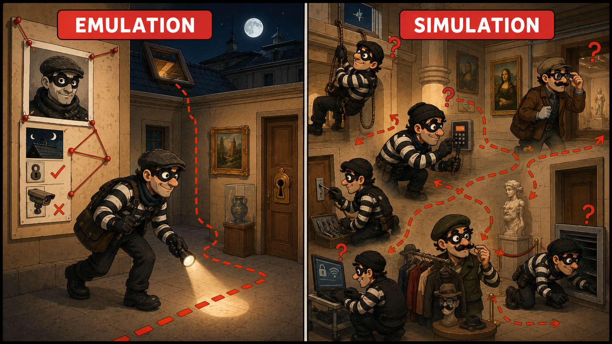
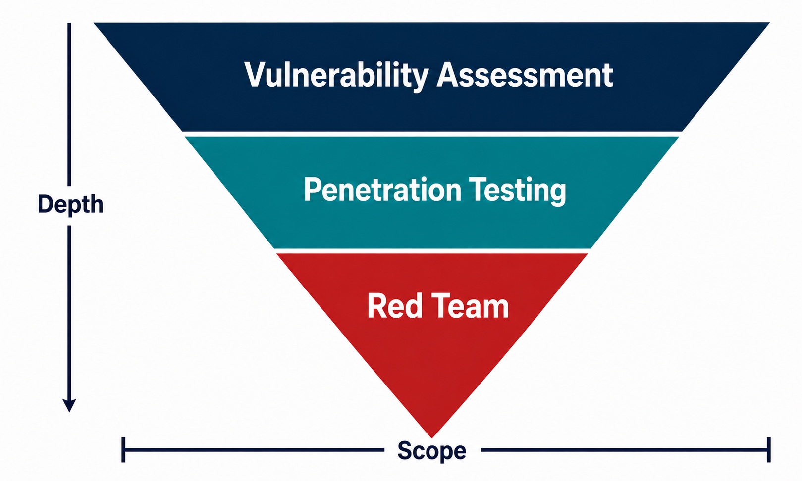
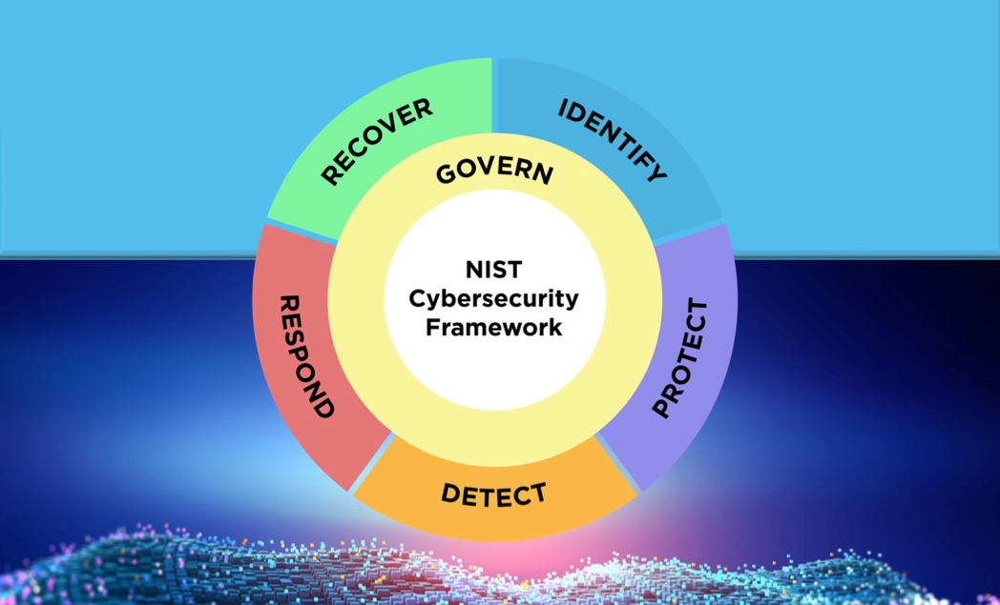
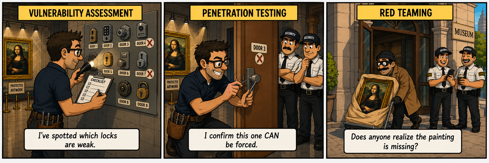
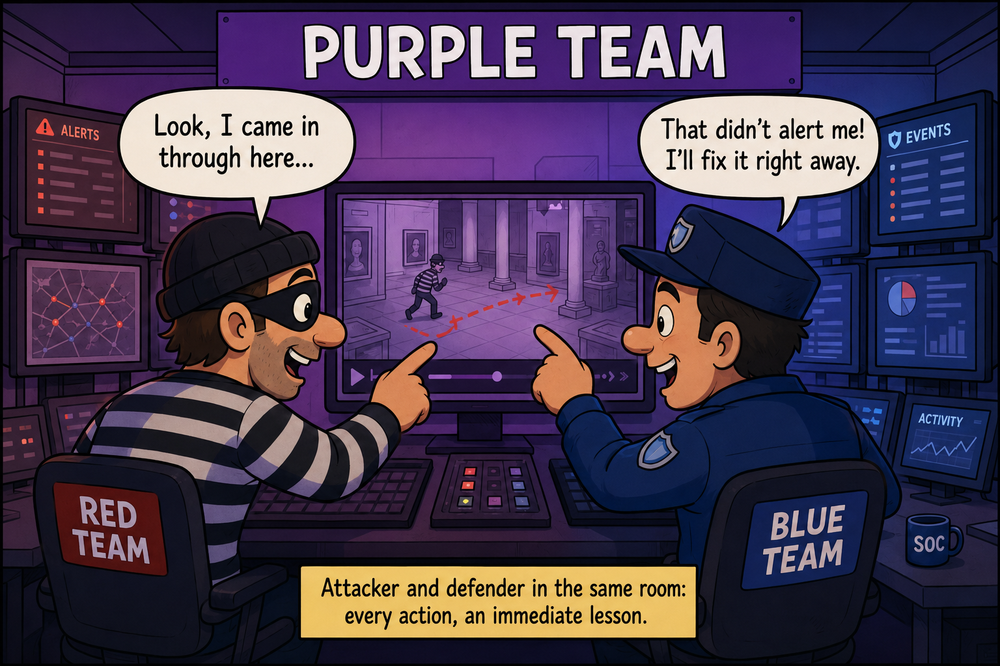

> I wrote this one back in the day, and it was originally published on [Security Art Work](https://www.securityartwork.es/2026/07/06/red-teaming-pensar-como-adversario/) (S2GRUPO) on July 6, 2026.

## Introduction

Picture a museum. One of those with a piece worth more than the whole building. Cameras everywhere, guards in every room, motion sensors, an armored display case straight out of a movie. The director sleeps soundly: _"this is Fort Knox, nobody gets in here"_.

But one day he does something odd. He picks up the phone and hires a thief. A real one, one of the good ones. And he tells him: _"Steal the painting. Don't warn anyone, don't hold back. I want to see how far you can get"_.

And here's the good part. The director expected a Mission Impossible movie: the thief lowering himself from the ceiling on harnesses, dodging lasers, drilling the armored case with a surgeon's precision.

None of that.

The thief showed up at nine in the morning in work overalls with a cleaning cart. He told the guard he was there to fix the air conditioning in room 3. The guard, who didn't even look up, opened the door for him. It turned out the €40,000 armored case opened with a key hanging in the little maintenance room, the one whose lock had been broken for months. The thief grabbed the painting, tucked it under some rags in the cart, said _"see you later, boss"_ on the way out… and the boss replied _"take care"_.

Zero lasers. Zero harnesses. The museum's most expensive piece walked out the front door in broad daylight, waving.

And you know what's the most uncomfortable part? The cameras recorded everything. They worked perfectly. Nobody was watching them.

This is the big difference between believing you're protected and knowing it.

Setting up a company's security is a headache. It's not just installing an antivirus and calling it a day. You pull on one side and it tightens on the other: clients ask you for guarantees, compliance chases you with its checklists, management wants results now, and if something hits the press the whole circus comes to town. All of it at once.

And then there's the money. There's almost never as much as you'd need, and the worst part isn't that: the worst part is that often nobody even knows what to spend it on. The trendy tool gets bought, the box gets ticked, and on to the next thing.

Underneath all this there's an idea nobody says out loud but that's always there: _"this happens to others, not to us"_. And from that idea the usual myths are born:

- _"If the user doesn't click, there's no breach."_
- _"We have an EDR, we're covered."_
- _"We comply with ISO 27001, our infrastructure is secure."_

Sounds reasonable. The problem is that reality doesn't read your certificates.

In 2016, the Lazarus group walked away with 81 million dollars from the Central Bank of Bangladesh. Not from a corner shop: from a country's central bank, connected to the SWIFT network, with all the protection you can imagine on top. Do you really think those networks weren't packed with controls, audits, and certifications?

They were. And it happened anyway.

So the question isn't _"do we have security?"_. The question is _"does it actually work when someone puts it to the test?"_.

## What is Red Teaming?

When we talk about what Red Teaming is, also known as Adversary Simulation or Emulation, that's when the first problem shows up. If you ask ten people what it is, you'll probably get fifteen different answers. There are definitions for every taste.

Of all the ones I've read, there's one I find especially accurate. It's the one by Joe Vest and James Tubberville in their book _Red Team Development and Operations_:

>Red Teaming is the process of using Tactics, Techniques and Procedures (TTPs) to emulate a real-world threat, with the goal of training and measuring the effectiveness of the people, processes and technology used to defend an environment.

From this definition we can pull out three important ideas:

1. _"Emulate a real-world adversary"_. It's not about launching a scanner and reviewing the list of flaws it returns. It's about behaving the way someone who actually wants to cause harm would. And that changes everything, because an attacker is not a vulnerability nor an exploit in a report: it's an intelligent person, with patience and a goal, and sometimes with enough capital to achieve their purpose. And when we talk about capital, we mean very concrete things: they can buy a zero-day _exploit_ for hundreds of thousands of dollars, pay a disgruntled employee to open a door from the inside, or sustain an operation for months without rushing to cash in.
   That's why the first thing, before touching anything, is to be clear about who you're protecting yourself from. Defending against an opportunistic attacker is not the same as defending against a state-sponsored group (APT) that has spent months studying its target. The tools change, the goals change, and the patience changes. If you don't know which adversary you're facing, you're putting up bars without even knowing whether the intruder comes through the window or the door.

2. _"Train and measure"_. Red Teaming's purpose is not to hand over a list of vulnerabilities; there are other approaches for that. It exists to answer far more complex and uncomfortable questions: would your team notice? In how long? Would they know how to react? It's a fire drill, but with real fire.

3. _"People, processes and technology"_. Here's the real heart of the matter. There's a tendency to understand security as a purely technical problem (firewall, antivirus, patches) and to forget the other two legs. But at the museum, the technology didn't fail: the cameras worked. What failed was the person who wasn't watching the screens and the process that left a key hanging in a room with a broken lock. Red Teaming tests all three dimensions at once, because a real attacker will always go for the weakest one, and it's rarely the technology.

None of this is improvised. A good exercise starts from well-defined objectives and scenarios, and for that it's key to identify the organization's critical functions and the impact of seeing them compromised. Without that direction, it's not a Red Team exercise: it's a group of people trying things to see what they find.

### Emulation vs Simulation

A note on the names: within Red Teaming there are two distinct approaches. Emulating an adversary is not the same as simulating one.

|  | Emulation | Simulation |
|---|---|---|
| Threat | Specific, real | Hypothetical |
| TTPs | Known (threat intelligence) | Free or custom |
| Scope | Narrow | Broad |
| Purpose | Harden defenses against that actor | Improve against a range of threats |

The purpose of adversary emulation is to develop, test, and tune an organization's ability to detect and respond to the TTPs of a specific threat. It provides a focused evaluation of their capabilities against a threat actor that is more likely to target them; in these scenarios, the red team leverages threat intelligence (TI) reports to mirror that actor's known TTPs as closely as reasonably possible. It's like preparing for a specific thief whose modus operandi you already know: breaks in at night through the roof, always picks the same kind of lock, avoids the east wing cameras. You want to see whether you stop that one.

Adversary simulation, conversely, lets the red team behave like a completely hypothetical threat, far less restricted in the TTPs it can leverage. This gives the organization a broader evaluation of its capabilities and can highlight lesser-known blind spots. Following the same analogy, it's letting loose any thief, with no script, free to use whatever tricks they come up with, to see how you hold up against any style of break-in.

## What Red Teaming is NOT

Sometimes the best way to understand something is to define what it isn't. And Red Teaming carries enough misconceptions to deserve a section. Let's dismantle a few.

- It's not hacking for the sake of hacking. It's not about breaking in for sport, planting a flag and leaving. If an exercise ends with a _"we got in, congrats everyone"_ and little else, it failed. The goal is not access itself, but the actionable value extracted from it: what failed, where, what could have been done differently, and what needs fixing starting tomorrow. A Red Team that doesn't leave the organization better than it found it hasn't done its job.

- It's not an exam, nor an attempt to embarrass anyone. Here lies one of the biggest sources of rejection toward this discipline: the idea that someone comes from outside to show how badly the internal team does its job, to point fingers and humiliate the Blue Team. Nothing further from the truth. The Red Team is not the enemy: it's the drill, not the fire. It's there so that, when the real fire comes, everyone knows exactly what to do. If an exercise is experienced as a trial, someone has misunderstood the purpose.

- It's not a "did they get in or not?". This is perhaps the most widespread confusion. Reducing the outcome to whether the Red Team managed to compromise the organization is staying on the surface. They almost always get in, as we'll see later; the interesting question is what impact is demonstrated along the way. The "yes, they got in" is the start of the analysis, not the end.

- It's not a one-off service. Security is not a state you reach, but something you maintain and that erodes constantly. The real value appears when Red Teaming is understood as a process that builds maturity: exercise, lessons learned, improvements, and start again. Doing it once to tick a box doesn't deliver the same value.

- It's not only the offensive team's thing. We tend to imagine Red Teaming as a group of attackers doing their magic in a basement, and little else. But an exercise without a Blue Team to detect and respond loses half its meaning, nothing is being measured. And without management understanding the results and deciding to act on them, the report ends up in a drawer. Red Teaming delivers value when the whole organization takes part: the offensive team, the defensive one, and whoever makes the decisions.

Deep down, all these misconceptions share the same root: confusing Red Teaming with an end (getting in, winning, showing off) when it's actually a means. A means for the organization to get to know itself better and prepare for the day the attacker isn't a fake one.

## Vulnerability Assessment vs Penetration Testing vs Red Teaming

These three terms are often used as synonyms, and they're not. Confusing them leads to hiring what you don't need, or worse, to believing you're measuring something you're actually not. Let's define them and then see them head to head.

Vulnerability Assessment. NIST defines it as the _"systematic examination of an information system or product to determine the adequacy of security measures, identify security deficiencies, provide data from which to predict the effectiveness of proposed security measures, and confirm the adequacy of such measures after implementation"_ (NIST SP 800-30). In practice: it searches, identifies and catalogs flaws. Breadth over depth.

Penetration Testing. NIST describes it as _"a test methodology in which assessors, typically working under specific constraints, attempt to circumvent or defeat the security features of a system"_ (NIST SP 800-115). Here it's no longer just about identifying the flaw: it's exploited to prove it's real and how far it allows you to go.

Red Teaming. NIST defines the Red Team exercise as _"an exercise, reflecting real-world conditions, that is conducted as a simulated attempt by an adversary to compromise the missions or business processes of an organization, in order to provide a comprehensive assessment of the security capability of the system and the organization itself"_ (CNSSI 4009 / NIST). The key word is organization: it's no longer a system being measured, it's the entire defensive environment.

The difference is much clearer when you put them head to head, point by point:

||Vulnerability Assessment|Penetration Testing|Red Teaming|
|---|---|---|---|
|Oriented to|Breadth (cover everything)|Exploitation depth|Depth + a concrete objective|
|What it measures|Assets, network or applications|Systems and their exploitability|The whole environment: people, processes and technology|
|Goal|Identify vulnerabilities|Demonstrate exploitation and impact|Measure the real state of security|
|What you get|Reduce the attack surface|Confirm real risks|Train and evaluate the defense|
|Tools|Automated scanners|Mixed (auto + manual)|Tailored, stealthy, emulating an adversary|
|Does the Blue Team know?|Yes|Usually yes|No (that's the whole point)|
|NIST functions covered|Identify, Protect|+ Detect|+ Respond, Recover|

That last row is the most revealing. If you read it left to right, you see how each approach covers a larger slice of the security lifecycle, the five functions of the _NIST Cybersecurity Framework_: Identify, Protect, Detect, Respond and Recover.

The Vulnerability Assessment tells you what you have and where you're exposed: it lives in _Identify_ and _Protect_. The Pentest adds _Detect_: by actually exploiting, it starts testing whether anything fires. But only Red Teaming reaches _Respond_ and _Recover_, because it's the only one done without warning the defenders, and therefore the only one that measures what truly matters during a real incident: do they detect it? do they react? do they recover? in how long?

Back to the museum: a vulnerability assessment is reviewing the inventory of locks and noting which ones are loose. A pentest is checking that a loose lock can indeed be forced, and opening the door to prove it. Red Teaming is hiring the thief, not telling the guards, and seeing if anyone notices the painting has walked out the front door waving.

None replaces the others. They complement each other, almost always in that order of maturity.

## What value does Red Teaming bring to the organization?

At this point, the logical question is: okay, and what's all this for, for me? The answer fits in one sentence: Red Teaming is where assumptions meet reality.

Every organization runs on two versions of itself. There's the one it believes it is, the one of the pretty diagram, the written policies, the _"this should be detected"_; and there's the one it really is when someone attacks it for real. The _IS_ versus the _SHOULD-BE_.

The museum from the start believed it was in its _should-be_ version: cameras, guards, armored case. Its _is_ version was a guy in overalls walking out the door waving. Red Teaming is the only thing that shows you the exact distance between the two.

From there, the value takes very tangible shape:

- Knowing your real security posture. Not the one in the compliance report, but the one measured in seconds and minutes: how long does it take you to detect an intrusion? how long to respond once detected? how long to fully recover? Those three times are worth more than any certificate hanging on the wall, because they're the ones that truly count on the day of the real incident.

- Training people, not just auditing machines. A Red Team exercise is the only occasion when your Blue Team and your employees face an attack that behaves like a real one… without the consequences of a real one. It's the fire drill: when the real fire comes, they'll have been through it already. They know which button to press, who to call, and what not to do in a panic. That isn't learned by reading a procedure.

- Understanding the real impact. It's one thing to say _"we have a critical vulnerability on that server"_ and a very different thing to see it demonstrated that, pulling on that thread, someone reaches the customer database and walks off with the whole thing. Red Teaming translates abstract risk into concrete consequences: this is what could happen, this is what it would cost, this is what it would look like. And nothing moves management more than seeing the impact, not hearing about it.

- Knowing where to invest. Perhaps the most practical value of all. The security budget is always limited, and the biggest waste isn't spending too little, but spending in the wrong place. An exercise shows you, with evidence, where they actually get in and which controls would have made the difference.

Deep down, it all comes down to this: Red Teaming turns _"we think we're protected"_ into _"we know exactly where we stand"_. And from knowledge you make much better decisions than from assumption.

## When should you do Red Teaming?

Here it's worth being honest: Red Teaming is not for everyone. Or rather, it's not for everyone _yet_.

There's a maturity question you can't skip. Hiring a Red Team when you don't even have the basics covered is like hiring the thief to test a museum that hasn't even installed the cameras. What for? You already know the result: they're getting in, and you won't learn anything you didn't already know. You'll have paid a considerable sum for someone to confirm the obvious.

The natural order usually goes like this. First, Vulnerability Assessment: know what you have and where you're exposed. Then, Penetration Testing: check which of that is actually exploitable and patch it. And when those foundations are laid, when you already protect and start to detect and respond, it makes sense to step up to the next level and emulate a real adversary.

So, when is an organization really ready? The sign is fairly clear: when it has already implemented detection and response capabilities and wants to know if they actually work against an attacker that behaves like one. If you have a SOC, an EDR, incident response processes, people on call… and you've never tested them against someone who plays at hiding, you're at exactly the right point. Red Teaming is what separates the _"on paper, this should fire"_ from the _"it fired, and we reacted in eleven minutes"_.

And one final note, which ties back to something we already said: this is not an audit you pass once and file away. The value isn't in the isolated exercise, but in the cycle it sets in motion: you attack, you learn, you fix, you reinforce… and you attack again to confirm that this time it holds. Each loop, the organization is a little harder to compromise and a little faster to react. Red Teaming isn't a snapshot of your security posture: it's the engine that makes it mature.

So the question isn't _"can I afford a Red Team?"_, but _"is my organization at a point where an exercise like this would reveal something I don't know?"_. The day the answer is yes, the time has come.

## Approaches: Zero Knowledge and Assumed Breach

Not all Red Team exercises start in the same place. Depending on where the attacker begins, we talk about two major approaches. It's not a minor technical detail: it conditions what gets tested and, above all, where the time is spent.

Zero Knowledge. Also called "black box". The Red Team starts from the outside, with no information and no access at all, just like a real attacker who has just picked their victim. They have to do everything: research the organization, find a crack, get that first entry point and, from there, advance toward the objective. It's the scenario most faithful to a real attack from scratch… but also the slowest and most expensive.

Assumed Breach. Here you start from an assumption: the attacker is already inside. They're granted an initial access point, a compromised employee laptop, valid credentials, a position on the network, and the exercise starts from there. Instead of spending weeks on how to get in, you start on day one working on what happens after getting in.

And here the typical objection comes up: _"if you hand them access, you're making it easy, that doesn't count"_. It's exactly the opposite, and it's worth understanding why.

Because there's an uncomfortable truth in security, and it's not some snake-oil salesman who says it: the NSA itself said it. In 2010, Debora Plunkett, then head of the agency's Information Assurance Directorate, summed it up bluntly: _"There's no such thing as secure anymore"_, and that's why _"we have to build our systems on the assumption that adversaries will get in"_. She even warned that _"the most sophisticated adversaries are going to go unnoticed on our networks"_.

If the agency with some of the best resources on the planet starts from that premise, it's reasonable for the rest to do the same. The attacker, sooner or later, gets in. It doesn't matter how much you invest in the perimeter: some user will end up clicking where they shouldn't, some credential will leak, some exposed service will have its bad day. Assuming nobody will ever get in is not a strategy, it's an illusion. The truly important question isn't _whether_ they'll get in, but what happens when they do: how far can they go? how long does it take you to notice? can they go from the reception laptop to full domain control?

That's why taking initial access for granted doesn't subtract value from the exercise: it concentrates it where it matters most. The value is in time, and time is limited. Spending it all proving, once again, that a first access can be obtained, something we already know happens, is wasting it. It's far more useful to invest it in what's critical: lateral movement, privilege escalation, reaching the "painting" and, meanwhile, measuring whether the defense notices anything.

There's also a powerful conclusion hidden here. If in an Assumed Breach exercise the Red Team reaches its objectives starting from a small foothold, that means anyone who gets that first foot in the door can compromise the entire organization. And getting that first foot in, as we've said, is only a matter of time. That's an actionable conclusion; "they didn't manage to get in from outside in two weeks" is much less so.

Back to the museum one last time: Zero Knowledge is seeing whether the thief manages to sneak into the building. Assumed Breach is something more interesting: take for granted that he's already inside, dressed as a cleaner, and ask what truly matters: once inside, what stops him from walking out with the painting?

## How is the success of an exercise measured?

If you've made it this far, you already sense that the question _"did they get in or not?"_ is the worst possible yardstick. And yet it's the first one almost everyone asks when an exercise ends.

Because a Red Team's success is not measured by whether they compromised the organization. That, at this point in the article, we take for granted: with enough time, they will. Measuring the exercise by the "yes, they got in" is like judging a fire drill by whether the fire caught. Of course it caught, we lit it on purpose. The question is what happened next.

What truly counts is this:

- The demonstrated impact. It's not the same to say _"they reached an unimportant server"_ as _"they reached the customer database and proved they could exfiltrate the whole thing"_. The value of an exercise is in how much real damage it was able to prove: how far it went and what that would have meant for the business. Impact translates the exercise into a language management understands.

- The objectives: which ones, and above all how. Before the exercise, concrete goals were set, the _"painting"_. Were they reached? But the most important question isn't _whether_, but how: by which path, exploiting which flaw, which controls were evaded and which, had they worked, would have stopped it.

- The detection and reaction of the defense. Here's the heart of the matter, and it's where we return to the museum's camera room: the footage was there, showing the heist live, but the room was empty. Having the capability is worth nothing if nobody uses it. That's why what's really measured is the Blue Team's response: did they detect anything? what exactly, and what went unnoticed? how long did it take them to realize? did they react well or did panic set in? An exercise where the Red Team reaches all its objectives but the Blue detects them and kicks them out halfway is, in reality, good news.

- The actionable data. And all of the above has to land in something concrete and executable. A good exercise doesn't end with a _"we beat you"_, but with a clear list of what to change, in what order and why. If, when the report closes, the organization doesn't know exactly what to do on Monday morning, the exercise has failed no matter how technically brilliant it was.

Deep down, measuring a Red Team well is about flipping the question. Not _"did the attacker get in?"_ (spoiler: yes), but _"how prepared were we for the day that attacker is real?"_. That's the only metric that truly matters. Everything else is ticking a box.

## What is Purple Team?

Before wrapping up, it's worth clarifying a term that constantly crosses paths with all this and causes quite a bit of confusion: the Purple Team.

First, and most important: the Purple Team is not a third type of exercise, nor an alternative to the Red Team. You don't choose between "doing a Red Team" or "doing a Purple Team". It's rather a layer of collaboration that can be added to any exercise to multiply what's learned from it.

And what does it consist of in practice? Sitting both sides in the same room. The Red Team executes a technique and, right then, you check what the Blue Team saw: did any alert fire? in which console? with what level of detail? If nothing was detected, the defense is tuned right there and you try again to confirm that now it does fire.

The value is in two things:

- Sharing intelligence, in both directions. The Red Team shows how an adversary really behaves, what tools it uses, what traces it leaves, where it moves; and the Blue Team shows what is and isn't visible from the other side of the screens. Each learns from the other's knowledge. The benefit is bidirectional, and that's why it usually leaves more of a training mark than a blind exercise.

- Comparing what was executed against what was detected. This is the Purple Team's star metric: putting side by side the list of actions the Red Team performed and the list of actions the Blue Team detected. The gaps between the two, what happened but nobody saw, are, literally, the map of your detection's blind spots. There's no more direct way to know where your visibility gaps are.

Put another way: if a classic Red Team tells you _how_ well prepared you are for a real attack, the Purple approach also helps you close the gaps on the fly, turning each action of the exercise into an immediate lesson for the defense. That's why, more than an alternative, it's an added value that almost always deserves consideration.

## Conclusions

We started with a museum that believed itself impregnable and ended up watching its most valuable piece walk out the front door, in broad daylight, hidden under some rags. The technology didn't fail: the people who weren't watching failed, and the processes that left keys hanging failed. And, above all, an idea failed: believing yourself secure without ever having checked.

If there's anything to take away from all this, it's three things.

- The first: bring in the adversary's perspective. You can't design a good defense thinking only as a defender. You have to sit in the attacker's chair and seriously ask how they'd get in, what they'd look for and which way they'd go. A security plan built without that perspective defends the front door while someone climbs in through the air duct dressed as maintenance. Red Teaming is, above all, that perspective: thinking like the adversary to anticipate the threat before it's real.

- The second: understand what it really gives you, and use it. Red Teaming isn't winning, nor getting in, nor showing off. It's a means to know yourself better: to know how long you take to detect, how you react, where your blind spots are and what's worth investing in. But all that information is worth nothing if it ends up in a drawer. The value isn't in the exercise, but in what the organization does with its conclusions on Monday morning.

- The third: distrust assumptions. _"If the user doesn't click, there's no breach." "We have an EDR, we're covered." "We comply with ISO, we're secure."_ All these myths share the same root: confusing what _should_ happen with what actually happens. Even the NSA assumes the adversary will get in. The question is never whether you're secure on paper, but whether you are when someone seriously puts it to the test.

And that's, in the end, the whole idea. The best way to know whether your museum holds isn't to admire how thick the display case is. It's to hire the thief, one of the good ones, one who plays on your team, and let him try. Better to discover the open air duct with him than with the one who doesn't give the painting back.

Because the real attacker, that one, doesn't warn you. And he certainly doesn't say goodbye waving.

*This time they do catch him. Same thief, better harnesses… but now there's detection and response: the lasers fire, the SOC watches the cameras and the guards react. The measures learned in the Red Team, working.*

## References

1. Vest, J. & Tubberville, J. — _Red Team Development and Operations: A Practical Guide._ (Definition of Red Teaming + general framework of the article.)

2. NIST — Definitions of Vulnerability Assessment (_SP 800-30_), Penetration Testing (_SP 800-115_) and Red Team Exercise (_CNSSI 4009_). Functions of the _NIST Cybersecurity Framework_: Identify, Protect, Detect, Respond, Recover.

3. Debora Plunkett (NSA) — The Atlantic / Government Executive cybersecurity forum, Dec 16, 2010. _"There's no such thing as secure anymore" / "We have to build our systems on the assumption that adversaries will get in."_ [eWeek — NSA: Assume Attackers Will Compromise Networks](https://www.eweek.com/security/nsa-assume-attackers-will-compromise-networks/)

4. Bangladesh Bank heist (Lazarus group, 2016) — BBC News, _The Lazarus heist: How North Korea almost pulled off a billion-dollar hack_ (2021): [bbc.com](https://www.bbc.com/news/stories-57520169). Official attribution in the U.S. Department of Justice indictment (2021): [justice.gov](https://www.justice.gov/opa/pr/three-north-korean-military-hackers-indicted-wide-ranging-scheme-commit-cyberattacks-and).
