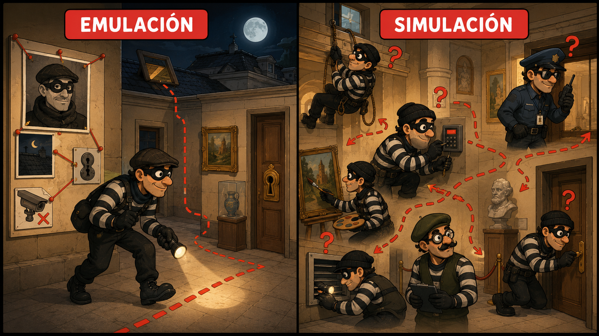
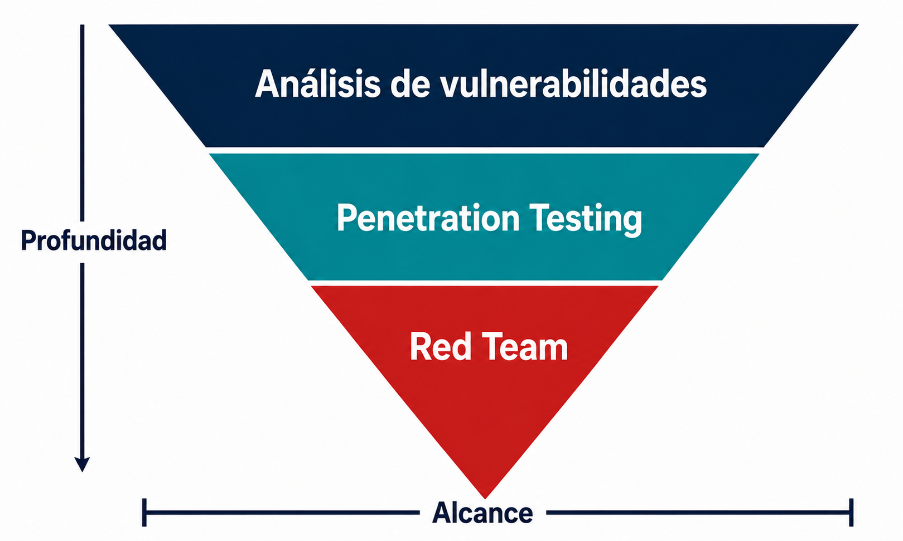
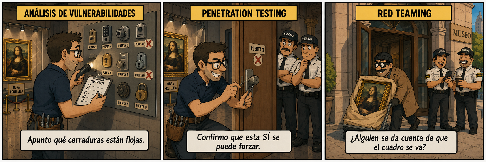
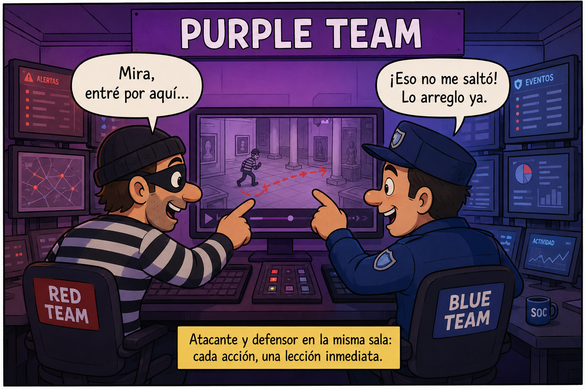

> Este post lo escribí en su día y se publicó originalmente en [Security Art Work](https://www.securityartwork.es/2026/07/06/red-teaming-pensar-como-adversario/) (S2GRUPO) el 6 de julio de 2026.

## Introducción

Imagina un museo. De esos con una obra que vale más que el edificio entero. Hay cámaras por todas partes, guardias en cada sala, sensores de movimiento, una vitrina blindada que parece sacada de una película. El director duerme tranquilo: _"esto es Fort Knox, aquí no entra nadie"_.

Pero un día hace algo raro. Coge el teléfono y contrata a un ladrón. Uno de verdad, de los buenos. Y le dice: _"Roba el cuadro. No avises a nadie, no te cortes. Quiero ver hasta dónde eres capaz de llegar"_.

Y aquí viene lo bueno. El director se esperaba una peli de Misión Imposible: el ladrón descolgándose del techo con arneses, esquivando láseres, taladrando la vitrina blindada con precisión de cirujano.

Nada de eso.

El ladrón se presentó a las nueve de la mañana con un mono de trabajo y un carrito de limpieza. Le dijo al de seguridad que venía a arreglar el aire acondicionado de la sala 3. El guardia, que ni levantó la vista, le abrió la puerta. Resulta que la vitrina blindada de 40.000 euros se abría con una llave que estaba colgada en el cuartito de mantenimiento, ese que llevaba meses con la cerradura rota. El ladrón cogió el cuadro, lo metió debajo de unos trapos en el carrito, dijo _"hasta luego, jefe"_ al salir… y el jefe le respondió _"que vaya bien"_.

Cero láseres. Cero arneses. La obra más cara del museo salió por la puerta principal a plena luz del día, saludando.

¿Y sabes qué es lo más incómodo? Que las cámaras lo grabaron todo. Funcionaban perfectamente. Nadie las estaba mirando.

Aquí la gran diferencia entre creer que estás protegido y saberlo.

Montar la seguridad de una empresa es un marrón. No es solo poner un antivirus y a correr. Tiras de un lado y aprietan por otro: los clientes te piden garantías, compliance te persigue con sus checklists, la dirección quiere resultados ya, y como salga algo en prensa se monta el circo. Todo eso a la vez.

Y luego está el dinero. Casi nunca hay tanto como haría falta, y lo peor no es eso: lo peor es que muchas veces ni se sabe en qué gastarlo. Se compra la herramienta de moda, se marca la casilla, y a otra cosa.

Por debajo de todo esto hay una idea que no se dice en voz alta pero que está siempre ahí: _"esto le pasa a otros, a nosotros no"_. Y de esa idea nacen los mitos de siempre:

- _"Si el usuario no hace clic, no hay intrusión."_
- _"Tenemos un EDR, estamos cubiertos."_
- _"Cumplimos la ISO 27001, nuestra infraestructura es segura."_

Suena razonable. El problema es que la realidad no se lee los certificados.

En 2016, el grupo Lazarus se llevó 81 millones de dólares del Banco Central de Bangladesh. No de una tiendecita de barrio: del banco central de un país, conectado a la red SWIFT, con toda la protección que te puedas imaginar encima. ¿De verdad crees que esas redes no estaban hasta arriba de controles, auditorías y certificaciones?

Estaban. Y aun así pasó.

La pregunta entonces no es _"¿tenemos seguridad?"_. La pregunta es _"¿funciona de verdad cuando alguien la pone a prueba?"_.
## ¿Qué es el Red Teaming?

Cuando hablamos sobre qué es el Red Teaming, también conocido como Simulación o Emulación de Adversarios, es cuando aparece el primer problema. si preguntas a diez personas qué es, probablemente obtengas quince respuestas distintas. Hay definiciones para todos los gustos.

De todas las que he leído, hay una que me parece especialmente acertada. Es la de Joe Vest y James Tubberville en su libro _Red Team Development and Operations_:

>El Red Teaming es el proceso de usar Tácticas, Técnicas y Procedimientos (TTPs) para emular a un adversario real, con el objetivo de entrenar y medir la efectividad de las personas, los procesos y la tecnología que se usan para defender un entorno.

De esta definición es posible sacar tres ideas importantes:

1. _"Emular a un adversario real"_.  No se trata de lanzar un escáner y revisar la lista de fallos que devuelve. Se trata de comportarse como lo haría quien realmente quiere causar daño. Y eso lo cambia todo, porque un atacante no es una vulnerabilidad ni un exploit en un informe: es una persona inteligente, con paciencia y un objetivo  y en ocasiones con el capital suficiente como para conseguir su propósito. Y cuando hablamos de capital, hablamos de cosas muy concretas: puede comprar un _exploit_ de día cero por cientos de miles de dólares, pagar a un empleado descontento para que le abra una puerta desde dentro, o sostener una operación durante meses sin prisa por rentabilizarla.
   Por eso lo primero, antes de tocar nada, es tener claro de quién te estás protegiendo. No es lo mismo defenderse de un atacante oportunista que de un grupo patrocinado por un estado (APT) que lleva meses estudiando a su objetivo. Cambian las herramientas, cambian las metas y cambia la paciencia. Si no sabes a qué adversario te enfrentas, estás colocando rejas sin saber siquiera si quien viene entra por la ventana o por la puerta.

2. _"Entrenar y medir"_. El Red Teaming no tiene como propósito entregar una lista de vulnerabilidades, para eso hay otros enfoques. Existe para responder preguntas bastante más complejas e incómodas: ¿se daría cuenta tu equipo? ¿En cuánto tiempo? ¿Sabrían cómo reaccionar? Es un simulacro de incendio, pero con fuego real.

3. _"Personas, procesos y tecnología"_. Aquí está el verdadero fondo del asunto. Existe la tendencia a entender la seguridad como un problema puramente técnico (firewall, antivirus, parches) y a olvidar las otras dos patas. Pero en el museo no falló la tecnología: las cámaras funcionaban. Falló la persona que no miraba las pantallas y el proceso que dejó una llave colgada en un cuarto con la cerradura rota. El Red Teaming pone a prueba las tres dimensiones a la vez, porque un atacante real buscará siempre la más débil, y rara vez es la tecnología.

Nada de esto se improvisa. Un buen ejercicio parte de objetivos y escenarios bien definidos, y para ello es clave identificar las funciones críticas de la organización y el impacto que tendría verlas comprometidas. Sin ese rumbo, no es un ejercicio de Red Team: es un grupo de personas probando cosas a ver qué encuentran.

### Emulación vs Simulación

Una matización sobre los nombres: dentro del Red Teaming se distinguen dos enfoques, y no son lo mismo. Emular a un adversario no es igual que simularlo.

|  | Emulación | Simulación |
|---|---|---|
| Amenaza | Concreta y real | Hipotética |
| TTPs | Conocidas (inteligencia de amenazas) | Libres o propias |
| Alcance | Estrecho | Amplio |
| Para qué | Afinar la defensa frente a ese actor | Mejorar frente a una variedad de amenazas |

El objetivo de la emulación es desarrollar, probar y afinar la capacidad de la organización para detectar y responder a las TTPs de una amenaza concreta. Es una evaluación enfocada frente a un actor que tiene más probabilidades de ir a por ti, y por eso el Red Team se apoya en informes de inteligencia de amenazas para reproducir sus TTPs conocidas lo más fielmente posible. Es el equivalente a prepararte para un ladrón concreto del que ya conoces el modus operandi: entra de noche por el tejado, fuerza siempre el mismo tipo de cerradura, evita las cámaras del ala este. Quieres ver si paras justo a ese.

La simulación, en cambio, deja que el Red Team se comporte como una amenaza totalmente hipotética, mucho menos restringido en las TTPs que puede usar. Eso da una evaluación más amplia de tus capacidades y destapa puntos ciegos menos evidentes. Siguiendo el símil, es soltar a un ladrón cualquiera, sin guion previo, libre de usar las mañas que se le ocurran, para ver cómo aguantas ante cualquier estilo de robo.

## ¿Qué NO es el Red Teaming?

A veces la mejor forma de entender algo es delimitar lo que no es. Y el Red Teaming arrastra suficientes malentendidos como para dedicarle un apartado. Vamos a desmontar unos cuantos.

- No es hackear por hackear. No se trata de entrar por deporte, plantar una bandera y marcharse. Si un ejercicio termina con un _"hemos conseguido entrar, enhorabuena a todos"_ y poco más, ha fracasado. El objetivo no es el acceso en sí, sino el valor accionable que se extrae de él: qué falló, por dónde, qué se podría haber hecho distinto y qué hay que arreglar a partir de mañana. Un Red Team que no deja a la organización mejor de lo que la encontró no ha hecho su trabajo.

- No es un examen, ni un intento de dejar a nadie en evidencia. Aquí está uno de los mayores motivos de rechazo hacia esta disciplina: la idea de que viene alguien de fuera a demostrar lo mal que lo hace el equipo interno, a señalar culpables y a humillar al Blue Team. Nada más lejos. El Red Team no es el enemigo: es el simulacro, no el incendio. Está ahí para que, cuando llegue el fuego de verdad, todo el mundo sepa exactamente qué hacer. Si un ejercicio se vive como un juicio, alguien ha entendido mal el propósito.

- No es un "¿entraron o no?". Esta es quizá la confusión más extendida. Reducir el resultado a si el Red Team logró comprometer la organización es quedarse en la superficie. Casi siempre se entra, ya lo veremos más adelante; la pregunta interesante es qué impacto se demuestra por el camino. El "sí entraron" es el principio del análisis, no el final.

- No es un servicio de una sola vez.  La seguridad no es un estado al que se llega, sino algo que se mantiene y se erosiona constantemente. El verdadero valor aparece cuando el Red Teaming se entiende como un proceso que construye madurez: ejercicio, lecciones aprendidas, mejoras, y vuelta a empezar. Pasarlo una vez para tachar una casilla no aporta el mismo valor.

- No es cosa solo del equipo ofensivo. Tendemos a imaginar el Red Teaming como un grupo de atacantes haciendo su magia en un sótano, y poco más. Pero un ejercicio sin Blue Team que detecte y responda pierde la mitad de su sentido no se está midiendo nada. Y sin dirección que entienda los resultados y decida actuar sobre ellos, el informe acaba en un cajón. El Red Teaming aporta valor cuando participa toda la organización: el equipo ofensivo, el defensivo y quien toma las decisiones.

En el fondo, todos estos malentendidos comparten la misma raíz: confundir el Red Teaming con un fin (entrar, ganar, lucirse) cuando en realidad es un medio. Un medio para que la organización se conozca mejor y se prepare para el día en que el atacante no sea de mentira.
## Diferencias entre Análisis de Vulnerabilidades vs Penetration Testing vs Red Teaming

Estos tres términos se usan a menudo como sinónimos, y no lo son. Confundirlos lleva a contratar lo que no necesitas, o peor, a creer que estás midiendo algo que en realidad no estás midiendo. Vamos a ponerles definición y luego a verlos enfrentados.

Análisis de Vulnerabilidades. El NIST lo define como el _"examen sistemático de un sistema de información o producto para determinar la adecuación de las medidas de seguridad, identificar deficiencias de seguridad, proporcionar datos a partir de los cuales predecir la eficacia de las medidas propuestas y confirmar su adecuación una vez implementadas"_ (NIST SP 800-30). En la práctica: busca, identifica y cataloga fallos. Amplitud por encima de profundidad.

Penetration Testing. El NIST lo describe como _"una metodología de prueba en la que los evaluadores, trabajando normalmente bajo restricciones específicas, intentan evadir o derrotar las características de seguridad de un sistema"_ (NIST SP 800-115). Aquí ya no solo se identifica el fallo: se explota para demostrar que es real y hasta dónde permite llegar.

Red Teaming. El NIST define el ejercicio de Red Team como _"ejercicio que, reflejando condiciones reales, simula el intento de un adversario por comprometer las misiones o los procesos de negocio de una organización, con el fin de ofrecer una evaluación integral de la capacidad de seguridad del sistema y de la propia organización"_ (CNSSI 4009 / NIST). La palabra clave es organización: ya no se mide un sistema, se mide todo el entorno defensivo.

La diferencia se ve mucho mejor enfrentándolos punto por punto:

||Análisis de Vulnerabilidades|Penetration Testing|Red Teaming|
|---|---|---|---|
|Orientado a|Amplitud (cubrir todo)|Profundidad de explotación|Profundidad + objetivo concreto|
|Qué mide|Activos, red o aplicaciones|Sistemas y su explotabilidad|Todo el entorno: personas, procesos y tecnología|
|Objetivo|Identificar vulnerabilidades|Demostrar su explotación e impacto|Medir el estado real de seguridad|
|Qué consigues|Reducir la superficie de ataque|Confirmar riesgos reales|Entrenar y evaluar la defensa|
|Herramientas|Escáneres automáticos|Mixtas (auto + manual)|A medida, sigilosas, emulando un adversario|
|¿Lo sabe el Blue Team?|Sí|Habitualmente sí|No (esa es la gracia)|
|Funciones NIST que cubre|Identificar, Proteger|+ Detectar|+ Responder, Recuperar|

Esa última fila es la más reveladora. Si la lees de izquierda a derecha, ves cómo cada enfoque cubre una porción mayor del ciclo de vida de la seguridad, las cinco funciones del _NIST Cybersecurity Framework_: Identificar, Proteger, Detectar, Responder y Recuperar.

El Análisis de Vulnerabilidades te dice qué tienes y dónde estás expuesto: vive en _Identificar_ y _Proteger_. El Pentest añade _Detectar_: al explotar de verdad, empieza a poner a prueba si algo salta. Pero solo el Red Teaming llega hasta _Responder_ y _Recuperar_, porque es el único que se hace sin avisar a quien defiende, y por tanto el único que mide lo que de verdad importa cuando hay un incidente real: ¿lo detectan?, ¿reaccionan?, ¿se recuperan?, ¿en cuánto tiempo?

Volviendo al museo: un análisis de vulnerabilidades es revisar el inventario de cerraduras y apuntar cuáles están flojas. Un pentest es comprobar que esa cerradura floja efectivamente se puede forzar, y abrir la puerta para demostrarlo. El Red Teaming es contratar al ladrón, no decírselo a los guardias, y ver si alguien se da cuenta de que el cuadro ha salido por la puerta principal saludando.

Ninguno sustituye a los otros. Se complementan, y casi siempre en ese orden de madurez.
## ¿Qué valor tiene el Red Teaming para la organización?

Llegados aquí, la pregunta lógica es: vale, ¿y todo esto para qué me sirve a mí? La respuesta cabe en una frase: el Red Teaming es donde las suposiciones se encuentran con la realidad.

Toda organización funciona sobre dos versiones de sí misma. Está la que cree que es, la del diagrama bonito, la de las políticas escritas, la del _"esto debería detectarse"_ y está la que es de verdad cuando alguien la ataca en serio. El _IS_ frente al _SHOULD-BE_. 

El museo del principio creía estar en su versión _should-be_: cámaras, guardias, vitrina blindada. Su versión _is_ era un tipo con un mono saliendo por la puerta saludando. El Red Teaming es lo único que te enseña la distancia exacta entre las dos.

A partir de ahí, el valor se concreta en cosas muy tangibles:

- Conocer tu estado real de seguridad. No el que figura en el informe de cumplimiento, sino el que se mide en segundos y minutos: ¿cuánto tardas en detectar una intrusión?, ¿cuánto en responder una vez detectada?, ¿cuánto en recuperarte del todo? Esos tres tiempos valen más que cualquier certificado colgado en la pared, porque son los que de verdad cuentan el día del incidente real.

- Entrenar a las personas, no solo auditar las máquinas. Un ejercicio de Red Team es la única ocasión en la que tu Blue Team y tus empleados se enfrentan a un ataque que se comporta como uno real… sin las consecuencias de uno real. Es el simulacro de incendio: cuando llegue el fuego de verdad, ya habrán pasado por ello. Saben qué botón pulsar, a quién llamar y qué no hacer presa del pánico. Eso no se aprende leyendo un procedimiento.

- Entender el impacto de verdad. Una cosa es decir _"tenemos una vulnerabilidad crítica en ese servidor"_ y otra muy distinta es ver demostrado que, tirando de ese hilo, alguien llega hasta la base de datos de clientes y se la lleva entera. El Red Teaming traduce el riesgo abstracto en consecuencias concretas: esto es lo que podría pasar, esto es lo que costaría, así es como se vería. Y nada mueve más a la dirección que ver el impacto, no oír hablar de él.

- Saber dónde invertir. Quizá el valor más práctico de todos. El presupuesto de seguridad siempre es limitado, y el mayor desperdicio no es gastar poco, sino gastar en el sitio equivocado. Un ejercicio te muestra, con pruebas, por dónde entran de verdad y qué controles habrían marcado la diferencia. 

En el fondo, todo se reduce a esto: el Red Teaming convierte el _"creemos que estamos protegidos"_ en _"sabemos exactamente dónde estamos"_. Y desde el conocimiento se toman decisiones mucho mejores que desde la suposición.
## ¿Cuándo hacer Red Teaming?

Aquí conviene ser honesto: el Red Teaming no es para todo el mundo. O, mejor dicho, no es para todo el mundo _todavía_.

Hay una cuestión de madurez que no se puede saltar. Contratar un Red Team cuando aún no tienes lo básico cubierto es como contratar al ladrón para que ponga a prueba un museo que ni siquiera ha instalado las cámaras. ¿Para qué? Ya sabes el resultado: va a entrar, y no vas a aprender nada que no supieras. Habrás pagado una cifra considerable para que alguien te confirme lo evidente.

El orden natural suele ser este. Primero, Análisis de Vulnerabilidades: saber qué tienes y dónde estás expuesto. Después, Penetration Testing: comprobar qué de eso es explotable de verdad y taparlo. Y  cuando esos cimientos están puestos, cuando ya proteges y empiezas a detectar y responder, tiene sentido subir el siguiente escalón y emular a un adversario real.

Entonces, ¿cuándo está una organización realmente lista? La señal es bastante clara: cuando ya ha implementado capacidades de detección y respuesta y quiere saber si funcionan de verdad frente a un atacante que se comporta como tal. Si tienes un SOC, un EDR, procesos de respuesta a incidentes, gente de guardia… y nunca los has puesto a prueba contra alguien que juega a esconderse, estás en el punto exacto. El Red Teaming es lo que separa el _"sobre el papel, esto debería saltar"_ del _"saltó, y reaccionamos en once minutos"_.

Y un último apunte, que enlaza con algo que ya dijimos: esto no es una auditoría que se pasa una vez y se archiva. El valor no está en el ejercicio aislado, sino en el ciclo que pone en marcha: atacas, aprendes, corriges, refuerzas… y vuelves a atacar para comprobar que esta vez sí. Cada vuelta, la organización es un poco más difícil de comprometer y un poco más rápida reaccionando. El Red Teaming no es una foto del estado de tu seguridad: es el motor que la hace madurar.

Así que la pregunta no es _"¿puedo permitirme un Red Team?"_, sino _"¿está mi organización en un punto en el que un ejercicio así me revelaría algo que no sé?"_. El día que la respuesta sea sí, ha llegado el momento.
## Aproximaciones: Zero Knowledge y Assumed Breach

No todos los ejercicios de Red Team empiezan en el mismo sitio. Según desde dónde arranque el atacante, hablamos de dos grandes aproximaciones. No es un detalle técnico menor: condiciona qué se pone a prueba y, sobre todo, en qué se invierte el tiempo.

Zero Knowledge. También llamado de "caja negra". El Red Team empieza desde fuera, sin información y sin ningún acceso, igual que un atacante real que acaba de elegir a su víctima. Tiene que hacerlo todo: investigar a la organización, encontrar una grieta, conseguir ese primer punto de entrada y, desde ahí, avanzar hacia el objetivo. Es el escenario más fiel a un ataque real desde cero… pero también el más lento y costoso.

Assumed Breach. Aquí se parte de una suposición: el atacante ya está dentro. Se le concede un punto de acceso inicial, un portátil de empleado comprometido, unas credenciales válidas, una posición en la red, y el ejercicio arranca desde ahí. En lugar de gastar semanas en cómo entrar, se empieza el día uno trabajando sobre lo que pasa después de entrar.

Y aquí surge la objeción típica: _"si le regalas el acceso, le estás poniendo las cosas fáciles, eso no vale"_. Es justo al revés, y vale la pena entender por qué.

Porque hay una verdad incómoda en seguridad, y no la dice un vendedor de humo: la dijo la propia NSA. En 2010, Debora Plunkett, entonces responsable de la Dirección de Aseguramiento de la Información de la agencia, lo resumió sin rodeos: _"Ya no existe tal cosa como estar seguro"_, y por eso _"tenemos que construir nuestros sistemas asumiendo que los adversarios entrarán"_. Llegó incluso a advertir que _"los adversarios más sofisticados van a pasar desapercibidos en nuestras redes"_.

Si la agencia con algunos de los mejores recursos del planeta parte de esa premisa, lo razonable es que el resto también lo haga. El atacante, tarde o temprano, entra. Da igual cuánto inviertas en el perímetro: algún usuario terminará haciendo clic donde no debe, alguna credencial se filtrará, algún servicio expuesto tendrá su día malo. Asumir que nadie va a entrar nunca no es una estrategia, es una ilusión. La pregunta de verdad importante no es _si_ entrarán, sino qué pasa cuando lo hagan: ¿hasta dónde pueden llegar?, ¿cuánto tardas en darte cuenta?, ¿pueden pasar del portátil de recepción al control total del dominio?

Por eso dar por hecho el acceso inicial no resta valor al ejercicio: lo concentra donde más importa. El valor está en el tiempo, y el tiempo es limitado. Gastarlo entero en demostrar, una vez más, que se puede conseguir un primer acceso, algo que ya sabemos que ocurre, es desaprovecharlo. Es mucho más útil invertirlo en lo crítico: el movimiento lateral, la escalada de privilegios, llegar al "cuadro" y, mientras tanto, medir si la defensa se entera de algo.

Hay además una conclusión potente escondida aquí. Si en un ejercicio de Assumed Breach el Red Team alcanza sus objetivos partiendo de un acceso pequeño, eso significa que cualquiera que consiga ese primer pie dentro puede comprometer la organización entera. Y conseguir ese primer pie, ya lo hemos dicho, es solo cuestión de tiempo. Eso es una conclusión accionable; "no lograron entrar desde fuera en dos semanas" no lo es tanto.

Volviendo al museo una última vez: el Zero Knowledge es ver si el ladrón consigue colarse en el edificio. El Assumed Breach es algo más interesante, dar por hecho que ya está dentro, vestido de limpieza, y preguntarse lo que de verdad importa: una vez dentro, ¿qué le impide salir con el cuadro?

## ¿Cómo se mide el éxito de un ejercicio?

Si has llegado hasta aquí, ya intuyes que la pregunta _"¿entraron o no?"_ es la peor vara de medir posible. Y sin embargo es la primera que casi todo el mundo formula al terminar un ejercicio. 

Porque el éxito de un Red Team no se mide por si comprometieron la organización. Eso, a estas alturas del artículo, ya lo damos por descontado: con tiempo suficiente, lo harán. Medir el ejercicio por el "sí entraron" es como juzgar un simulacro de incendio por si el fuego prendió. Claro que prendió, lo encendimos a propósito. La pregunta es qué pasó después.

Lo que de verdad cuenta es esto:

- El impacto demostrado. No es lo mismo _"llegaron a un servidor sin importancia"_ que _"llegaron a la base de datos de clientes y demostraron que podían exfiltrarla entera"_. El valor de un ejercicio está en cuánto daño real fue capaz de probar: hasta dónde se llegó y qué habría supuesto para el negocio. El impacto traduce el ejercicio a un idioma que la dirección entiende.

- Los objetivos: cuáles, y sobre todo cómo. Antes del ejercicio se fijaron unas metas concretas, el _"cuadro"_. ¿Se alcanzaron? Pero la pregunta más importante no es _si_, sino cómo: por qué camino, aprovechando qué fallo, qué controles se evadieron y cuáles, de haber funcionado, lo habrían frenado. 

- La detección y la reacción de la defensa. Aquí está el corazón del asunto, y es donde volvemos a la sala de cámaras del museo: las imágenes estaban ahí, mostrando el robo en directo, pero la sala estaba vacía. Tener la capacidad no sirve de nada si nadie la usa. Por eso lo que de verdad se mide es la respuesta del Blue Team: ¿detectaron algo?, ¿qué exactamente y qué pasó desapercibido?, ¿cuánto tardaron en darse cuenta?, ¿reaccionaron bien o cundió el pánico? Un ejercicio en el que el Red Team alcanza todos sus objetivos pero el Blue los detecta y los expulsa a mitad de camino es, en realidad, una buena noticia.

- Los datos accionables. Y todo lo anterior tiene que aterrizar en algo concreto y ejecutable. Un buen ejercicio no termina con un _"os hemos ganado"_, sino con una lista clara de qué cambiar, en qué orden y por qué. Si al cerrar el informe la organización no sabe exactamente qué hacer el lunes por la mañana, el ejercicio ha fallado por mucho que fuera técnicamente brillante.

En el fondo, medir bien un Red Team es invertir la pregunta. No _"¿consiguió entrar el atacante?"_ (spoiler: sí), sino _"¿qué tan preparados estábamos para el día en que ese atacante sea real?"_. Esa es la única métrica que de verdad importa. Todo lo demás es marcar la casilla.
## ¿Qué es el Purple Team?

Antes de cerrar conviene aclarar un término que se cruza constantemente con todo esto y que genera bastante confusión: el Purple Team.

Lo primero, lo más importante: el Purple Team no es un tercer tipo de ejercicio, ni una alternativa al Red Team. No eliges entre "hacer un Red Team" o "hacer un Purple Team". Es, más bien, una capa de colaboración que puede sumarse a cualquier ejercicio para multiplicar lo que se aprende de él. 

¿Y en qué consiste en la práctica? En sentar a las dos partes en la misma sala. El Red Team ejecuta una técnica y, en el momento, se comprueba qué vio el Blue Team: ¿saltó alguna alerta?, ¿en qué consola?, ¿con qué nivel de detalle? Si no se detectó nada, se ajusta la defensa allí mismo y se vuelve a intentar para confirmar que ahora sí salta.

El valor está en dos cosas:

- Compartir inteligencia, en ambas direcciones. El Red Team enseña cómo se comporta realmente un adversario, qué herramientas usa, qué huellas deja, por dónde se mueve, y el Blue Team enseña qué se ve y qué no desde el otro lado de las pantallas. Cada uno aprende del conocimiento del otro. El beneficio es bidireccional, y por eso suele dejar más poso formativo que un ejercicio a ciegas.

- Comparar lo ejecutado contra lo detectado. Esta es la métrica estrella del Purple Team: poner una al lado de otra la lista de acciones que realizó el Red Team y la de acciones que detectó el Blue Team. Los huecos entre ambas, lo que ocurrió pero nadie vio, son, literalmente, el mapa de los puntos ciegos de tu detección. No hay forma más directa de saber dónde están las lagunas de visibilidad.

Dicho de otro modo: si un Red Team clásico te dice _cómo_ de bien estás preparado para un ataque real, el enfoque Purple te ayuda además a cerrar las brechas sobre la marcha, convirtiendo cada acción del ejercicio en una lección inmediata para la defensa. Por eso, más que una alternativa, es un valor añadido que casi siempre merece la pena considerar.

## Conclusiones

Empezamos con un museo que se creía inexpugnable y terminó viendo cómo su obra más valiosa salía por la puerta principal, a plena luz del día, escondida bajo unos trapos. No falló la tecnología: fallaron las personas que no miraban y los procesos que dejaban llaves colgadas. Y, sobre todo, falló una idea: la de creerse seguro sin haberlo comprobado nunca.

Si hay algo que llevarse de todo esto, son tres cosas.

- La primera: incorpora la mirada del adversario. No se puede diseñar una buena defensa pensando solo como defensor. Hay que sentarse en la silla del que ataca y preguntarse en serio cómo entraría, qué buscaría y por dónde iría. Un plan de seguridad construido sin esa perspectiva defiende la puerta principal mientras alguien entra por el conducto del aire vestido de mantenimiento. El Red Teaming es, ante todo, esa mirada: pensar como el adversario para anticipar la amenaza antes de que sea real.

- La segunda: entiende qué te aporta de verdad, y úsalo. El Red Teaming no es ganar, ni entrar, ni lucirse. Es un medio para conocerte mejor: para saber cuánto tardas en detectar, cómo reaccionas, dónde están tus puntos ciegos y en qué merece la pena invertir. Pero toda esa información no vale nada si acaba en un cajón. El valor no está en el ejercicio, sino en lo que la organización hace con sus conclusiones el lunes por la mañana.

- La tercera: desconfía de las suposiciones. _"Si el usuario no hace clic, no hay intrusión." "Tenemos un EDR, estamos cubiertos." "Cumplimos la ISO, somos seguros."_ Todos estos mitos comparten la misma raíz: confundir lo que _debería_ pasar con lo que pasa de verdad. Hasta la NSA asume que el adversario entrará. La pregunta nunca es si estás seguro sobre el papel, sino si lo estás cuando alguien lo pone a prueba en serio.

Y esa es, al final, toda la idea. La mejor forma de saber si tu museo aguanta no es admirar lo gruesa que es la vitrina. Es contratar al ladrón , uno de los buenos, uno que juega en tu equipo y dejar que lo intente. Mejor descubrir el conducto del aire abierto con él, que con el que no devuelve el cuadro.

Porque el atacante real, ese, no avisa. Y desde luego no se despide saludando.

*Esta vez sí lo pillan. Mismo ladrón, mejores arneses… pero ahora hay detección y respuesta: los láseres saltan, el SOC mira las cámaras y los guardias reaccionan. Las medidas aprendidas en el Red Team, funcionando.*

## Referencias

1. Vest, J. & Tubberville, J. — _Red Team Development and Operations: A Practical Guide._ (Definición de Red Teaming + marco general del artículo.)
    
2. NIST — Definiciones de Análisis de Vulnerabilidades (_SP 800-30_), Penetration Testing (_SP 800-115_) y Red Team Exercise (_CNSSI 4009_). Funciones del _NIST Cybersecurity Framework_: Identificar, Proteger, Detectar, Responder, Recuperar.
    
3. Debora Plunkett (NSA) — Foro de ciberseguridad de The Atlantic / Government Executive, 16 dic 2010. _"There's no such thing as secure anymore" / "We have to build our systems on the assumption that adversaries will get in."_ [eWeek — NSA: Assume Attackers Will Compromise Networks](https://www.eweek.com/security/nsa-assume-attackers-will-compromise-networks/)

4. Robo al Banco Central de Bangladesh (grupo Lazarus, 2016) — BBC News, _The Lazarus heist: How North Korea almost pulled off a billion-dollar hack_ (2021): [bbc.com](https://www.bbc.com/news/stories-57520169). Atribución oficial en la acusación del Departamento de Justicia de EE. UU. (2021): [justice.gov](https://www.justice.gov/opa/pr/three-north-korean-military-hackers-indicted-wide-ranging-scheme-commit-cyberattacks-and).
